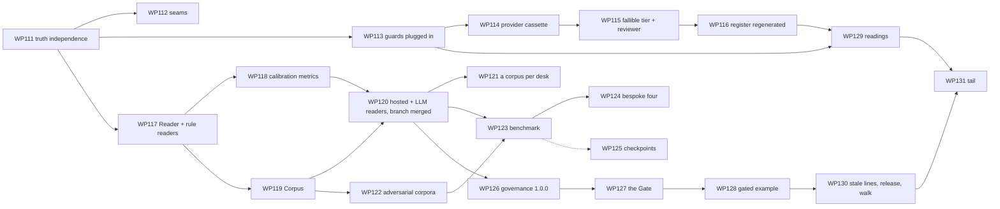

# 101 — Day 7 Roadmap: Phases AC–AI, WP111–WP131

> The phased plan from `main` at `406a7b0` (Day 6 merged; WP0–WP110 done; the Jev and DGX Spark experiments merged outside any work package) to the target design in `100-TARGET-DESIGN-V7.md` — the bank made fallible, readers and corpora, the honest bank, adversarial assurance across vendors, the Gate, and the reading desk. Written 2026-09-29. Supersedes `84-DAY6-ROADMAP.md`'s forward plan (exhausted); `84-…` §3 and §8 remain the record of what Day 6 built. Every WP names the `100-…` section it implements and the gap ids (`100-…` §3) it retires. **Nothing in this document is built.** It is written for review: §1's five decisions and §2's ordering are the questions to settle first.

---

## 1. Scope decision of record

Day 7 is the phase in which the bank's evidence starts to mean something, and the first phase in which the product reaches outside itself. Five decisions fix its shape:

1. **Fallibility before anything else is measured.** No new experiment, benchmark or register row is written until an actor can err and a person can be wrong. The seven reference experiments are re-run on the fallible and live tiers, and a comparison at ceiling reads *untestable* (D14, D15, tenet 33). This is the phase's reason.
2. **Readers are a contract, and the rule is one reader.** `Reader`, typed questions and the `reader` executor with its gate reach `core`; the seven desks' regexes become rule readers byte-identically; the branch's hosted classifier and a general chat-model reader are the second and third (D16). The Jev experiment's optional pack is the first instance; the DGX Spark pack leaves the harness's default list and becomes opt-in the same way.
3. **A corpus is content, and the held-out rule is enforced.** Corpora with guides, digests, blind annotators and `seenBy` records; `checkCorpus` refuses a re-score; one corpus per desk's classify stage and one adversarial corpus per desk (D17).
4. **Every connectable guard is measured before it is fitted.** The benchmark over the adversarial corpora runs every service and reader-as-guard side by side; the Guard Rack reads numbers or *unmeasured*; the unplugged hosted-guard baselines are plugged in with the stand-in config as the stated default (D19, tenet 37).
5. **The Gate is the exit toward purpose 2, as a reference implementation.** An OpenAI-compatible proxy running a saved stack over an agent's traffic, shadow or enforce, with an identity test to the session's chain; governance 1.0.0 (D20, tenet 38). It is not a product.

Through all of it, the reading desk (D21): the two hundred pending readings in one queue, so that *pending* becomes *reviewed* at a minute each, and the checks honour the record.

## 2. Priority logic

- **The honest bank first, because it is cheap and everything after it is scored on it.** Truth independence, the servicing order, `touches`, the disputes pair, report v4, `specFor`, the per-desk chunk and the plugged-in hosted guards are a week of small, testable changes that every later measurement depends on. Phase AC.
- **Fallible actors before readers, because the register is the headline.** The provider cassette, the fallible tier and the reviewer model make the seven experiments say something; readers make one stage of each journey better. The register's regeneration is the first thing a reviewer of Day 7 should be able to read. Phase AD.
- **Readers and corpora together, because each proves the other.** The rule reader's identity test needs no corpus; the hosted and LLM readers need the servicing corpora; the corpus kind needs a reader to make `seenBy` mean anything. Phase AE builds the contract, then the kind, then the readers that ship on them.
- **The benchmark after the corpora and the readers, because its subjects are both.** Phase AG runs vendors and readers over rows that Phase AE's rules produced, and builds the four bespoke components as levels rather than as isolated WPs.
- **The Gate late, because it needs governance's reader export and a stable stack.** Phase AH cuts 1.0.0 with readers in it and builds the proxy on the chain the identity test already holds.
- **Readings and the tail last, and Andrew's readings throughout.** Every WP that adds a cited row adds it `pending`; the desk in Phase AI is where they are read. The reading is never a gate on CI.
- **Every foundation lands with its identity test**: rule readers (WP117), the oracle reviewer (WP115), the plugged-in baselines (WP113), the provider cassette's replay (WP114), the Gate's chain (WP127).

## 3. Phases and work packages

Sizes as before: **S** a session or two; **M** several; **L** a week. Every WP has a design-of-record note (`102-…` onward) before its stage A where `100-…` leaves a contract to be detailed, and a dated *Done* entry here on close, with what diverged.

### Phase AC — The honest bank (WP111–WP113)

*Truth the rule did not write; the seams the exit reviews named; the guards plugged in. Nothing new is measured until this is green.*

| WP | What | Definition of done | Size | Retires |
|---|---|---|---|---|
| **WP111** ✅ | **Done 2026-09-29 — §8 items 2–3; `102-HONEST-BANK.md`.** **Truth independence and the servicing audit** (`100-…` §6.5, D18). Stage A: the note (`102-HONEST-BANK.md`) — the property's exact rule, the `derivedFrom` declaration, the audit method. Stage B: the property in `checkDesk`; the servicing label hook (`ServicingItemPayload.label`, on `main` since PR #52) read by the property; `record` before `act` in `fs-servicing/servicing` with its golden run re-taken; `touches` counting a `*-review` stage once; the float rounding in the readers' outputs. Stage C: the seven desks audited under the property, each finding a dated note in the desk's doc. | The property is red on the servicing desk without the hook and green with it; every desk green or with `derivedFrom` declared and its evaluators marked `derived`; `disclosure-recorded` passes on a mid-call disclosure; `touches` on the branch's servicing experiment reads 5 at 0.80; every golden run and baseline unchanged except servicing's, noted. | M | G75, G82-part |
| **WP112** ✅ | **Done 2026-09-29 — §8 item 3; the dated notes in `01-…` §8, `59-…`, `67-…`, `74-…`, `79-…`, `90-…`, `94-…`.** **The seams: pair, incidences, report v4, `specFor`, the per-desk chunk** (`100-…` §6.5). The disputes matched pair and its parity gate with the planted skew; four calibration rows for the Phase AA books' incidences, sourced and `pending`; `cell.workflow.workflowId` and `cell.pairId` on report v4 with the v3 reader; `RunWorkflowOptions.specFor(worldId)` used by the clock and `workflow run --follow --kit`; `$edition-packs` splitting each `fs-*` pack into its own dynamic import; the budgets re-stated (`01-…` §8). | The disputes pair fails on the skew and passes without; the Model-risk page reads pairs from `pairId`; a followed handoff runs the target desk with the kit's bot; every edition's smoke spec green and the reclaimed kilobytes recorded; every v3 report reads as v4. | M | G82-part, G83, G86 |
| **WP113** | **The hosted guards plugged in** (`100-…` §6.5, tenet 37). **Stage A is Andrew's decision**: the stand-in config as the default, or a stack without the service — the roadmap states the default and proceeds with it after a stated wait. Stage B: every baseline fitting `serviceConfig: '{}'` fits the offline stand-in; the identity test and the CI gates re-baselined; dated notes in `89-…` §8 and `28-…`; the register's rows that cite these stacks re-labelled *re-run in Phase AD*. | Every hosted-guard baseline shows `guardrail.checked` from the service's stand-in; CI green on the new baselines; a test refuses a baseline whose service config the service refuses. | S | G77 |

**Exit:** `100-…` §14 items 5 and 6; a Phase AC exit review in §8.

### Phase AD — Fallible actors (WP114–WP116)

*An actor that errs, a person who is a model, and the seven experiments re-run so the register records an effect.*

| WP | What | Definition of done | Size | Retires |
|---|---|---|---|---|
| **WP114** | **The provider cassette and the live tier at scale** (`100-…` §6.1, D14). Stage A: the note (`103-FALLIBLE-ACTORS.md`) — the cassette kind, the prompt digest, the tiers, the error model, the `untestable` verdict. Stage B: `craftabot-cassette` `kind: 'provider'`; `createMockProvider`'s cassette source; `craftabot record --experiment --provider`; `BrainChoice { tier: 'live', cassette }` through all three cell paths; `provider.cassette` on `think.completed`. Stage C: one experiment (`lending-stack`) recorded live on OpenAI at reduced size, its cassette under `docs/evidence/`, replayed in CI. | A cassette recorded from the mock provider replays to the same trace digest; a miss never reaches `fetch`; the live level of `lending-stack` runs in CI from its cassette with no key; the cassette's every entry pins the model id. | M | G80 |
| **WP115** | **The fallible tier and the reviewer model** (`100-…` §6.1–§6.2, D14, D15). `ErrorModel` and `PackManifest.errorModels`; `BrainChoice { tier: 'fallible', errorModel }`; `decision.fault` on the trace; `fs-bank`'s error rows (per desk decision stage, cited, `pending`); `ReviewerModel` on `WorkflowConfig`, the runtime's scripted person drawing from `dice`, `stage.completed.by`; human load v2 in `metrics` (cost, quality, catch rate); the reviewer rows (accuracy, automation bias, seconds per case, fatigue — cited, `pending`); the Monitor's queue reading capacity. | The fallible tier plants faults at the row's rate within the interval over 5,000 cases, every one with its event; `rules-only` and `expert` byte-identical; `reviewer: undefined` byte-identical on every golden run; `accuracy: 1, automationBias: 0` is the oracle; the rows' rates reproduced within the interval; `docs/metrics.md` regenerated. | L | G72-part, G73 |
| **WP116** | **The register, regenerated** (`100-…` §6.1, tenet 33). Each of the seven designs gains `fallible` and `live` levels on `brains` and a reviewer model where a `human` stage exists; `analyseExperiment`'s *untestable* verdict; `docs/evidence/` and `timings.md` regenerated at full size; the register's §5 in the assurance pack and the Assurance entry read the new verdicts; `experiment-shape.mjs` extended to the new levels; the eighth reference experiment, `servicing-readers`, reserved for WP119. | Every reference experiment records at least one effect whose interval excludes zero; every ceiling comparison reads *untestable*; the reduced CI run holds the shape; the register table names the tier beside every effect. | M | G72 |

**Exit:** `100-…` §14 items 1 and 2; a Phase AD exit review in §8.

### Phase AE — Readers and corpora (WP117–WP121)

*A judgment with a contract, a corpus with a guide, and the Jev experiment's pack as the first instance.*

| WP | What | Definition of done | Size | Retires |
|---|---|---|---|---|
| **WP117** | **`Reader`, typed questions, the `reader` executor, the rule readers** (`100-…` §6.3, D16). Stage A: the note (`104-READERS.md`) — the contract, the confidence formula, the executor and its gate, the event, the rule adapter's exact wrap. Stage B: `core/types/reader.ts`, `core/schemas/reader.ts`, `PackManifest.readers`, `Executor 'reader'`, `reader.answered`; `governance/readers/rule.ts`; the executor in `workflow`; `checkReader` in `pack-testkit`. Stage C: the seven desks' classify-shaped rules as rule readers on their stages. | **The identity test**: every desk golden run and every campaign baseline byte-identical with rule readers fitted; a rule reader never gates; `checkReader`'s fixtures per question type; the Pipeline's stage card shows the answer and confidence; `docs/schemas/reader.schema.json` generated. | L | G74-part |
| **WP118** | **Calibration in `@craftabot/metrics`; report v4's calibration pane** (`100-…` §6.3). `calibration.ts`: ECE, Brier, the reliability table, the gate curve, each with a hand case, a planted case and a null; the pane per reader stage on the report and in the Workshop's campaign view; `docs/metrics.md`. | The branch's published figures (ECE 0.023, Brier 0.014 on v1) recomputed from its cassette to the same values; the validation suite green; the pane on the visual pass. | S–M | G81 |
| **WP119** | **`Corpus` as content, `checkCorpus`, the labelling tools, the corpus book** (`100-…` §6.4, D17). Stage A: the note (`105-CORPORA.md`) — the schema, the six refusals, the held-out rule's exact semantics, the annotator record. Stage B: `core/schemas/corpus.ts`, the content and evidence kinds, `PackManifest.corpora`, `checkCorpus`, `Book.source.corpus`, `craftabot corpus freeze \| label \| agreement`, `/workshop/corpora` with its twin. Stage C: the three servicing corpora migrated from the branch with their guides, second labels and κ; the branch's lab record moved to `docs/evidence/servicing-readers/` as the eighth reference experiment. | `checkCorpus`'s six refusals; the held-out rule refuses a re-score and admits a `regression` cell; `corpus label` never shows a label; a corpus book runs the servicing journey to the branch's experiment result byte for byte; the eighth experiment holds its shape in CI. | M | G76-part, G90-part |
| **WP120** | **The hosted and LLM readers; the experiment packs on the contract** (`100-…` §6.3). `governance/readers/hosted.ts` over a `ServiceLine`; `governance/readers/llm.ts` over any provider (constrained where it can, log-probabilities where it returns them, argmax otherwise, the method on the answer); `pack-readers-llm`; `@craftabot/pack-typesafe`'s line as a hosted reader and its journey collapsed onto the `reader` executor with `gate`; the `steer` noul on the gate; `@craftabot/pack-dgx-spark` out of the harness's default list and opt-in by `--config`, its classifier delegating to the `llm` reader (`99-…` amended to say so); the reader component adapter (`components/reader.ts`). | The servicing journey runs `regex` / `jev` / `llm:mock` / `jev-gate-0.80` through one executor; the gate sends exactly the rows under the threshold to `else`; the steer routes independently of confidence; the `llm` reader over the mock provider both constrained and unconstrained; `checkReader` and `checkComponent` green on all three; the optional pack absent from every edition's bundle. | M | G74, G90 |
| **WP121** | **A corpus per desk** (`100-…` §6.4). Six corpora — disputes, fraud, complaints, onboarding, lending, advice — each about 100 rows, authored, tagged, frozen, blind-labelled by a second annotator with κ recorded, and split seen/held-out where a question set exists; each desk's classify-shaped stage gets its rule reader scored on its corpus and a `regex` vs `llm:mock` configuration; the guide of every corpus stating the authorship and the missing real-call test. | Seven corpora pass `checkCorpus` and the sweep; every rule reader has a scored accuracy on its corpus in the desk's doc (the regex baseline the readers are measured against); no corpus carries the `single-annotator` finding. | M | G76 |

**Exit:** `100-…` §14 items 3 and 4; a Phase AE exit review in §8.

### Phase AG — Adversarial assurance (WP122–WP125)

*Every connectable guard measured on the same rows; the four bespoke components built as levels; the checkpoints taken.* (Phase AF is not used: the letter is skipped so the phases keep their pairing with `100-…` §6's order.)

| WP | What | Definition of done | Size | Retires |
|---|---|---|---|---|
| **WP122** | **The adversarial corpora** (`100-…` §6.6). Stage A: the note (`106-BENCHMARK.md`) — the attack and target vocabularies, the surfaces per desk, the benchmark kind and its report. Stage B: one adversarial `Corpus` per desk (about 200 rows, benign rows included) over the surfaces the desk has, seeded by the branch's 27 steers, authored under WP119's rules and blind-labelled. | Seven adversarial corpora green on `checkCorpus`; every surface a desk has is represented; the benign share stated per corpus. | M | G78-part |
| **WP123** | **The benchmark** (`100-…` §6.6, D19). `campaign.kind: 'benchmark'`; subjects over every connectable `GuardrailService`, every reader noul as a guard, and the bespoke components; every subject through its stand-in in CI and its cassette when recorded (`craftabot benchmark run --record`); the report per subject (precision, recall, confusion by attack and target, latency, tokens, list price, the rows caught alone); `/workshop/benchmarks` with its twin; the Guard Rack's rows reading the latest benchmark or *unmeasured*; the catalogue entry's `measured` beside its status; the assurance pack's *Coverage* reading it. | The benchmark over the stand-ins is deterministic and shape-held in CI; a subject's cassette replays to the same confusion matrix; the Rack reads *unmeasured* for a service with no benchmark; the page says *synthetic rows* first. | L | G78 |
| **WP124** | **The bespoke four** (`100-…` §6.6). `untrusted-content` marking at `post-act` with the `content-is-untrusted` leaf; `taint` and `taint-reaches`; the quarantined-reader two-seat configuration; the red-team seat as the `adversarial` counterpart tier over the adversarial corpus. Each a component with point, verdict class and cost; each a catalogue entry moved to *shipped*; each a benchmark level; the manual's §52 extended. | A planted `SYSTEM:` line in a bureau file is marked, tainted and blocked at `pre-act`; the quarantined seat cannot call a tool; the red-team seat's lines are corpus rows and no others; `checkComponent` fixtures for all four; `checkCatalogue` green with four fewer *bespoke*. | L | G84 |
| **WP125** | **The live checkpoints and the vendors' cassettes** (`100-…` §6.6). Azure, Bedrock, Lakera and the Gen AI evaluation service, one command each with a key, recorded dated in `30-…`/`39-…`; each service's benchmark cassette recorded the same day; the OAuth client id for GEAP set up per `docs/geap-setup.md`. **Needs keys; runs when they exist; nothing else waits on it.** | Four dated checkpoint lines; four cassettes under the packs; the benchmark's live column filled for each; `browserCapable` flipped where the preflight allows. | S | G87-part |

**Exit:** `100-…` §14 item 7; a Phase AG exit review in §8.

### Phase AH — The Gate (WP126–WP128)

*What the Studio builds, the Gate runs, and the same chain is the proof.*

| WP | What | Definition of done | Size | Retires |
|---|---|---|---|---|
| **WP126** | **`@craftabot/governance` 1.0.0** (`100-…` §6.7). `readers/*` and the reader component in the export list; the TSDoc audit over them; `docs/governance-mapping.md`'s reader and Gate rows; the README's status line; the version cut; `check:governance-pack` unchanged and green. | The tarball installs into `examples/plain-node-agent` with readers importable; the audit test green; `npm view`-shaped metadata correct. | S | G79-part |
| **WP127** | **The Gate** (`100-…` §6.7, D20). Stage A: the note (`107-THE-GATE.md`) — the wire mapping per hook, the verdict effects per mode, the trace, the approval round-trip, the loopback default, the first-page disclaimer. Stage B: `packages/gate` (Node only): the server, the stack file loader, the three chains, shadow and enforce, `TraceSink`, `--principal`, the upstream key from the environment; `craftabot gate serve \| approve`. Stage C: **the identity test** over the five presets and one Studio-built fixture; the Studio's *Use in… the Gate*. | The identity test green on every push; each verdict's wire effect in `enforce` and absence in `shadow`; `pause` round-trips; the key-leak sweep over the Gate's trace and logs; the egress guard refuses any host but the upstream; a non-loopback bind needs the flag. | L | G79 |
| **WP128** | **The gated example and the Gate's evidence** (`100-…` §6.7). `examples/gated-agent`: an OpenAI client pointed at the Gate, no Craft A Bot import; a Gate's day as a bundle the Audit Centre opens and the assurance pack reads (`run.started.gate`); `docs/gate.md`; the manual's Part I §on the Gate. | The example's four outcomes through the Gate; a Gate bundle verifies its digest in the Audit Centre; the pack names the Gate's mode and stack. | S–M | G79 |

**Exit:** `100-…` §14 item 8; a Phase AH exit review in §8.

### Phase AI — The reading desk and the tail (WP129–WP131)

*Two hundred readings, one queue; the stale lines; the release; the practitioner walk; the Kit's card.*

| WP | What | Definition of done | Size | Retires |
|---|---|---|---|---|
| **WP129** | **`review` and `/workshop/readings`** (`100-…` §6.8, D21). Stage A: the note (`108-READINGS.md`) — the subject kinds, the verdicts, the amendment's path into content, what each check reads. Stage B: `core/schemas/review.ts` replacing `control-review` with the alias and migration note; the kind on all three stores and the evidence store; `checkCalibration({ requireReview })`, `checkCatalogue`, `checkControlMap`, `checkDomainPack` reading it; `/workshop/readings` with the queue, the sources, the progress readouts, the URL filter and the push; `craftabot readings export`. | A `review` for a row turns its check green for that row only; the queue's count equals the pending set across the eight kinds; `control-review` records read as `review`; the screen on the visual, axe and keyboard passes. | M | G85 |
| **WP130** | **The stale lines, the index, the release, the walk** (`100-…` §6.8). `USER-MANUAL.md` §41, `UX-AND-GAPS.md` §0/§4 and the three "awaiting review" notes corrected; `98-` and `99-` in `README.md`'s index; the first `v*` tag cut and `release.yml` exercised with its archive attached; the practitioner walk of `84-…` §9 performed and recorded; the Linux baselines for every new screen. | `git tag` non-empty and the release's zip verifies; no line in the manual or the register contradicts `84-…` §8; the walk's record names each stop with what was seen. | S | G87-part, G88 |
| **WP131** | **The tail: Part I, the roundels, the Kit's card** (`100-…` §6.8). The manual's Part I (readers, corpora, the register regenerated, the benchmark, the Gate, the readings) and the rebuilt PDF; five roundels on the wave-2 seam; the Kit's *Sure or unsure* card on the Front Desk with the confidence chip and the child's threshold; the Phase AI exit review. | The PDF rebuilt with Part I's figures; `wave2.test.ts` green over 27 files; the card wins and loses on the Front Desk under the mock provider with a keyboard-only e2e; `100-…` §14 items 9–12 met. | S–M | G89 |

**Exit:** `100-…` §14 items 9–12; a Phase AI exit review in §8.

## 4. Dependency sketch

**Parallelism.** Phase AD (WP114–WP116) and Phase AE (WP117–WP121) share only WP111 and can run interleaved: the register's regeneration does not need readers, and the reader contract does not need the fallible tier. WP125 runs whenever keys exist. WP126 can start as soon as WP120 lands.

**Critical path.** WP111 → WP117 → WP119 → WP120 → WP123 → WP124 → WP127 → WP130 → WP131: about seven L/M packages. Phase AD sits beside it and finishes earlier.

## 5. Build discipline (inherited, five additions)

Everything in `84-…` §5 stands. Added:

1. **Identity before novelty.** The rule readers (WP117), the oracle reviewer (WP115), the plugged-in baselines (WP113) and the provider cassette's replay (WP114) each land with a byte-identity test as stage A's first commit, and the test never moves to *flaky*.
2. **Every rate is a row.** A fallible tier's rate, a reviewer's accuracy, a book's incidence: a calibration row with a source and `review: 'pending'`, never a literal in code. A test greps the packs for numeric rates outside the table.
3. **No corpus is scored on data it has seen.** `checkCorpus`'s held-out rule is a runner refusal, and a `regression` cell is marked as such on the report. A second annotator labels blind, and κ is recorded before any recording.
4. **A benchmark number is never a ranking.** The page and the report show a table with the corpus named and *synthetic* first; the catalogue's coverage status is unchanged by a measurement.
5. **The Gate binds loopback.** Any non-loopback bind requires the named flag; the key-leak sweep runs over the Gate's logs on every push; the README's first line says *reference implementation*.

## 6. Carried in, and where each lands

| Item | Lands in |
|---|---|
| The Jev and DGX Spark experiments (`98-…`, `99-…`, the lab record; merged as PRs #51–#53) | WP111 (the order finding, the touches count), WP119 (the corpora, the lab record as the eighth experiment), WP120 (the packs on the reader contract; the DGX pack opt-in) |
| The unplugged hosted guards (`89-…` §8, `84-…` §8 item 5) | WP113 |
| `touches` double-counting (`98-…` §9) | WP111 |
| The disputes matched pair (`90-…` §7) | WP112 |
| The four books' stated incidences (`84-…` §8 item 16) | WP112 |
| Report v4 `workflowId` (`79-…` §3), *no pairs* on Model-risk (`79-…`) | WP112 |
| The one-spec-per-run seam (`90-…` §7) | WP112 |
| The per-desk chunk and the budgets (`84-…` §8 item 16) | WP112 |
| `drift-day` as a campaign-shaped experiment (`80-…` §4) | WP116 (a bank-day experiment kind, if the register's regeneration finds it needed; else recorded again as the Monitor's test) |
| The bespoke components (`84-…` §7): untrusted-content, taint, quarantined reader, red-team seat | WP124; `no-progress`, `memory-provenance`, `privilege-scopes`, `content-digest`, the policy-conditioned classifier stay in §7 |
| The four live checkpoints and the GEAP client id | WP125 |
| Governance 1.0.0 (`38-…`) | WP126 |
| GAP-3's Telemetry cohort axis and Run Browser filter (`UX-AND-GAPS.md` §8) | WP129's Workshop pass, if small; else §7 |
| The catalogue, calibration, control-row, decision-right, blueprint and screening-list readings | WP129 (the desk); the readings themselves are Andrew's, throughout |
| The stale manual and register lines; the "awaiting review" notes; the empty `git tag` | WP130 |
| The practitioner walk of `84-…` §9, never recorded | WP130 |
| Wave-2 art (still placeholders), the `20-…` §8 and `63-…` §8 questions | Outside a WP: the seams are built; the commission is a reading |
| The `axiomverity` half of Phase W (`82-…` §4) | Outside this repository, as before |

## 7. Follow-ups this roadmap does not schedule

- The remaining bespoke and blueprint catalogue entries: `no-progress` with a progress predicate, `memory-provenance`, `privilege-scopes`, pack `content-digest`, the policy-conditioned classifier, formal verification, inter-agent authentication. Each a session-sized WP when wanted, now with a benchmark to land in.
- A corpus of real calls, labelled by someone else — the missing test every corpus's guide names. Not a door this repository builds.
- A reviewer model fitted to observed reviewers rather than cited rates. A later day, and someone else's data.
- The Gate as a product: auth, TLS, tenancy, rate limits, persistence. Not this repository.
- The Kit beyond one card: a Day 8 question for purpose 1, once the bank's evidence is read.
- Mortgages, pensions, insurance, business banking; healthcare, logistics, manufacturing (`83-…` §6.5.1, §6.6.3 stand).
- The pooled conditional-parity interval (`68-…`), the JSON-import lint rule (D19's class), touch e2e (T5's residue).

## 8. Session-sized next steps (the immediate to-do)

0. **The review of this plan.** §1's five decisions and §2's ordering are for Andrew; in particular WP113's default (the stand-in config), WP120's decision to take the DGX pack out of the harness's default list, and whether Phase AD or AE runs first. Nothing below starts until this is read.

   > **Amended 2026-09-29:** Andrew asked for the build to start on a `day7` branch, which takes §1's five decisions and §2's ordering as read, with the defaults this document states: WP113 fits the offline stand-in config (`serviceConfig: '{}'` → the stand-in) as the default; WP120 takes `@craftabot/pack-dgx-spark` out of the harness's default list; Phase AC first, then AD, then AE, interleaved only where §4 allows. Any of the three can still be reversed at its WP's stage A.
1. ✅ **The docs pass.** `CLAUDE.md`'s table and chain, `README.md`'s index (`98-`, `99-`, `100-`, `101-`), `12-…`'s pointer to `100-…` §2.1, the glossary rows in `00-…` §6. Committed on a `day7` branch, one commit per stage or WP, CI on every push, no PR to `main` until the sprint is reviewed, as Day 5 and Day 6 ran.

   > **Done 2026-09-29:** on `day7` — `00-…` §6's fifteen rows from `100-…` §1.3, `12-…`'s pointer to `100-…` §2.1, `ci.yml`'s push trigger naming `day7` for the sprint (in place of `day6`), `CLAUDE.md`'s chain. The table and the index rows were written with the plan.
2. ✅ **`102-HONEST-BANK.md` and WP111 stage A** — the truth-independence property's exact rule and the audit method, reviewed before code.

   > **Done 2026-09-29:** the note is written (`102-…` §2, §5, §7) and marked *awaiting review*; as on Day 5 and Day 6, the build continued rather than wait, and the three places it diverges from `100-…` §6.5 are named in `102-…` §7 so the review can reverse any of them.
3. **WP111 stages B–C, WP112, WP113.** Phase AC exit review.

   > **WP111 done 2026-09-29** (`102-…` §9's stage notes): `checkDesk`'s truth-independence property (`desk.truth-independent`, `desk.truth-derived`) red on the servicing desk without the label and green with it; the servicing category a label on the layouts, the book and the items; `record` before `act` (`disclosure-recorded` 86.3% → 100% under Jev on the branch's experiment) with `StageSpec.mayGoTo` for the drawing; `touches` counting a review once (5 at 0.80, 10 at 0.90, as the branch counted by hand); five desks declaring their rule-derived leaves (`DeskWorldSpec.derivedTruth`) and five agreement evaluators marked (`Evaluator.derivedFrom`); fraud and complaints independent. Moved: the servicing journey's snapshot and book items only. **Next: WP112.**

   > **WP112 done 2026-09-29:** the disputes matched pair (a scam within the limit, the sides differing only in cohort) with its matched parity gate on the baseline, the planted skew failing it (proxy-a 1, proxy-b 0); the Phase AA books' incidences as `fs-bank`'s `BOOK_INCIDENCES`, assumptions and pending, a table apart from the population's so no digest moved, every book byte-identical; report v4 (`cell.workflow.workflowId`, `cell.pairId` from truth's `pairSide`; v3 reads as v4 and is the same instrument for `no-regression`), the Model-risk page zipping pair sides into matched pairs and the Conduct page reading the journey's id; `RunWorkflowOptions.specFor` with `specOnWorld`, `craftabot workflow run --follow` wired and the kit re-pointed on each followed desk; each desk pack its own chunk (`$edition-main`, `loadDesks`), the Kit's first page 1221 → 812 kB with its own gate, the totals +50 kB for the chunks' glue, every edition's smoke spec green. Two things the DoD's words did not fit: the disputes pair's cells decide *reimburse*, which the fairness fold's decision (approve/decline/refer) does not read, so the Model-risk page's matched discordance reads lending's pairs, not disputes' — the disputes pair is held by its parity gate; and book cells carry no side, so a book campaign still reads *no pairs*. Two screenshots moved with the new scenario row — `ws-playground-disputes` and `ws-scenarios` — re-taken on Windows; their Linux baselines are re-taken from CI's `visual` artefact on the first push. **Next: WP113.**
4. **`103-FALLIBLE-ACTORS.md`, WP114, WP115, WP116.** Phase AD exit review — the register's first effects, read before anything else in Day 7 is judged.
5. **`104-READERS.md`, WP117, WP118.**
6. **`105-CORPORA.md`, WP119, WP120, WP121.** Phase AE exit review.
7. **`106-BENCHMARK.md`, WP122, WP123, WP124; WP125 when keys exist.** Phase AG exit review.
8. **WP126, `107-THE-GATE.md`, WP127, WP128.** Phase AH exit review.
9. **`108-READINGS.md`, WP129, WP130, WP131.** Phase AI exit review and the §9 check.

## 9. What "done" looks like for this roadmap

`100-…` §14's twelve criteria, plus one of this document's own: a practitioner's walk. A governance professional:

- opens Experiments and reads, for the policy-card stack on the loan book, an effect with an interval that excludes zero, with the tier that made the errors named beside it, and a *untestable* lamp on the row where the actors were perfect;
- opens the servicing journey's Pipeline and sees the classify stage's reader, its confidence, and that the case gated to a person; switches the configuration to the regex and watches the same case close the wrong account;
- opens the servicing corpus and reads its guide, its two annotators' κ, and which readers have seen it; tries to re-score a seen reader on it and is refused;
- opens the Guard Rack and reads, for each vendor, recall by attack kind on the disputes desk's adversarial corpus, with *unmeasured* on the one no key has reached;
- saves a stack in the Studio, chooses *Use in… the Gate*, runs the example agent against it in shadow mode, and opens the day's bundle in the Audit Centre with the same verdicts on the trace;
- opens Readings, accepts three calibration rows and amends one, and sees the Assurance entry's *pending* count fall by four;
- throughout, every drawing has a list twin, every rate has a source, and every number says *synthetic* first.

*End of document.*
