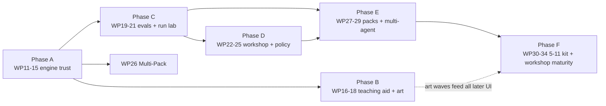

# 18 — Day 2 Roadmap: Phases, Work Packages & the Kit Line (Workstream 6)

> The prioritised, phased plan from today's V1.0 to the full ages 5–11 construction-kit line and the professional Workshop. Supersedes `09-ROADMAP.md` §4 ("Beyond V1.0"); the WP0–WP10 history in that document remains the record of what was built.
> Prerequisite reading: `12-…` (why this order), `13-…`/`14-…` (Phase A content), `15/16/17-…` (Phases B–D content), `19-…` (the control catalogue Phases D–F draw from).

> **Amended 2026-08-14:** status reconciliation. WP11, WP12 and WP13 shipped on 2026-08-13 but only WP14's row had been marked, so §3 and §7 disagreed with `main`. Now marked, with WP16 recorded as **in progress** (slices a+b landed) rather than untouched, and WP15 explicitly flagged **not started** — the commit `chore: WP15 tidy-up` is WP14's clean-up wearing a confusing label, and Phase A is therefore not closed. No plan or scope changed here; only the record of what is built.

---

## 1. Scope decision of record: where the product line ends

The kit line runs from **My Very First Agent (ages 2–5)** to the **Agent Builder constructor kit (ages 5–11)** — and stops there. The **AI Architect (ages 11+) kit is not a build target**: its box art remains brand lore and a source of ideas, but datasets/training/deployment-pipeline content will not be built as a children's product. Where AI Architect concepts are genuinely valuable — evaluation matrices, red-team cards, monitoring dashboards, permissions — they are delivered **in the Workshop (professional mode) only** (`17-…`), where they serve purpose 2 directly. This keeps the children's line achievable and the governance proving-ground ambitious, without either hostaging the other.

## 2. Priority logic

1. **Trust before features** (Phase A): the bot must behave credibly and the engine contract must open (D-register + C-causes + brick contract) before anything is built on top.
2. **The teaching aid is the priority audience-facing work** (Phase B, per Andrew's workstream 4 emphasis) — plus the art, which is the largest perceived-quality jump available.
3. **Measure before expanding** (Phase C): the eval harness and run history are the shared foundation both modes and all future packs depend on.
4. **The Workshop earns its keep early** (Phase D): policy cards + Run Lab turn the proving ground from promise to practice.
5. **Expansion packs ride on the opened contract** (Phases E–F): each pack is content, priced in days not weeks, because Phase A made bricks an extension point.

## 3. Phases and work packages

Numbering continues from WP10. Each WP is Claude-Code-sized with a DoD; one WP per branch/PR; deviations get dated notes in the affected doc (`10-…` §7 discipline unchanged).

### Phase A — Solid foundations (engine trust) — *do first*

| WP | Deliverable | DoD |
|---|---|---|
| WP11 | **Behaviour fixes C1–C8** (`14-…` E3, E4, E12 + card re-scope 16 §1.1 + no-repetition v2 + naming corpus) | ✅ **Done 2026-08-13.** Scripted-optimal solutions pass every non-expert card in budget; naming corpus ≥95%; loop-score regression fixtures green. The card re-scope added a seventh card (`starter/locked-chest-expert`, par 36) rather than leaving a flagship card unwinnable; **displaying par on the card holder was deferred to WP16** — the `par` data landed here and waits for the UI wave (see 16 §1.1) |
| WP12 | **Test estate gap-fill** (13 §L0–L2: fixtures, unit charters, dead-config audit, guardrail ordering, post-act test-first) | ✅ **Done 2026-08-13.** Coverage targets met; every 12-§3 defect has a failing-then-passing test or an accepted-risk note |
| WP13 | **Engine evolutions E1–E2, E5–E6, E8–E11** (post-act honoured, session I/O, single-sourced shapes, qualified ids, trace v2 + migrations, identity fields, retry) | ✅ **Done 2026-08-13.** Golden traces migrate v1→v2; audit-completeness test (13 §L5) passes. Landed as two commits — E1/E2/E5/E8–E11, then E6 (qualified world content ids) |
| WP14 | **The open brick contract** (`14-…` §2: BrickKindDefinition, spec v2, migrations; port all six starter bricks) | ✅ **Done 2026-08-13.** Golden trace byte-stable; `@craftabot/pack-monitor` builds and runs against the contract with no core edits. Delivered in slices 1, 2a–2c, 3a–3d, 4a–4c + the prototype. One deliberate behaviour change: a fitted Safety Brick's rules now always run, where they previously depended on the host compiling them (slice 3d) |
| WP15 | **Strategy seams E7** (MemoryStrategy/PromptStrategy; transcript realism mode) | ⚠️ **Not started.** Both strategies selectable in tests; transcript mode produces well-formed tool-result message sequences. **Do not read the commit `chore: WP15 tidy-up — delete the v1 window` (2026-08-13) as this WP** — that was WP14's own clean-up of `asLegacySpec`/`legacyBricks`, delivered in the WP14 branch and labelled "WP15 tidy-up" because `14-…` had flagged it as a follow-on. Neither `MemoryStrategy` nor `PromptStrategy` exists in the codebase |

### Phase B — Teaching-aid excellence (workstream 4 delivered)

| WP | Deliverable | DoD |
|---|---|---|
| WP16 | **P0 UX wave** (16 §1: winnable cards + par display, visible failures, story strip, run continuity/scrapbook/replay, nav + confirms, honest speed) | 🚧 **In progress — slices a+b landed 2026-08-13.** Sliced five ways: **a** the narrated tick model (`lib/narration/narrate.ts`, derived from events alone so one function narrates live *and* replayed runs) ✅; **b** visible failures + the story strip, incl. the play route's aria-live region — closes 16 §1.2/§1.3 and `12-…` D16's live-region half ✅; **c** chrome — nav header, delete confirm, eviction notice, par on the card holder (16 §1.5 + §1.1 remainder) ✅ landed 2026-08-14; **d** honest speed dial and a lively bot (16 §1.6) ⬜; **e** run continuity — persistence, Scrapbook, replay + scrubber (16 §1.4) ⬜. Natural order c → d → e; c and d are independent of each other and of e, and e depends on slice b's strip. DoD outstanding: 16 §1 acceptance tests green; **§1.3's usability check with a target-age reader and the moderated-session legibility check both need a human and a child — neither can be closed from a coding session** |
| WP17 | **P1 UX wave** (16 §2: safety centre-stage, tutorial gap-fixes, celebration/identity, naming chips, free play real, hearing input, a11y completion) | 16 §2 acceptance tests green; axe pass |
| WP18 | **Art production & swap-in** (the `11-…` manifest, waves 1–3; commission or produce per its checklist) | P0+P1 assets landed and swapped; silhouette/tint/contrast checks pass; `v1.0.0` tag finally cut on real art |

### Phase C — Measurement & shared foundations

| WP | Deliverable | DoD |
|---|---|---|
| WP19 | **Eval harness** (`@craftabot/evals`, 13 §8: matrix runner, scripted-noisy brains, metrics, EvalReport schema, nightly live lane) | Baselines recorded 6 cards × 3 cartridges × 20 seeds; scorecard in CI artefacts |
| WP20 | **Run Browser + Run Lab v1** (17 §3–4.3: read-only over persisted runs; replay, filters, inspectors, diff view) | A stored Kit run is fully forensicable in the Workshop; replay byte-consistent |
| WP21 | **Pack conformance kit** (`@craftabot/pack-testkit`, 13 §7) extracted from starter | Starter + openai pass it; a deliberately-broken fixture pack fails it usefully |

### Phase D — The Workshop earns its keep (purpose 2 in practice)

| WP | Deliverable | DoD |
|---|---|---|
| WP22 | **Policy cards end-to-end** (`14-…` §4.6 + 17 §4.5: schema, compiler, Studio, test bench, Kit rendering as collectible cards) | Efficacy suite proves each authored card; a card round-trips Kit ⇄ Workshop |
| WP23 | **Spec Lab + Bench Dashboard + Eval Matrix UI** (17 §4.1–4.4 over WP19 data) | Matrix run configured, executed, drilled to a single trace without leaving the Workshop |
| WP24 | **Safety brick v2 config** (risk tiers, `approval:'risky'`, autonomy dial, bounded budgets, token cap) | Brick-matrix + safety e2e extended; approval-fatigue scenario demonstrable |
| WP25 | **Governance scenarios v1** (19 #12/#11/#35: poisoned-sign injection card, lethal-trifecta level, approval-flood teaching moment — as goal cards + world content, both modes) | Each scenario runs scripted in CI; leaflet side-quests reference them |

### Phase E — Expansion era begins

| WP | Deliverable | DoD |
|---|---|---|
| WP26 | **LLM Multi-Pack** (Anthropic + Gemini + Ollama packs, persona cartridges, battery bay growth, Compare bench via 17 §4.3) | Conformance kit passes; compare view ships; expansion-shelf fiction becomes real acquisition flow |
| WP27 | **Monitor brick + Test Bench brick** (`14-…` §5.3/5.7 — the governance bricks first, per project identity) | Monitor flags surface in trace + Kit ticker; assertion cards runnable against any trace |
| WP28 | **Second world pack** ("The Workshop" room: new layouts, one irreversible action (paint!), risk tiers made vivid, new sense channel) | Conformance kit passes; two cards ship with par; art per manifest process |
| WP29 | **Multi-agent core** (`14-…` §6: SessionGroup, agent handles, scheduler, merged traces; Playroom v2 state) | Two scripted bots complete a co-op card deterministically; group trace replays |

### Phase F — The ages 5–11 constructor kit ("Agent Builder") assembled

| WP | Deliverable | DoD |
|---|---|---|
| WP30 | **Planner + If/Then bricks** (`14-…` §5.1–5.2) with their leaflet chapters (plan-visibly, rules-vs-thinking) | Failure→fix pairs scripted + e2e'd like chapters 1–6 |
| WP31 | **Radio brick + Robot Friends duo experience** (§5.4 + co-op goal cards + spoofed-message safety scenario) | Duo runs in Kit with two-bot bench; ASI07 scenario teachable |
| WP32 | **Librarian + Connector bricks** (§5.5–5.6) + scope-permission leaflet chapter | Retrieval + remote-capability lessons e2e'd; confused-deputy mini-scenario in Workshop |
| WP33 | **Identity badges + kit-line packaging** (§5.8; box art for each expansion pack; the 5–11 kit as a curated bundle of packs; export formats) | Every bot exports an agent card; kit line purchasable/installable as pack bundles |
| WP34 | **Workshop maturity** (telemetry dashboards, OTel-mapped export, safety-case worksheet, incident log — 19 #20/#23/#28/#31/#36) | Audit centre ships; a full governance demo (build → policy → run → incident → report) runs end-to-end |

## 4. The expansion-pack line (the merchandising map, ages 5–11)

Each pack = engine-ready content behind the Phase A contract; "needs" lists its earliest phase.

| Pack (box name) | Contents | Concepts taught | Needs |
|---|---|---|---|
| **LLM Multi-Pack** *(existing art)* | 6 persona cartridges across providers, compare chart | model choice; behaviour = model × config | E (WP26) |
| **Safety Patrol Pack** | Policy card deck, Monitor brick, incident stickers, scenario cards (poisoned sign, approval flood) | governance as play; loop/injection/oversight | D–E (WP22/25/27) |
| **Planner Pack** | Planner brick, If/Then brick, plan-paper accessories, harder par cards | deliberation, rules vs reasoning | F (WP30) |
| **Robot Friends Pack** | Radio brick, second chassis, co-op + spoofed-message cards | multi-agent co-op, comms trust | E–F (WP29/31) |
| **Explorer's World Pack** | The Workshop room world, new senses, irreversible paint action, risk-tier cards | environments, consequence, permissions | E (WP28) |
| **Library Pack** | Librarian brick, book sets, retrieval cards | looking things up, grounding, citation | F (WP32) |
| **Tool Shop Pack** | Extra tools (measuring tape, camera, walkie-talkie link to Radio) | tool contracts, choosing tools | E+ (content-only) |
| **Agent Builder — the 5–11 kit** | Curated bundle of the above + big-format leaflet + badge album | the full arc: plan · reason · use tools · test · improve | F (WP33) |

## 5. Dependency sketch

Phases B and C can run in parallel after A (different surfaces); D needs C; E needs D's policy plumbing for its governance bricks; F is the assembly.

## 6. Consolidated functionality-improvement priorities

**Teaching aid (workstream 4/6):** P0 = WP11+WP16 (behaviour + core UX); P1 = WP17+WP18 (depth + art); P2 = 16 §3 polish, then packs as delight (Safety Patrol first — it *is* the brand).
**Professional mode (workstream 5/6):** P0 = WP19–20 (measure + inspect); P1 = WP22–24 (author + prove policies); P2 = telemetry/export maturity (WP34). Controls adopted from the `19-…` catalogue in order: #6/#7 budgets+loops (done/A), #2/#3 approvals+tiers (D), #14 policy-as-code (D), #21 verdict telemetry (A/E8), #22 replay (C), #12/#11 injection scenarios (D), #27 monitor agent (E), #24 evals (C), #29/#30 agent cards/BOM (F), #20 OTel export (F).

## 7. Session-sized next steps (the immediate to-do)

1. ~~WP11 + WP12 together (behaviour fixes land with their tests)~~ — **done 2026-08-13**.
2. ~~WP13, then WP14 (contract) with the golden-trace migration gate~~ — **done 2026-08-13**. WP14 ran to twelve slices rather than the two sessions estimated here; the extra went on the workbench, which held six brick names in its tray, sockets, drag-and-drop, box lid and tutorial long after the engine had stopped caring.
3. **WP16 (P0 UX) — in progress.** Slices a, b and c are on `main`; **pick up at slice d** (§1.6, the honest speed dial), then e (§1.4, run continuity — the largest of the five). WP19's harness skeleton can still start in parallel. Note that WP15 (strategy seams E7) was **skipped**, not completed — see its row in §3 before assuming Phase A is closed.
4. Commission the art (WP18) now — it is the longest external lead time and blocks the tag.
5. Revisit this roadmap at the end of each phase; amendments get dated notes here, as ever.
