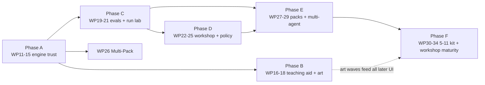

# 18 — Day 2 Roadmap: Phases, Work Packages & the Kit Line (Workstream 6)

> The prioritised, phased plan from today's V1.0 to the full ages 5–11 construction-kit line and the professional Workshop. Supersedes `09-ROADMAP.md` §4 ("Beyond V1.0"); the WP0–WP10 history in that document remains the record of what was built.
> Prerequisite reading: `12-…` (why this order), `13-…`/`14-…` (Phase A content), `15/16/17-…` (Phases B–D content), `19-…` (the control catalogue Phases D–F draw from).

> **Amended 2026-08-14:** status reconciliation. WP11, WP12 and WP13 shipped on 2026-08-13 but only WP14's row had been marked, so §3 and §7 disagreed with `main`. Now marked, with WP16 recorded as **in progress** (slices a+b landed) rather than untouched, and WP15 explicitly flagged **not started** — the commit `chore: WP15 tidy-up` is WP14's clean-up wearing a confusing label, and Phase A is therefore not closed. No plan or scope changed here; only the record of what is built.

---

## 1. Scope decision of record: where the product line ends

The kit line runs from **My Very First Agent (ages 2–5)** to the **Agent Builder constructor kit (ages 5–11)** — and stops there. The **AI Architect (ages 11+) kit is not a build target**: its box art remains brand lore and a source of ideas, but datasets/training/deployment-pipeline content will not be built as a children's product. Where AI Architect concepts are genuinely valuable — evaluation matrices, red-team cards, monitoring dashboards, permissions — they are delivered **in the Workshop (professional mode) only** (`17-…`), where they serve purpose 2 directly. This keeps the children's line achievable and the governance proving-ground ambitious, without either hostaging the other.

## 2. Priority logic

1. **Trust before features** (Phase A): the bot must behave credibly and the engine contract must open (D-register + C-causes + brick contract) before anything is built on top.
2. **The teaching aid is the priority audience-facing work** (Phase B, per Andrew's workstream 4 emphasis) — plus the art, which is the largest perceived-quality jump available.
3. **Measure before expanding** (Phase C): the eval harness and run history are the shared foundation both modes and all future packs depend on.
4. **The Workshop earns its keep early** (Phase D): policy cards + Run Lab turn the proving ground from promise to practice.
5. **Expansion packs ride on the opened contract** (Phases E–F): each pack is content, priced in days not weeks, because Phase A made bricks an extension point.

## 3. Phases and work packages

Numbering continues from WP10. Each WP is Claude-Code-sized with a DoD; one WP per branch/PR; deviations get dated notes in the affected doc (`10-…` §7 discipline unchanged).

### Phase A — Solid foundations (engine trust) — *do first*

| WP | Deliverable | DoD |
|---|---|---|
| WP11 | **Behaviour fixes C1–C8** (`14-…` E3, E4, E12 + card re-scope 16 §1.1 + no-repetition v2 + naming corpus) | ✅ **Done 2026-08-13.** Scripted-optimal solutions pass every non-expert card in budget; naming corpus ≥95%; loop-score regression fixtures green. The card re-scope added a seventh card (`starter/locked-chest-expert`, par 36) rather than leaving a flagship card unwinnable; **displaying par on the card holder was deferred to WP16** — the `par` data landed here and waits for the UI wave (see 16 §1.1) |
| WP12 | **Test estate gap-fill** (13 §L0–L2: fixtures, unit charters, dead-config audit, guardrail ordering, post-act test-first) | ✅ **Done 2026-08-13.** Coverage targets met; every 12-§3 defect has a failing-then-passing test or an accepted-risk note |
| WP13 | **Engine evolutions E1–E2, E5–E6, E8–E11** (post-act honoured, session I/O, single-sourced shapes, qualified ids, trace v2 + migrations, identity fields, retry) | ✅ **Done 2026-08-13.** Golden traces migrate v1→v2; audit-completeness test (13 §L5) passes. Landed as two commits — E1/E2/E5/E8–E11, then E6 (qualified world content ids) |
| WP14 | **The open brick contract** (`14-…` §2: BrickKindDefinition, spec v2, migrations; port all six starter bricks) | ✅ **Done 2026-08-13.** Golden trace byte-stable; `@craftabot/pack-monitor` builds and runs against the contract with no core edits. Delivered in slices 1, 2a–2c, 3a–3d, 4a–4c + the prototype. One deliberate behaviour change: a fitted Safety Brick's rules now always run, where they previously depended on the host compiling them (slice 3d) |
| WP15 | **Strategy seams E7** (MemoryStrategy/PromptStrategy; transcript realism mode) | ✅ **Done 2026-08-14.** Both seams exist and are selectable — from a spec via the Memory brick's `strategy` dial, and directly via `SessionOptions.strategies`, which is what the seam tests use. `transcript-v1` produces well-formed tool-result sequences, held as an invariant in **both** directions (no orphan results, no unanswered calls) over prompts real runs composed. Closes `12-…` D5 and D12, and with them **Phase A**. Three notes: only one *memory* implementation ships and that is deliberate (see the E7 amendment in `14-…` §3 — a transcript differs in rendering, not retention, and a delegating second strategy would be a fake seam); `chatMessageSchema` needed `toolCalls` before a transcript could be well-formed at all; and the default `sections-v1` path is byte-identical, the golden trace's only change being the new `run.started.strategies`. Note for the record that the earlier commit `chore: WP15 tidy-up — delete the v1 window` (2026-08-13) was **not** this WP — it was WP14's own clean-up, mislabelled |

### Phase B — Teaching-aid excellence (workstream 4 delivered)

| WP | Deliverable | DoD |
|---|---|---|
| WP16 | **P0 UX wave** (16 §1: winnable cards + par display, visible failures, story strip, run continuity/scrapbook/replay, nav + confirms, honest speed) | 🚧 **In progress — slices a+b landed 2026-08-13.** Sliced five ways: **a** the narrated tick model (`lib/narration/narrate.ts`, derived from events alone so one function narrates live *and* replayed runs) ✅; **b** visible failures + the story strip, incl. the play route's aria-live region — closes 16 §1.2/§1.3 and `12-…` D16's live-region half ✅; **c** chrome — nav header, delete confirm, eviction notice, par on the card holder (16 §1.5 + §1.1 remainder) ✅ landed 2026-08-14; **d** honest speed dial and a lively bot (16 §1.6) ✅ landed 2026-08-14 — needed a core seam, `AgentSession.setTickDelayMs`; **e** run continuity — persistence, Scrapbook, replay + scrubber (16 §1.4) ✅ landed 2026-08-14 — and found that **no run had ever been stored**: `putRun` was rejecting reactive proxies, unnoticed because nothing had ever read the `runs` store back. Natural order c → d → e; c and d are independent of each other and of e, and e depends on slice b's strip. DoD outstanding: 16 §1 acceptance tests green; **§1.3's usability check with a target-age reader and the moderated-session legibility check both need a human and a child — neither can be closed from a coding session** |
| WP17 | **P1 UX wave** (16 §2: safety centre-stage, tutorial gap-fixes, celebration/identity, naming chips, free play real, hearing input, a11y completion) | ✅ **Done 2026-08-14.** Sliced five ways: **a** a11y completion + the axe harness (16 §2.7) ✅; **b** free play made real + hearing (§2.5, §2.6) ✅ landed 2026-08-14 — the §2.5 "E-fix" was a real defect: the goal a child wrote had never reached the prompt (`12-…` D10); **c** safety centre stage (§2.1) ✅ landed 2026-08-14 — the ticker and the approval card; the brick glow and stamp FX are deferred with reasons recorded in 16 §2.1; **d** celebration/identity + naming chips (§2.3, §2.4) ✅ landed 2026-08-14 — box art, the trace-derived end-card hint, three sound cues and the "did it mean?" chips; confetti, Teddy-happy and the first-success sound prompt deferred with reasons in 16 §2.3; **e** tutorial gap-fixes (§2.2) ✅ landed 2026-08-14 — a seventh chapter for the dials, the coverage invariant that found they were untaught, the prompt-row spotlight, the badge name and the trace legend; the quick tour deferred with a reason in 16 §2.2 Slice a's axe pass exposed an app-wide contrast fault (`04-…` §2.3); the remaining DoD is 16 §2 acceptance tests |
| WP18 | **Art production & swap-in** (the `11-…` manifest, waves 1–3; commission or produce per its checklist). **Wave 1 is specified in `20-ART-COMMISSION-BRIEF.md`** — the artefacts WP16/17 designed against and could not draw, with canvases, paths and the drop-in contract. Note that brief's §4: there is no asset loader today, so each group needs a small piece of swap-in code as well as the art | 🚧 **Wave 1 done 2026-08-15; waves 2–3 outstanding.** The 28 artefacts landed with their own validator report (`22-…`), and the eight swap-ins followed the same day in three commits: **a** the inlining primitive + the whole Playroom — faces, poses, items, furniture, the chest's three states, Teddy, the backdrop; **b** the five FX, which WP16 §1.2/§2.1 and WP17 §2.3 had all deferred for want of art; **c** the box sticker and the badge rosette. `20-…` §8.1's four-fold `--cab-u` trap closed in the same pass. Two of that brief's opening questions remain open and neither blocks: **§8.2** (`assets-src/` in-repo or on a drive) and **§8.3** (the typeface, which still blocks brand category A). **The `v1.0.0` tag now waits on waves 2–3 only** — `20-…` §6 lists the eight manifest categories deliberately left unspecified, and `22-…` §3.1's letter-block silhouette question wants an answer before wave 2's tooling is written |

### Phase C — Measurement & shared foundations

| WP | Deliverable | DoD |
|---|---|---|
| WP19 | **Eval harness** (`@craftabot/evals`, 13 §8: matrix runner, scripted-noisy brains, metrics, EvalReport schema, nightly live lane) | 🚧 **Scripted lanes done 2026-08-15; live lane outstanding.** Five slices: **a** the scripted-optimal plans moved out of `solvability.test.ts` into a new `@craftabot/pack-starter/testing` subpath, so the matrix's floor is the one the solvability suite proves; **b** the metrics fold, from the trace and nothing else; **c** both scripted brains; **d** the matrix runner and the schema-versioned `EvalReport`; **e** baselines, the diff gate and the markdown scorecard, behind `npm run evals`. Baselines recorded and committed for 6 cards × 2 scripted tiers × 20 seeds, plus the expert card on its own budget. **The DoD's "3 cartridges" is a live-API requirement**: the starter pack ships none, so the three are OpenAI's Quick/Deep/Penny Thinker and those 360 runs need a key and a spend cap. `runMatrix` refuses a live column without a provider rather than falling back to the mock and filing scripted numbers under a real model's name |
| WP20 | **Run Browser + Run Lab v1** (17 §3–4.3: read-only over persisted runs; replay, filters, inspectors, diff view) | 🚧 **Read-only forensics done 2026-08-15; compare view outstanding.** Four slices: **a** the Workshop shell — `/workshop`, the rail, and the `data-mode="workshop"` token layer (surfaces and typography only); **b** the Run Browser over the run store, with trace import; **c** the Run Lab — world + scrubber, tick-grouped timeline with lane/failure/text filters, structured inspector with raw JSON one click away, and a recomputed `✓ trace integrity` badge; **d** the prompt diff, which is `17-…` §3's memory-window lesson made visible. **DoD met**: an e2e builds and plays a run in the Kit, then examines it in the Workshop with no export or conversion — and replay is byte-consistent by construction, because both modes fold the same events with the same `projectThrough`. **Outstanding**: §4.3's multi-select Compare (side-by-side synced scrubbing), and §3's breakpoints and live-run trailing, which want a live session rather than a stored one |
| WP21 | **Pack conformance kit** (`@craftabot/pack-testkit`, 13 §7) extracted from starter | ✅ **Done 2026-08-16.** Assertion library + Vitest adapter, both pack-agnostic (ESLint-restricted to depend only on `@craftabot/core`, same rule `@craftabot/governance` carries). Starter and openai each pass it via their own `contract.test.ts`; the kit's own suite proves a deliberately-broken fixture pack fails every category with a useful message. Two `13-…` §7 bullets — semver range evaluation, cartridge-defaults-consumed — check machinery that has not shipped in `core` yet and are deliberately left unchecked rather than faked; full accounting in `13-…` §7's dated amendment |

### Phase D — The Workshop earns its keep (purpose 2 in practice)

| WP | Deliverable | DoD |
|---|---|---|
| WP22 | **Policy cards end-to-end** (`14-…` §4.6 + 17 §4.5: schema, compiler, Studio, test bench, Kit rendering as collectible cards) | ✅ **Done 2026-08-16.** Six slices: **a** the `PolicyCard` contract in core (schema, registry, the `BrickRuntimeContext.getPolicyCard` seam a policy card needed that a tool/action id never did) ✅; **b** `compilePolicyCard` in governance ✅; **c** three real starter cards (one per disposition) fitted on `starter/safety`, proven by an L5 efficacy suite driving a scripted adversarial run at each ✅; **d** the Kit's picker — cards render as toy cards (`PolicyCardChip`), not checkbox rows ✅; **e** the Policy Studio at `/workshop/policies` — rule builder, live preview, library, test bench part (a) ✅; **f** test bench part (b) and the round-trip e2e ✅. Both DoD halves met: the efficacy suite proves each shipped card, and a card fitted through the real Kit bench reads back in the Spec Lab (which gained a "Policy cards fitted" section) with no export or conversion. Not built, with reasons in `17-…` §4.5: a persistence store letting a *Studio-authored* card become Kit-pickable — the round trip proven is pack-shipped-card-fitted-in-Kit-reads-back-in-Workshop, not the reverse |
| WP23 | **Spec Lab + Bench Dashboard + Eval Matrix UI** (17 §4.1–4.4 over WP19 data) | ✅ **Done 2026-08-15.** Three slices: **a** the Eval Matrix over WP19's runner — configure, execute in the browser, sequential single-hue success grid, scorecard, and a cell drilled down to one run in the Run Lab (the DoD, walked by an e2e); **b** the Bench Dashboard — fleet table with the Kit's socket strip and stat tiles from the run store; **c** the Spec Lab — build checks, the kit-file contract made visible, and the whole `AgentSpec` as JSON. Found and fixed three real bugs on the way: a frozen tab (scripted awaits never yield a macrotask), every matrix cell sharing one `runId` (so §4.4's join key joined everything to everything), and a success tile quoting a denominator its own rate had not used. Deliberately not built, with reasons in `17-…` §4.4: live tiers (no spend cap), baseline diffs in the UI (needs browser-side baseline storage), and §4.2's editable baseplate (the Kit's bench already is that) |
| WP24 | **Safety brick v2 config** (risk tiers, `approval:'risky'`, autonomy dial, bounded budgets, token cap) | ✅ **Done 2026-08-16.** Six slices: **a** `riskTier: 'observe'\|'reversible'\|'irreversible'` metadata on `ToolMetadata`/`WorldActionDefinition`, starter content tagged (`open` is the Playroom's one `reversible` action; `notebook_write` the one `reversible` tool) ✅; **b** governance gained `createTokenBudgetGuardrail` and reworked `createApprovalModeGuardrail` to take a mode plus an injected risk-tier predicate, keeping the package ignorant of what a risk tier *is* ✅; **c** the Safety Brick's v2 config schema (`approval` replacing `approvalMode`, `maxTokens?`, `autonomy?`) and — the real structural find — wiring up `migrateBrickConfig`, the `configVersion`/`migrateConfig` contract mechanism `14-…` §2 had always declared and nothing had ever called ✅; **d** `starter/safety` wired to all of it, plus the approval-fatigue efficacy test (`'everything'` pauses 5/5 actions in a mixed run, `'risky'` pauses 1/5) ✅; **e** the Kit `SafetyPanel`'s boolean toggle became a three-way radio, a spending-limit rocker joined it, and the leaflet's chapter 6 gained a step teaching it ✅; **f** this row ✅. DoD met on both halves: `brick-matrix.test.ts` gained a token-budget and an approval-fatigue test, `safety-brick.spec.ts` gained a "risky mode does not ask about a plain move" e2e proof, and the fatigue numbers above are the demonstrable scenario. Found and fixed in passing: the workbench's `updateBrick` patched a brick's stored config without migrating it first, so an edit to a pre-WP24 bot's Safety Brick would have been silently reverted the next time its config migrated — closed at the same `migrateBrickConfig` seam. Not built, and recorded rather than dropped: a Workshop UI for the `autonomy` preset dial — it is schema-real and documented (writes concrete `approval`/budget values at pick-time, like `identity.displayName`), but no picker exists yet; `13-…`'s note that "tool risk-tier metadata... flows to approval tiering" is now true. |
| WP25 | **Governance scenarios v1** (19 #12/#11/#35: poisoned-sign injection card, lethal-trifecta level, approval-flood teaching moment — as goal cards + world content, both modes) | ✅ **Done 2026-08-16.** Six slices: **a** world content — two manual entries (a poisoned sign, a private code), two layouts, a `no-secrets-out-loud` policy card scoped to the exact leak text, a `hello-said-secret-kept` predicate ✅; **b** two new goal cards, "The warning sign" and "Keep the secret", each with a scripted-optimal plan (ignoring the sign is always the safe, optimal solve) ✅; **c** `governance-scenarios.test.ts` — five scripted proofs: an undefended hijack that abandons the real goal, a blocklist that holds even though the model still read the sign, an unremoved trifecta that leaks the code despite the friendly half landing, a policy card that removes just the exfiltration leg and lets the goal still succeed, and the approval-fatigue count run against `starter/tidy-the-blocks`'s own plan (`'everything'`: 10 pauses; `'risky'`: 1) ✅; **d** side quests — a mechanism named in docs since WP17 and never built until now, deliberately lighter than a chapter (no anchor, no badge), referencing all three from the leaflet's badge sheet ✅; **e** this row + `16-…`'s dated note ✅; **f** full gate ✅. DoD met on both halves: all five scenario tests are scripted and run in CI, and the badge sheet's new section references all three. Scope decision: the busy-bot scenario reuses `starter/tidy-the-blocks` rather than new content — its lesson is the Safety Brick's `approval` dial, already built and proven in WP24, so the WP25 content is the packaging and the reference, not a re-proof of the mechanism. |

### Phase E — Expansion era begins

| WP | Deliverable | DoD |
|---|---|---|
| WP26 | **LLM Multi-Pack** (Anthropic + Gemini + Ollama packs, persona cartridges, battery bay growth, Compare bench via 17 §4.3) | ✅ **Done 2026-08-18 — every piece named in this row has shipped.** Landed across five slices in one session once the user asked directly for "the models other than OpenAI": **a** a provider registry seam in core (`ProviderFactory`, `PackManifest.providers`, `PackRegistry.getProviderFactory`), replacing `brain.ts`'s hardcoded `if (providerId === OPENAI_PROVIDER_ID)` — which had been silently running the demo brain for any provider it did not recognise — and generalising the battery-bay UI, which turned out to already be provider-parameterised underneath and only needed Settings to iterate instead of hardcoding one compartment; **b** `@craftabot/pack-anthropic` (Messages API); **c** `@craftabot/pack-gemini` (`streamGenerateContent`, key in `x-goog-api-key` never the URL — hard rule 2); **d** `@craftabot/pack-ollama` (keyless, OpenAI-compatible `/v1/chat/completions` on `localhost:11434`, friendly copy for "not pulled" and "not running"); **e** docs. Each provider pack proved out with its own thorough unit suite (error-kind coverage, streaming assembly, key-scrubbing) plus a real e2e test per provider driving a full build → battery → Playroom run against a stubbed server. Full accounting of what shipped and the real wire-format differences between all three is in `06-…` §8's closing dated amendment. |
| WP27 | **Monitor brick + Test Bench brick** (`14-…` §5.3/5.7 — the governance bricks first, per project identity) | ✅ **Done 2026-08-18, in two sessions.** Monitor half done 2026-08-16: `@craftabot/pack-monitor`'s Watchbot — built in WP14 purely to prove the open brick contract, and deliberately left uninstalled — now joins `installedPacks`. Nothing in the workbench needed writing for it: the tray, the socket, the schema-driven panel and the trace all already worked generically, which was WP14's whole point. It occupies the same `safety` slot as `starter/safety` (swap one for the other) rather than the reference design's target "2nd chest socket", which needs a new core slot and chassis art that do not exist yet — recorded as deferred, not dropped, in `14-…` §5.3. Test Bench half done 2026-08-18: a Workshop-only screen (`/workshop/bench`, `17-…` §4.7), not a chassis brick at all — the row's own "bench accessory (not on robot)" turned out to mean exactly that, so no tray, socket or core brick-kind registration was needed, and this stayed the small slice the Monitor half already proved most of the workbench surface is generic enough to absorb for free. `AssertionCard` (core) reuses WP22's `PredicateExpr`; `evaluateAssertion` (`@craftabot/evals`, a new dependency on `@craftabot/governance`) folds a run's completed calls through it. Five built-in cards, written against real starter/Workshop content rather than invented ones. |
| WP28 | **Second world pack** ("The Workshop" room: new layouts, one irreversible action (paint!), risk tiers made vivid, new sense channel) | ✅ **Done 2026-08-16.** `@craftabot/pack-workshop`: a 6×5 room, `move` + `paint` (the first `riskTier: 'irreversible'` content anywhere), a `smell` sense channel, two goal cards ("Find the paint pot", par 3; "Paint the birdhouse blue", par 10) each proven by a scripted-optimal plan run through the real session engine. Ships no bricks of its own — a builder fits `starter`'s Hands & Wheels and Eyes & Ears and enables the Workshop's action/sense ids on them, the only shape a v1 spec's fixed brick keys can resolve to. Registered in `installedPacks` alongside `starter`/`openai`/`monitor`/`demo`; conformance kit and full package test suite (65 tests, 100% on `predicates.ts`/`actions.ts`) both pass. One design bug caught before it shipped: `paint` originally required the bot within reach of *both* the target and the pot at once, which a room with them in opposite corners can never satisfy — fixed by having the bot collect paint passively on proximity to the pot (`bot.hasPaint`, never cleared, the pot is bottomless) rather than needing it re-fetched each time. A second, larger finding is recorded in `14-…`'s dated amendment: `WorldView` was not actually generic over `WorldState` despite the type being nominally opaque, fixed by extracting a shared `GridWorldState` into `@craftabot/core` (user's explicit architectural choice among three options presented) rather than a pack-level workaround. |
| WP29 | **Multi-agent core** (`14-…` §6: SessionGroup, agent handles, scheduler, merged traces; Playroom v2 state) | ✅ **Done 2026-08-19.** DoD met exactly as the roadmap states it: two scripted bots (`starter/tidy-together`, `pack-starter/src/session/group-solvability.test.ts`) complete a co-op card deterministically at 12 rounds against a 26-tick solo par, and the group trace replays — both the merged stream and every member's own — byte-identically across repeat runs. Built to the letter of **`23-MULTI-AGENT-DESIGN.md`**, its own design of record, across seven independently-gated stages: **A** the world-injection seam (`CreateSessionDeps.world?`, `SessionOptions.parentRunId?`), proven byte-identical against the golden trace before anything else was built on it; **B** `AgentHandle`/`WorldInstance.forAgent?`/`GridWorldState.agents?` — types only, dormant; **C** `SessionGroup` itself (round-robin scheduling, the merged stream, the `19-…` §7.2 orchestrator chokepoint as running code, `group.started`/`group.finished` added to the event catalogue), proven against a hand-built fake world; **D** the Playroom's own `forAgent` — the seat-swap facade trick, under which collision detection and fellow-agent observation fell out of one extended function (`blockerAt`) for free; **E** the DoD itself as executable tests, split honestly across `pack-starter` (the `SessionGroup` proof) and `apps/workbench` (the `projectThrough` replay proof, since that fold is workbench-only by hard rule 1) — the design's own "point of no return worth pausing at for review before any UI work"; **F** persistence (`RunRecord.groupRunId?`, a new `GroupRunRecord` store) and a minimal Workshop surface (grouped Run Browser rows, a group-aware Run Lab, `WorldView` drawing fellow robots plainly), seeded through a real, reusable `window.craftabot.recordGroupEpisode` entry point since no Kit UI exists yet to seed one through; **G** this row. A dedicated post-stage-E verification pass (not one of the seven stages, done because the user asked for one before UI work began) found and fixed one real bug — a repeated `stepRound()` call after a guardrail trip or `stop()` silently reported the wrong outcome — and one real, honestly-scoped gap (the Hearing channel's queue is one per room, not one per seat; no shipped card exercises it). Every divergence between the design and what actually got built is logged, dated, in `23-…` §8; the additive-only property held throughout — a single-agent bot, card, kit file, stored run and trace all behave exactly as they did before this WP, with no migration performed or required. Kit-facing duo UX remains explicitly WP31's, un-started, per the design's own boundary. |

### Phase F — The ages 5–11 constructor kit ("Agent Builder") assembled

| WP | Deliverable | DoD |
|---|---|---|
| WP30 | **Planner + If/Then bricks** (`14-…` §5.1–5.2) with their leaflet chapters (plan-visibly, rules-vs-thinking) | ✅ **Done 2026-08-20.** Both halves shipped, each across its own gated stages. Planner (§5.1): the brick, its checklist live in the Playroom, and its own eighth leaflet chapter ("Think it through") — `14-…` §5.1's own dated amendment carries the close-out, including the one real core widening it needed (`contributeState`/`brick.state`, `02-…` §7) and two pre-existing leaflet bugs its own e2e walk surfaced. If/Then (§5.2): the reflex mechanism (`contributeReflex`, a genuine new core hook, not a config channel), the brick itself — fitted to a new `reflexes` socket after "share `mobility` with Actions" was proven wrong by a real build error — and its own ninth leaflet chapter ("Skip the thinking"); `14-…` §5.2's own dated amendments carry the close-out, including the socket correction and two bugs found live walking the chapter in the browser (a qualified-vs-wire-name mismatch in the Kit panel, and a chapter-transition staleness bug in the leaflet controller, fixed at the root in `leaflet.svelte.ts`). `18-…` §7 items 25–26 carry both halves' own entries. Phase F now has WP30 and WP31 fully done, and WP33 half done; WP32 and WP34 remain. |
| WP31 | **Radio brick + Robot Friends duo experience** (§5.4 + co-op goal cards + spoofed-message safety scenario) | ✅ **Done 2026-08-20.** Duo runs in the Kit with a real two-bot bench; the ASI07 scenario (`starter/party-line`) is teachable — a real card, scripted both ways, proven in CI. Built to **`24-ROBOT-FRIENDS-DESIGN.md`**, its own design of record (2026-08-19), across eight independently-gated stages: **A** `createGroupSessionView` proven against a real `SessionGroup`; **B** the duo Play route, reached by hand before any picker existed; **C** narration's actor-naming, additive and byte-identical for every solo case; **D** live persistence into the Scrapbook and the Workshop's Run Browser; **E** the Robot Friends entry point — the bench lever and the coop-card picker, the inverse of the Kit's existing filter; **F** the Radio brick — `radio_send`, the `radio` sense channel, per-agent delivery cursors that close the Hearing channel's own known drop (`23-…` §9), which needed one small, deliberate core extension (`BrickRuntime.contributeWorldConfig?()`/`WorldInstance.configure?()`) the design doc did not first anticipate; **G** the ASI07 scenario itself, reusing `keep-the-secret`'s exact lethal-trifecta shape and its existing policy card rather than inventing either fresh; **H** this row. Every divergence between the design and what actually got built is logged, dated, in `24-…` §8, the same discipline `23-…` §8 held to for WP29; the additive-only property held throughout — a solo bot, card, run and trace all behave exactly as they did before this WP. Phase F now has WP31 done; WP30 (Planner + If/Then) and WP32–34 (Librarian/Connector, kit-line packaging, Workshop maturity) remain. |
| WP32 | **Librarian + Connector bricks** (§5.5–5.6) + scope-permission leaflet chapter | ✅ **Done 2026-08-21.** Both bricks shipped, each a new registered kind against the open contract, no core change either needed. Four stages: **A** the Librarian brick (`memory`'s second kind — `books: string[]`, one retrieval tool per book, offered only for a book actually on the shelf); **B** the Connector brick (`equipment`'s third kind — `serviceId` controls reach via `contributeCalls`, `scopes` controls authority via a `contributeGuardrails`-built tool blocklist, `@craftabot/governance`'s new sibling `createToolBlocklistGuardrail`); **C** the Librarian's own tenth leaflet chapter, "Ask before you guess," on a genuinely new goal card (`starter/hiding-spot`) — the first chapter that needed one, since every earlier chapter's lesson fit a card already in the pack; **D** the confused-deputy mini-scenario named in §5.6's own row (`19-…` §4.5 #38) — `starter/false-alarm`, built as a `SIDE_QUESTS` entry rather than a leaflet chapter, matching WP25's three other solo scenario cards, with `session/false-alarm.test.ts` proving the lesson concretely over both scope configurations. `18-…` §7 item 27 carries the full close-out; `14-…` §5.5/§5.6 carry no dated amendment for A/B (both shipped as specified) and one each for C and D. One scope note: the original stage-C plan named "leaflet chapters" (plural) for both bricks; only the Librarian's got one — Connector's own lesson turned out to fit the lighter side-quest shape better, and stage D built that instead of a second chapter. Phase F now has WP30, WP31 and WP32 fully done; only WP33's kit-line-packaging half and WP34 remain, neither dependent on the other. |
| WP33 | **Identity badges + kit-line packaging** (§5.8; box art for each expansion pack; the 5–11 kit as a curated bundle of packs; export formats) | ✅ **Done 2026-08-21.** Identity badge half done 2026-08-20 (Passport) — every bot exports an Agent Card, `14-…` §5.8's own dated amendment carries the close-out. Kit-line packaging half done 2026-08-21: the Shelf's "Expansion packs" section, one hardcoded LLM Multi-Pack block since V1.0, is now data-driven (`expansion-packs.ts`) over §4's own merchandising table — all seven packs, plus a distinct "Agent Builder" bundle box naming what it curates (every pack, the Leaflet, the badge album — the last two already shipped, so this is presentation, not new mechanics). One real finding, checked rather than assumed: Tool Shop Pack's own content (measuring tape, camera, walkie-talkie link) does not exist in any pack, unlike the other six, which all trace to a real WP — it ships marked `coming-soon`, not `unlocked`, the one honest exception among the seven. "Export formats" shipped nothing beyond the identity badge's own Agent Card export — a restatement of that half, not a second deliverable. `14-…` §5.8's own dated amendment carries the full close-out; `18-…` §7 item 29 too. Phase F is now fully closed — WP30, WP31, WP32, WP33 and WP34 all done. |
| WP34 | **Workshop maturity** (telemetry dashboards, OTel-mapped export, safety-case worksheet, incident log — 19 #20/#23/#28/#31/#36) | ✅ **Done 2026-08-21.** Four new Workshop screens, each a new registered kind of nothing — no core change, no new mechanism, at any stage. **A** `/telemetry` (§4.6, `19-…` #36): cross-run breakdowns by goal card and by cartridge (success/loop rate, mean ticks/tokens), the guardrail trip mix, and autonomy stats (approval rate, interruptions) — all pure aggregation over stored runs/events, no invented cost figure, matching the Bench Dashboard's own "a governance tool that invents a number is the one thing it must never be." **B** `/incidents` (`19-…` #31): derived, not authored — every stored run carrying at least one `timeline.ts`-flagged failing event, tagged by kind, quoted from the event's own payload. **C** `/safety-case` (`19-…` #28): a "why is this bot safe?" worksheet in UK AISI's own inability/control/trustworthiness shape, auto-assembled per bot from real evidence (the irreversible-tier catalogue vs. `BotCapabilities`, `guardrailIds` verbatim, stage B's own `incidentsFrom` scoped to one bot). **D** `/export`, the Audit Centre (`19-…` #20): the capstone — an OTel-mapped trace export (best-effort against the still-experimental GenAI semantic conventions: `invoke_agent`/`chat`/`execute_tool` spans, guardrail catches as `gen_ai.evaluation.result` events, no fabricated durations), alongside the existing Agent Card export and links to the safety case and incident log. `18-…` §7 item 28 carries the full close-out; `17-…` §4.7–§4.10 carry each screen's own dated amendment (§4.7/Test Bench predates this WP; §4.8–§4.10 are new). Two real scope gaps, recorded rather than hidden: `19-…` #23's "behavioural drift dashboard" asks for trend-*over-time* — stage A's own telemetry is a current-state breakdown, not a time series, so drift/change detection did not ship; and `23-MULTI-AGENT-DESIGN.md` §4.7/`07-…` §5 had both named "group trace export with digest" as this WP's own job when WP29 deferred it here — the Audit Centre picks from the solo `RunRecord` list alone, so a group episode still exports only one member's own trace, not the merged one, and both docs now carry a dated amendment saying so rather than pointing at a phase that closed without it. Phase F now has WP30, WP31, WP32 and WP34 fully done; only WP33's kit-line-packaging half remains before the phase closes. |

### Phase G — Hosted controls (the governance proving ground meets a real host) — *opened 2026-09-01*

> **Added 2026-09-01.** Phases A–F closed the product line `§1` drew. Phase G is new scope, opened by a fresh planning pass rather than assumed: the first brick whose policy is decided *outside* the browser, by a hosted service the builder does not author. It stops where `§1` stops — no AI Architect box — and adds nothing to the Kit arc.

| WP | Deliverable | DoD |
|---|---|---|
| WP35 | **The Armour Brick** (`25-ARMOUR-BRICK.md`) — Google Cloud Model Armor as a Workshop-only second kind in the `safety` socket (`geap/armor`, `@craftabot/pack-geap`), composed with the local governance floor; the credential/network seams on the brick contract; `guardrail.external`; `checkWithRecord` keeping guardrails pure (`19-…` #9/#10/#12 in hosted form) | Five gated stages, `25-…` §11: **A** library + fixtures, offline; **B** Workshop lane through `CreateSessionDeps.guardrails` with a *real* Model Armor verdict stopping `starter/warning-sign`, CORS/latency measured; **C** core seams (`fetch`/`getCredential`/`hasCredential`/`credential`/`audience`); **D** the brick, Workshop-gated tray, golden trace byte-stable under `offline`; **E** OAuth-token battery compartment, `docs/geap-setup.md`, `smoke:geap`, key-leak gate with a planted token. Acceptance: `25-…` §12 |

## 4. The expansion-pack line (the merchandising map, ages 5–11)

Each pack = engine-ready content behind the Phase A contract; "needs" lists its earliest phase.

| Pack (box name) | Contents | Concepts taught | Needs |
|---|---|---|---|
| **LLM Multi-Pack** *(existing art)* | 6 persona cartridges across providers, compare chart | model choice; behaviour = model × config | E (WP26) |
| **Safety Patrol Pack** | Policy card deck, Monitor brick, incident stickers, scenario cards (poisoned sign, approval flood) | governance as play; loop/injection/oversight | D–E (WP22/25/27) |
| **Planner Pack** | Planner brick, If/Then brick, plan-paper accessories, harder par cards | deliberation, rules vs reasoning | F (WP30) |
| **Robot Friends Pack** | Radio brick, second chassis, co-op + spoofed-message cards | multi-agent co-op, comms trust | E–F (WP29/31) |
| **Explorer's World Pack** | The Workshop room world, new senses, irreversible paint action, risk-tier cards | environments, consequence, permissions | E (WP28) |
| **Library Pack** | Librarian brick, book sets, retrieval cards | looking things up, grounding, citation | F (WP32) |
| **Tool Shop Pack** | Extra tools (measuring tape, camera, walkie-talkie link to Radio) | tool contracts, choosing tools | E+ (content-only) |
| **Agent Builder — the 5–11 kit** | Curated bundle of the above + big-format leaflet + badge album | the full arc: plan · reason · use tools · test · improve | F (WP33) |

## 5. Dependency sketch

Phases B and C can run in parallel after A (different surfaces); D needs C; E needs D's policy plumbing for its governance bricks; F is the assembly.

## 6. Consolidated functionality-improvement priorities

**Teaching aid (workstream 4/6):** P0 = WP11+WP16 (behaviour + core UX); P1 = WP17+WP18 (depth + art); P2 = 16 §3 polish, then packs as delight (Safety Patrol first — it *is* the brand).
**Professional mode (workstream 5/6):** P0 = WP19–20 (measure + inspect); P1 = WP22–24 (author + prove policies); P2 = telemetry/export maturity (WP34). Controls adopted from the `19-…` catalogue in order: #6/#7 budgets+loops (done/A), #2/#3 approvals+tiers (D), #14 policy-as-code (D), #21 verdict telemetry (A/E8), #22 replay (C), #12/#11 injection scenarios (D), #27 monitor agent (E), #24 evals (C), #29/#30 agent cards/BOM (F), #20 OTel export (F).

## 7. Session-sized next steps (the immediate to-do)

1. ~~WP11 + WP12 together (behaviour fixes land with their tests)~~ — **done 2026-08-13**.
2. ~~WP13, then WP14 (contract) with the golden-trace migration gate~~ — **done 2026-08-13**. WP14 ran to twelve slices rather than the two sessions estimated here; the extra went on the workbench, which held six brick names in its tray, sockets, drag-and-drop, box lid and tutorial long after the engine had stopped caring.
3. ~~WP16 (P0 UX)~~ — **all five slices on `main` as of 2026-08-14.** Everything in WP16 a coding session can close is closed. What remains is not code: §1.3's usability check with a target-age reader and the DoD's moderated-session legibility check, both of which need a human and a child. One design item is deliberately unbuilt — §1.4's leave-mid-run confirm, which was a safety net for a problem that no longer exists now the run is saved as it happens, and should be re-judged rather than inherited. WP19's harness skeleton can still start in parallel. (This step used to warn that WP15 had been skipped and Phase A was therefore not closed; it has since landed — see step 4.)
4. ~~WP15 (strategy seams E7)~~ — **done 2026-08-14**, so **Phase A is now genuinely closed**: all twelve engine evolutions E1–E12 have landed and the engine-and-governance defect register D1–D13 is fully accounted for. WP17's leaflet-coverage invariant earned its keep here, catching the new `memory.strategy` field the moment it appeared and forcing a written, *enforced* exemption rather than a silent one.
5. ~~Commission the art (WP18) now — it is the longest external lead time and blocks the tag.~~ — **wave 1 done 2026-08-15**, art and swap-in both. The lead time never materialised: the artwork was produced in-house against `21-…`'s plan and the swap-in took three commits. What it did surface is that "there is no asset pipeline" (`20-…` §4) was the accurate half of that brief and "it is small" was the optimistic half — the eight swaps were small, but the *inlining* question underneath them (a template drawn seven times cannot carry seven copies of the same id) was not in anybody's plan. Next art decision is `22-…` §3.1 before wave 2 tooling.
6. **WP19's scripted lanes are done (2026-08-15)**, so Phase C is open. Two things fell out of building it. The harness found a real defect in its own first scorecard — the Sums card was running with no Tool Belt, scoring 50 % wasted ticks on a plan the solvability suite proves wastes none, and *still passing*, because the card only asks that Teddy be told the right answer. And the scripted-noisy gradient across the six cards (80 % → 45 % → 20 % → 15 % as the plans lengthen) is the concrete legibility measure `16-…` §4 wanted and never had.
7. ~~Next: **WP20** (Run Browser + Run Lab)~~ — **read-only forensics done 2026-08-15**. The **live lane** still needs a spend decision before it can produce the numbers WP19's DoD names; it is the only part of Phase C that cannot be finished from a coding session.
8. **WP23 done 2026-08-15**, so Phase D has its measurement surfaces. The Workshop now has four screens — Bench, Runs, Run Lab, Evals, Spec Lab — and the pattern held every time: the screen was small because the data model was already right. The Eval Matrix is ~300 lines because `@craftabot/evals` already had the runner, the metrics and the report; the Run Lab was small because `projectThrough` already existed. **Every screen that has been cheap was cheap for the same reason**, which is the argument for doing WP21 (the conformance kit) before more UI.
9. Two findings from WP20 worth carrying: the Workshop skin failed the contrast bar on its first build (a rail at 3.2:1, in the mode `15-…` §7 rule 5 says is explicitly *not* exempt), so `contrast.test.ts` now audits both token layers rather than reading the first declaration in the file twice; and the shared-fold architecture paid off exactly as designed — the Run Lab needed no new reducer, no new store and no conversion step, which is why "replay byte-consistent" needed no test to establish, only one to keep.
10. **WP21 done 2026-08-16**, so **Phase C is fully closed** — WP19, WP20 and WP21 have all landed (WP19's live lane and WP20's compare view remain open, but both are named exceptions, not blockers). The pack-conformance kit turned up the same shape of finding WP19 and WP20 each did: two of `13-…` §7's own checks (semver ranges, cartridge-defaults-consumed) describe engine machinery that does not exist yet, and the kit says so rather than pretending to check it — see the dated amendment in `13-…` §7. With Phase C closed, Phase D's next open item is **WP22** (policy cards end-to-end); WP24 and WP25 are the other two.
11. **WP22 done 2026-08-16.** A `PolicyCard` compiles to ordinary guardrails through a seam that had to be added rather than reused: `contributeCalls` lets a brick *offer* a tool or action id and have core resolve it later, but a policy card must already be a live `Guardrail` by the time `contributeGuardrails` returns one, so `BrickRuntimeContext` gained a `getPolicyCard` lookup — every existing call site across core, starter and the workbench needed the same one-line fix, caught immediately by the type checker and, separately, by starter's own dead-config audit flagging the new schema field as unprobed. The efficacy suite and the Policy Studio's test bench both proved out cleanly against the three starter cards; what did not fit in this WP's scope was letting the Studio's own authored drafts become Kit-pickable, which needs a real content-persistence decision and is recorded rather than quietly dropped (`17-…` §4.5). Phase D now has three of five WPs done (WP20/WP23/WP22); WP24 (Safety Brick v2 config) and WP25 (governance scenarios) remain, and WP24 in particular now has a natural next question: whether `approval:'risky'` and policy cards' `require-approval` disposition are the same mechanism wearing two names, or genuinely two.
12. Revisit this roadmap at the end of each phase; amendments get dated notes here, as ever.
13. **WP24 done 2026-08-16.** Answers item 11's open question: `approval:'risky'` and a policy card's `require-approval` are genuinely two mechanisms, not one wearing two names. The dial is blanket and metadata-driven — every action whose `riskTier` is `reversible` or above pauses, full stop — while a card's rule is named and predicate-scoped, firing only for the exact `when` it names (`ASK_BEFORE_OPENING` gates `open` and nothing else). They compose rather than collapse: on the Playroom's one `reversible` action (`open`) both currently agree, but a second irreversible action would make the difference visible — the dial would catch it automatically, a card would need writing. The other real finding was structural rather than about safety itself: `BrickKindDefinition.configVersion`/`migrateConfig` had been part of the open brick contract since `14-…` §2 but nothing had ever called `migrateConfig` — every kind had shipped at version 1. The Safety Brick's `approvalMode → approval` rename needed it for real, which turned up a second, genuinely latent bug while wiring it: the workbench's `updateBrick` patched a brick's *stored* (unmigrated) config directly, so an edit to a bot fitted before this WP would have been silently overwritten the next time its config was migrated. Both are fixed at the one seam (`migrateBrickConfig`, called wherever a config is read for display, validated, or written back). Scope boundary, recorded rather than dropped: the `autonomy` preset dial is schema-real and documented but has no Workshop UI in this WP — it is designed to write concrete `approval`/budget values at pick-time (the same shape `AgentSpecV2.name`/`identity.displayName` already uses), and building that picker is future Workshop work, not part of WP24's DoD. Phase D now has four of five WPs done; WP25 (governance scenarios) remains.
14. **WP25 done 2026-08-16, closing Phase D.** All three `19-…` scenarios (#11/#12/#35) ship as real goal cards proven by scripted CI runs, not documentation describing a threat in the abstract — the same "prove it against real content" discipline the L5 efficacy suites (WP22) and the approval-fatigue test (WP24) already established. Two findings worth carrying: first, "side-quest" turned out to be a name three separate docs had been using since WP17 for a mechanism nobody had actually built — every real gap up to now got a full chapter instead, so the term sat unchallenged until a piece of content (three optional governance scenarios) finally did not belong in the numbered arc and needed the lighter thing the word had always implied. Second, the lethal-trifecta card's defense reuses WP22's policy-card mechanism rather than the Safety Brick's blocklist, and had to: a blanket `blockedActions: ['say']` would have blocked the legitimate "say hello" alongside the leak, since both travel through the same action. A policy card's `argument-equals` predicate scopes the block to the exact leak text instead — "remove one leg" only reads as a lesson if the other two still work afterwards, which is the same reasoning that shaped `approval:'risky'`'s own riskTier scoping in WP24. Phase D is now fully closed (WP20/22/23/24/25 all shipped); Phase E (WP26–29, expansion era) is next.
15. **WP27's Monitor half done 2026-08-16 (Phase E begun).** The find worth recording: shipping it was almost entirely *not writing code*. `@craftabot/pack-monitor` was built in WP14 to prove the open brick contract needed no core changes for a genuinely new kind of brick, and it proved something larger than WP14 asked for — every workbench surface a brick touches (tray, socket, schema-driven panel, trace) turned out to already be generic enough that "install a pack" and "ship a brick" are the same action. The two lines in `packs.ts` were the whole diff; the e2e proof and the docs were the rest of the WP. One real scope decision, not a finding: the reference design's target socket for the Monitor ("2nd chest socket", so it runs *alongside* the Safety Brick rather than instead of it) needs a new core slot and chassis art, neither of which exist, so it ships swap-only in the existing `safety` slot instead — see the dated note in `14-…` §5.3. The Test Bench brick (§5.7) did not ship with it; it is a bench accessory, not a chassis brick, and building its UI paradigm from nothing is its own WP, not a rider on this one.
16. **WP28 done 2026-08-16.** The Workshop is the second world pack, and `paint` is the first `riskTier: 'irreversible'` content anywhere — both predicted in `14-…` §4.5 since WP24 and now real. The bigger find was not in the new pack but in the old assumption underneath it: `WorldView.svelte` imported `PlayroomState` from `@craftabot/pack-starter` directly, so `WorldState`'s opacity at the engine level was fiction as far as rendering was concerned, and a second world could not have been drawn at all as first scoped. This was consequential and hard to reverse enough to ask rather than decide alone — three options went to the user (pack-level adapter, a generic-renderer rewrite, or extracting a shared `GridWorldState` into core) and the third was chosen: `pack-starter`'s `PlayroomState` now aliases onto core's shape with zero behavioural change (694 workbench tests stayed green), and `pack-workshop` implements the same shape independently. `WorldView` imports from `@craftabot/core` now, never from a pack — the reusable win `18-…`'s WP29 (multi-agent) inherits for free. Second finding, caught while writing the world's own content rather than after: the `paint` action's first draft required the bot within reach of *both* the paint pot and the target at once, which a room with them in opposite corners (deliberate, so the Workshop draws through `WorldView`'s honest plain-grid fallback rather than borrowing the Playroom's backdrop by coincidence) can never satisfy. Fixed before any test ran, by having paint collect passively on proximity to the pot rather than needing the pot present at the moment of use. Phase E now has WP27 (half) and WP28 done; WP26 (LLM Multi-Pack, next) and WP29 (multi-agent core) remain, and WP29 in particular now has `GridWorldState` and the `bot: {position}` → `agents: AgentState[]` migration path (`14-…` §6) sitting on firmer ground than before this WP.
17. **WP26's Compare view done 2026-08-16, scoped down before it was built rather than mid-way through.** Research sized the full WP26 as described (three provider packs, persona cartridges, battery-bay UI) at comparable to or larger than WP29 — a second oversized estimate in a row — and rather than either committing to it silently or picking arbitrarily, the choice went back to the user with the concrete finding, the same way the WorldView architecture fork did in WP28. The answer both times was the same shape: ship the one piece that was actually small (here, Compare; there, the `GridWorldState` extraction) and record the rest as deferred rather than dropped. Compare reuses everything that already existed — the Run Browser table, `WorldView`, and `projectThrough` (the same fold the Kit's live view and the Run Lab already share, so the two panels cannot disagree about a tick any more than the Kit and the Run Lab can) — which is why this slice needed no new reducer and no new rendering code, only a route and a selection affordance. Phase E now has WP26 (Compare only), WP27 (Monitor only) and WP28 done; the three provider packs, the Test Bench brick, and multi-agent core (WP29) all remain, each recorded with why it did not ship rather than left silently unstarted.
18. **Bug fix, 2026-08-16: the offline app shell (`01-…` §8) was answering navigations for origins it no longer had anything to do with.** User report: running `npm run preview`/`dev` for an *unrelated* repo showed Craft A Bot's own pages instead, surviving the Craft A Bot server process being killed. Root cause was `service-worker.ts`'s fetch handler treating a navigation to `/` exactly like a hashed static asset — cache-first, cache hit wins outright. That is correct for the hashed JS/CSS the shell is built from (the URL changes whenever the content does, so a hit is always right), but `/` never changes URL, and a service worker registration is scoped to an **origin** (`localhost:4173`, Vite's own preview default and about the most commonly reused local port there is), not to this app. Once this shell was precached there, `cache.match('/')` answered every future navigation to that origin from cache, forever — including a different project's dev or preview server binding the same port long after this one's process exited; that project's real page was never reached because the stale cache answered first. Fixed by splitting the strategy: navigations go network-first (a live server, this app's or anyone else's, always wins; the cache answers `/` only when nothing does), hashed assets stay cache-first as before. `polish.spec.ts` gained a regression test — proven to fail against the old code first, by literally reverting the fix and re-running it — that poisons the cached `/` entry and confirms a reload still reaches the live app rather than the stale document. Existing users need the currently-stuck service worker(s) cleared manually once (DevTools → Application → Service Workers → Unregister, for whichever `localhost` ports were affected); the fix only reaches a browser the next time it fetches this project's own updated `service-worker.js`, which a browser only ever does by revisiting this project, never by visiting whatever else now shares that port.
19. **WP27 fully closed, 2026-08-18: the Test Bench half shipped, sized honestly before building rather than after.** Unlike WP26 and WP29 (item 17 and the still-open WP29 row), this one did not need a scope-down: `14-…` §5.7's own description — "bench accessory (not on robot)" — meant no chassis-brick machinery was needed at all, so the whole slice was a schema (`AssertionCard`, reusing WP22's `PredicateExpr` rather than a second condition language), one new fold (`evaluateAssertion` in `@craftabot/evals`, over the same `action.performed`/`tool.executed` events the metrics fold already reads), and a Workshop screen following the Compare page's own pattern (`?run=` query param, a picker, `appStorage()`). The one real finding: `PredicateExpr`'s exact-match `argument-equals` cannot express "said something like a greeting", only "said this literal phrase" — every built-in card is written against a literal a real scripted plan actually sends, the same discipline `starter/policy-cards.ts` already followed, rather than against free text a card author might expect to fuzzy-match. Phase E now has WP27 and WP28 fully done, and WP26 (Compare only) partially done; the three LLM provider packs, persona cartridges, battery-bay UI, and WP29 (multi-agent core) all remain, each already recorded above with why it did not ship rather than left silently unstarted.
20. **WP26's persona cartridges done, 2026-08-18 — a scope-down that cut the other way from usual.** The first two times this roadmap sized a WP wrong (items 16 and 17), the fix was "ship the one piece that turned out small, defer the rest." This time the finding ran the other direction on the way in: persona cartridges *looked* entangled with the same open questions as the three provider packs (which personas bind to which providers, a design decision with no obvious answer) — but the box art's "behaviour = model × configuration, not just model" line turned out to mean exactly what it said. All six personas ride the OpenAI provider that already exists; nothing about "does the bot feel different" needed a second provider, only a personality string reaching the prompt (a field `starter/llm` already had) and a cartridge's own defaults actually being applied when picked (a dead-config gap, not a missing feature — `13-…` §7 had already named it "gated on work that has not shipped," and this WP was that work). The real constraint was a live-API fact from `06-…` §6a: the GPT-5 family 400s on any non-default temperature, so "personality" had to be free text, not a dial. Phase E now has WP27 and WP28 fully done, WP26 two-thirds done (Compare, personas); the three provider packs, battery-bay UI, and WP29 remain, each recorded with why.
21. **WP26 fully closed, same day (2026-08-18) — the user asked directly for "the models other than OpenAI," and the remainder turned out to divide cleanly rather than needing another scope-down.** The genuine hard part named in items 17 and 20 — "three separate wire-protocol integrations, each roughly the size the OpenAI pack itself was" — was correct, and got built as three, each with its own full unit suite and a real e2e proof against a stubbed server. What made the whole thing tractable in one session was finding the actual shared prerequisite first: `brain.ts` had never been a seam at all, just an `if` naming OpenAI — worth fixing regardless of how many providers ever arrived, and once fixed (`ProviderFactory`, `PackRegistry.getProviderFactory`), each provider pack was purely additive, no further app-level wiring per pack beyond one line in `installedPacks`. Three findings a session that only built one provider would not have surfaced: Gemini's key must go in a header, never its own docs' default `?key=` query parameter, or hard rule 2 breaks the moment a second provider exists; Ollama's two everyday failures (server not running, model not pulled) needed their own copy because none of the other three packs' failure modes fit them; and the battery-bay UI's state layer had been provider-generic since it was written, so "grow it to N compartments" was a Settings-page change, not the redesign its own roadmap line implied. Phase E now has WP26, WP27 and WP28 all fully done; only WP29 (multi-agent core) remains, and its own sizing (7–9 slices, `18-…` §3) has not been re-checked since — the same honest-sizing pass this WP and WP27 both did should happen before assuming that number is still right.
22. **WP29 done 2026-08-19, closing Phase E.** Item 21's own challenge — re-check the sizing before trusting it — was answered first, not skipped: a full design of record, `23-MULTI-AGENT-DESIGN.md`, re-derived the estimate at seven stages against the real codebase (not the `14-…` §6 sketch's memory of it) before any of them were built, and the estimate held — seven stages shipped, none grew enough mid-flight to need the "stop and re-size" escape hatch the design itself set up. Each stage landed as its own gated commit: **A** proved the world-injection seam byte-identical against the golden trace *before* anything used it; **B** added the multi-agent vocabulary (`AgentHandle`, `forAgent?`, `agents?`) as dormant types, zero behaviour change; **C** built `SessionGroup` — round-robin scheduling, the merged event stream, and the `19-…` §7.2 orchestrator chokepoint as running code for the first time — against a hand-built fake world, nothing pack-specific yet; **D** the Playroom opted in, and the seat-swap facade trick turned out to make collision detection and fellow-agent observation free side effects of one extended function rather than two features to build; **E** the roadmap's own DoD sentence became executable tests, split honestly across `pack-starter` (the `SessionGroup` proof) and the workbench (`projectThrough`'s replay proof, since that fold cannot legally live in a pack) — and surfaced a genuine, worth-keeping finding: a member whose own plan finishes early stops learning what its groupmates do afterward, "a shared goal does not mean shared understanding" made mechanical rather than designed away; **F** persistence and a minimal Workshop surface, seeded through a real `window.craftabot.recordGroupEpisode` entry point (there being no Kit UI yet to seed one through) rather than throwaway test scaffolding; **G** this entry. A dedicated verification pass between E and F — not one of the seven stages, run because the size and risk of this WP made "check before building UI on top of it" worth doing explicitly — found and fixed one real bug (a repeated `stepRound()` call after a non-natural finish silently returned the wrong outcome) that no stage's own tests happened to exercise. Phase E is now fully closed (WP26/27/28/29 all done); Phase F (WP30–34, the Agent Builder kit) is next, and WP31 in particular — the Kit-facing Robot Friends duo bench — is the WP this one was deliberately scoped to make possible without reopening any core contract, per `23-…` §5.1.
23. **WP31 done 2026-08-20, the first WP of Phase F.** Built to `24-ROBOT-FRIENDS-DESIGN.md`, the design of record written the day WP29 closed, against eight independently-gated stages (A–H, one per session, the same rhythm `23-…` held to across its own seven). Duo runs in the Kit with a real two-bot bench; the ASI07 scenario (`starter/party-line`) is teachable — a real card, scripted both ways, proven in CI. Two findings worth carrying forward. First, stage F's own claim that Radio needed "nothing here is a new *mechanism*" (hard rule 4) turned out to be wrong: a brick's `channel`/`allowFrom` config has to reach the *world* for both sending and receiving, and the open brick contract had no door for that, since `AgentHandle` is deliberately identity-only ("a world learns *who* is asking; *what bricks they have fitted* stays entirely inside the session"). The fix was a small, symmetric extension to the existing optional-hook pattern — `BrickRuntime.contributeWorldConfig?()`, collected once per session into a new `WorldInstance.configure?()` — found and justified as a deliberate core change rather than routed around as a pack workaround, which is what the rule actually asks for. Second, Radio's own tray entry surfaced a genuine, pre-existing e2e gap: `PartsTray.svelte` has no scroll containment, and an eighth tray item was enough to push later baseplate sockets below a standard test viewport, silently breaking `build-mouse.spec.ts`'s coordinate-based drag (Playwright does not auto-scroll for raw `page.mouse.move`, unlike `.click()`). Fixed at the test-infrastructure layer — scroll each drag endpoint into view before reading its bounding box — rather than production CSS: an independently-scrollable tray is a real UX decision, left for whichever future WP next grows the catalogue (Planner, Librarian, Connector all still to come). The ASI07 scenario itself (stage G) needed no new mechanism at all: it reuses `keep-the-secret`'s exact lethal-trifecta shape and its existing `no-secrets-out-loud` policy card verbatim, changing only the request leg's delivery vector — which is also what keeps the card solo-winnable under `solvability.test.ts`'s blanket rule that every card, `coop` ones included, ships a scripted-optimal plan a lone bot can run to `SUCCESS`. Every divergence between the design and what actually got built is logged, dated, in `24-…` §8, the same discipline `23-…` §8 held to for WP29; the additive-only property held throughout — a solo bot, card, run and trace all behave exactly as they did before this WP. Phase F now has WP31 done; WP30 (Planner + If/Then, no dependency on WP31, available any time) and WP32–34 (Librarian/Connector, kit-line packaging, Workshop maturity) remain.
24. **WP33's identity badge (Passport) done 2026-08-20 — the other half of the row, kit-line packaging, recorded as blocked rather than built.** Sized down before it started, the same "ship the real small piece, defer the rest" move as WP26 and WP27: the row bundled a bot-level transparency artefact with box art and pack bundling, and only the first had anything to build yet. Four small stages, no design-of-record doc needed — `buildAgentCard` in core, the Passport view sharing `BrickPanel`'s own flip mechanism, "Export Passport" on the Shelf, this entry — each landing on its own full-gate pass. The genuinely new finding: reusing `describeFitted` for "permissions" (the row's own word) rather than inventing a pack-specific field core would have had to interpret, which is what hard rule 4 asks for and the more expensive-looking option would not have given. The blocked half is not a gap nobody noticed — kit-line packaging needs WP30/WP32's actual bricks to exist before there is a bundle to curate, and "purchasable" has no mechanism to build against in an app with no backend and no accounts (`00-…` §3.5). `14-…` §5.8's own dated amendment carries the full close-out, naming-collision decision included (**Passport**, not "Identity badge" — the leaflet's existing Merit badges feature already owns that word). Phase F now has WP31 fully done and WP33 half done (identity badge); WP30, WP32, and the rest of WP33 (kit-line packaging) remain, plus WP34, none dependent on each other.
25. **WP30's Planner half done 2026-08-20 — §5.1 shipped, §5.2 (If/Then) not started.** Five stages, each its own gated commit: **A** the dormant `planner` socket — `SLOT_IDS`, chassis art, nothing fittable yet; **B** the brick itself, `make_plan`/`check_off_step` offered independent of the Tools brick, plan state living entirely in the brick's own runtime closure; **C** the checklist made live in the Playroom; **D** the leaflet's own eighth chapter, "Think it through," e2e'd in full per this row's own DoD rather than only reached the way chapter 7 was; **E** this entry. `14-…` §5.1's own dated amendment carries the full close-out. The one genuine core widening: `contributeState?(): unknown` on `BrickRuntime`, feeding a new `brick.state` event (`02-…` §7) — found while building stage C, because a pack-contributed brick's own internal state has no core-privileged home the way Memory's does, and reading it back out of `tool.executed`'s raw tool-call args would have silently disagreed with the brick's own trimmed/clamped/validated belief (a plan longer than `maxSteps`, an out-of-range check-off) the instant either happened. Stage D's own build surfaced two pre-existing bugs nothing had ever tripped, because chapter 7 had never been walked start-to-finish in a browser before: `apps/workbench`'s settings schema hard-capped `tutorialChapter` at 6, throwing inside the very call that awards a chapter's badge the moment an eighth chapter existed to finish; and the leaflet's own header still read "Chapter N of 6," stale since chapter 7 shipped in WP17. Both fixed in the same PR — the cap dropped outright rather than bumped to 8, since `chapterByNumber` already treats "past the end" as "no such chapter" and a hard cap was never a real invariant, only a second count to keep in step with `CHAPTERS.length`. Phase F now has WP31 fully done, WP33 half done, and WP30 half done (Planner); WP30's own other half (If/Then, §5.2) needs a fresh sizing pass against the post-stage-B codebase before anyone picks it up, the same "re-derive before building" discipline `23-…`/`24-…` held to for their own WPs — the chassis now genuinely has a second brain-adjacent socket, which was an open question `14-…` itself flagged before this WP started and is one no longer. WP32 and WP34 remain untouched.
26. **WP30 fully done 2026-08-20 — the If/Then half (§5.2) shipped, closing the WP.** Four stages, one per session: **A** the reflex mechanism itself (`contributeReflex`, a genuine new core hook — the row's own "evaluated before the brain" turned out to need one, not a config channel — proven against fixture bricks only, no If/Then content yet); **B** the brick — a rule list matched by case-insensitive substring against `Observation.text` (the condition language sizing had leaned toward reusing `PredicateExpr` for; that turned out wrong, since `PredicateExpr` is deliberately scoped to a proposed call plus usage facts and cannot reach world state at all), and a real socket correction found by a failing build check: every socket is single-occupancy regardless of how many kinds are registered for it, so "share `mobility` with Actions" (this WP's own sizing conclusion, `14-…` §5.2's earlier amendment) was wrong, and If/Then got a new `reflexes` socket instead, mirroring the Planner's own `planner`-socket precedent from earlier in this WP; **C** the leaflet's own ninth chapter, "Skip the thinking," e2e'd in full, reusing "Tidy the blocks" rather than a new card; **D** this entry. `14-…` §5.2's own dated amendments carry the full close-out, including two more bugs found live walking stage C's own chapter in a real browser rather than only in the chapter model: the Kit panel had stored a rule's target by its qualified registry id, which fired correctly as a reflex and then failed at the world (`world.perform` only ever sees the wire name a brain-driven call carries); and a chapter whose own *last* step is itself a `latch` could be satisfied by the *previous* chapter's own leftover run evidence rather than anything the reader did — fixed at the root, in `leaflet.svelte.ts`'s `advanceIfComplete`, which now clears a finished chapter's own run evidence on every chapter change. WP30 is the first Phase F work package to ship in full across two separately-sized halves under one WP number. Worth remembering for whoever sizes WP32 next: this WP's own sizing pass called the `reflexes` socket "free" with real-sounding reasoning (`mobility` has no core-owned slot contract, and `equipment` already holds two kinds) — and a failing build check is what actually settled it, not the reasoning. Phase F now has WP30 and WP31 fully done, and WP33 half done; WP32 and WP34 remain, neither dependent on the other.
27. **WP32 fully done 2026-08-21 — Librarian and Connector bricks, and both their own teaching content.** Four stages, one per session, no §7 entry along the way — this is the first one, at the WP's own close: **A** the Librarian brick (`memory`'s second kind, a builder's choice against Scrapbook — `books: string[]` selects a subset of a small fixed catalogue, `world/bookshelf.ts`, the same shape the Tools brick's own `enabled` already used, and one retrieval tool per book rather than one tool with an argument, since `ToolContext` carries nothing brick-specific for a shared tool's own `execute()` to key off); **B** the Connector brick (`equipment`'s third kind — a deliberate two-layer model, `serviceId` controlling *reach* through `contributeCalls` and `scopes` controlling *authority* through a `contributeGuardrails`-built tool blocklist, `@craftabot/governance`'s new `createToolBlocklistGuardrail`, the exact mirror of the pre-existing action blocklist); **C** the Librarian's own tenth leaflet chapter, "Ask before you guess" — the first chapter needing a genuinely new goal card (`starter/hiding-spot`), since every chapter before it reused one already in the pack; **D** the confused-deputy mini-scenario §5.6's own row named (`19-…` §4.5 #38) — `starter/false-alarm`, shipped as a `SIDE_QUESTS` entry rather than a leaflet chapter, the same lightweight shape WP25's other three solo scenario cards use, with a poisoned tool *result* (the Weather Line's own `forecast` reply) rather than a room prop carrying the injected suggestion — the textbook shape of both tool poisoning and a confused-deputy attempt at once. Neither brick needed a single core change: `contributeCalls`/`contributeGuardrails` were already exactly the hooks each one needed, confirming the sizing pass's own guess. `session/false-alarm.test.ts` proves stage D's lesson concretely, over both scope configurations, the same scripted-contrast shape `party-line.test.ts` used for ASI07. One scope note, recorded rather than silently dropped: stage C's own original plan named "leaflet chapters" (plural) for both bricks; only the Librarian's shipped one, and Connector's own lesson found the side-quest shape a better fit instead. `14-…` §5.5 carries no dated amendment (shipped as specified); §5.6 carries one, for stage D's own concrete shape. Phase F now has WP30, WP31 and WP32 fully done; WP33's kit-line-packaging half is unblocked as of this WP and not yet started, and WP34 is untouched — neither depends on the other.
28. **WP34 fully done 2026-08-21 — Workshop maturity, four screens across four sessions, closing the WP.** Each stage reused everything the ones before it built, deliberately in this order — telemetry and incidents first because the safety case and the audit centre both needed something real to hold against a bot rather than an empty store: **A** `/telemetry` (§4.6, `19-…` #36) — cross-run breakdowns by goal card and cartridge, the guardrail trip mix, and autonomy stats, all pure aggregation with no invented cost figure; **B** `/incidents` (`19-…` #31) — derived from `timeline.ts`'s own `isFailure`, no separate store, no authoring UI, the same discipline the Test Bench's assertion cards already set; **C** `/safety-case` (`19-…` #28) — a "why is this bot safe?" worksheet in UK AISI's own inability/control/trustworthiness shape, the newest design surface in the WP, assembled from the irreversible-tier catalogue vs. `BotCapabilities`, `guardrailIds` verbatim, and stage B's own `incidentsFrom` reused rather than reimplemented; **D** `/export`, the Audit Centre (`19-…` #20) — the capstone, an OTel-mapped trace export (best-effort against the still-experimental GenAI semantic conventions, zero-width spans rather than a fabricated duration) alongside the existing Agent Card export and links to C and B's own screens; **E** this entry. Not one stage needed a core change or a new mechanism — `BotCapabilities`, the world/tool catalogues' own `riskTier`, and the trace itself were already everything every screen needed, the same "the open contract already had the hook" property WP32 found for its own bricks. Two genuinely new screens beyond §2's original eight (`/incidents`, `/safety-case`) were retrofitted into `17-…` the same way Test Bench was in WP27 — new numbered subsections (§4.8, §4.9), each with its own dated note, plus a filled-in §4.10 for the Audit Centre, which the original IA always named but never detailed. Two real scope gaps, recorded rather than silently dropped. First, `19-…` #23's own "behavioural drift dashboard" asks for trend-*over-time*; stage A's telemetry is a current-state breakdown, not a time series, so drift/change detection did not ship — a fair target for whoever next touches `/telemetry`, not a WP34 promise broken. Second, and more pointed: `23-MULTI-AGENT-DESIGN.md` §4.7 and `07-…` §5 had both explicitly named "group trace export with digest" as *this WP's own job* when WP29 deferred it here in 2026-08-19 — it did not ship, because the Audit Centre's own run picker reads `storage.listRuns()` alone, the same solo list the Run Browser's ungrouped rows use, and never lists a `GroupRunRecord`; a group episode's own member run, picked individually, still exports only its own trace. Found only by reading the cross-references those two docs carried rather than trusting this WP's own row in isolation — both now carry their own dated amendment saying so, rather than continuing to point at a phase that has since closed without it. Phase F now has WP30, WP31, WP32 and WP34 fully done; only WP33's own kit-line-packaging half remains before the phase closes, and nothing blocks it any longer.
29. **WP33 fully done 2026-08-21 — kit-line packaging, the row's other half, closing both the WP and Phase F.** One stage: the Shelf's own "Expansion packs" section, one hardcoded LLM Multi-Pack block since V1.0, made data-driven (`expansion-packs.ts`) over §4's own merchandising table — all seven packs, each with the same "Unlocked!" honesty every other WP33 artefact holds to (`00-…` §3.5: no accounts, no purchase gate, nothing to actually lock), plus a distinct "Agent Builder" bundle box naming what it curates: every pack above, the Instruction Leaflet, and the badge album — the last two already shipped, so this was presentation over real content, not new mechanics, the same shape stage C's own leaflet chapters and stage D's own Agent Card reuse took throughout this phase. One real finding, checked rather than assumed while building the pack list against the actual packs: Tool Shop Pack's own content (measuring tape, camera, walkie-talkie link to Radio) does not exist anywhere, unlike the other six, which each trace to a real shipped WP — §4 always scoped it "E+ (content-only)", unscheduled, and this is the first place that was checked rather than left implicit. It ships marked `coming-soon`, not `unlocked` — the Workshop rail's own "shown, honestly labelled, not hidden" discipline for pending screens, applied here to a pending pack instead. "Export formats," the row's third phrase, shipped nothing new: it is a restatement of the identity badge's own Agent Card export from this WP's first half, recorded as such rather than treated as a second deliverable nobody built. `14-…` §5.8's own dated amendment carries the full close-out. **Phase F is now fully closed** — WP30, WP31, WP32, WP33 and WP34 all done — and the roadmap's forward plan (`18-…`) has nothing left it names.
30. **Phase G opened 2026-09-01 with WP35, the Armour Brick — nothing built yet.** Two study documents (a survey of the Gemini Enterprise Agent Platform's API-callable controls, and a Model Armor capability study) found exactly one GEAP control a browser-hosted bot can call per request as a decision service — Model Armor — and that every useful GEAP control needs an OAuth token, not an API key. `25-ARMOUR-BRICK.md` is the design of record, sized honestly before building in the `23-…`/`24-…` mould: five stages, the go/no-go on direct browser calls (CORS is undocumented for the regional hosts) taken at Stage B on real traffic against the owner's own project, and a proxy fallback that changes one field if it goes the other way. Decisions of record D1–D5 (`ask` by default at `pre-act`; Workshop-only via an `audience` gate on the existing Workshop preference; guardrails stay pure via `checkWithRecord`; owner-funded free-tier live lane; `europe-west2` default). Stage A is next.
31. **WP35 substantively built 2026-09-01, across all five of its own stages — not yet closed.** `25-ARMOUR-BRICK.md` §8 carries every stage's own dated note; this is the honest summary, not a "fully done" claim, because one is not warranted yet. **A** (library) through **D** (the fitted `geap/armor` kind, Workshop-only, verified live in the browser in both directions of the Kit/Workshop gate) are complete and green — `pack-geap`'s own suite plus the whole workspace's stay green throughout every stage, `turbo run check`/`test`/`build` all clean. **E** built the credential/network operator surface — the `geap-credential.svelte.ts` state module and its own Settings compartment (a real Google Identity Services `initTokenClient` integration, every path around it unit-tested via an injected script-loader and a mocked `window.google`, verified live in the browser both with the Workshop door shut and open), the key-leak sweep's own `geap` entry, `docs/geap-setup.md`, and `smoke:geap` (confirmed to build and skip gracefully with no env vars set — a real bug this stage's own build caught and fixed: Stage A's fixture import needed `with { type: 'json' }` to survive Node's native ESM loader, invisible to every Vitest-run suite that had exercised the same code path since). What genuinely remains, spanning stages B through E rather than belonging to any one of them: the live checkpoint against a real Google Cloud project — "a real Model Armor verdict," CORS/latency numbers and the direct-vs-proxy go/no-go (stage B's own DoD), and "one real `europe-west2` call succeeds from the built app" (stage E's own DoD) — deferred twice by the project owner's own explicit choice ("build first, sort GCP later"), not by any technical blocker this session found. `docs/geap-setup.md` §2 gives the fastest path to closing it (`gcloud auth print-access-token`, no OAuth client id required); running `smoke:geap` against a real project, or fitting the brick and pressing "Test the guard," is what turns this into a real WP35 close-out entry.
