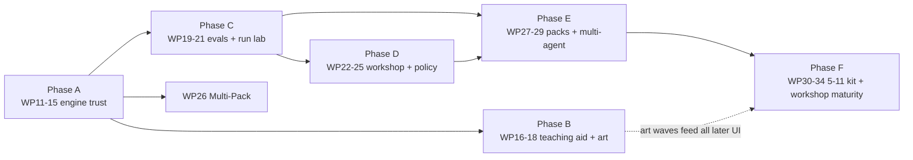

# 18 — Day 2 Roadmap: Phases, Work Packages & the Kit Line (Workstream 6)

> The prioritised, phased plan from today's V1.0 to the full ages 5–11 construction-kit line and the professional Workshop. Supersedes `09-ROADMAP.md` §4 ("Beyond V1.0"); the WP0–WP10 history in that document remains the record of what was built.
> Prerequisite reading: `12-…` (why this order), `13-…`/`14-…` (Phase A content), `15/16/17-…` (Phases B–D content), `19-…` (the control catalogue Phases D–F draw from).

> **Amended 2026-08-14:** status reconciliation. WP11, WP12 and WP13 shipped on 2026-08-13 but only WP14's row had been marked, so §3 and §7 disagreed with `main`. Now marked, with WP16 recorded as **in progress** (slices a+b landed) rather than untouched, and WP15 explicitly flagged **not started** — the commit `chore: WP15 tidy-up` is WP14's clean-up wearing a confusing label, and Phase A is therefore not closed. No plan or scope changed here; only the record of what is built.

---

## 1. Scope decision of record: where the product line ends

The kit line runs from **My Very First Agent (ages 2–5)** to the **Agent Builder constructor kit (ages 5–11)** — and stops there. The **AI Architect (ages 11+) kit is not a build target**: its box art remains brand lore and a source of ideas, but datasets/training/deployment-pipeline content will not be built as a children's product. Where AI Architect concepts are genuinely valuable — evaluation matrices, red-team cards, monitoring dashboards, permissions — they are delivered **in the Workshop (professional mode) only** (`17-…`), where they serve purpose 2 directly. This keeps the children's line achievable and the governance proving-ground ambitious, without either hostaging the other.

## 2. Priority logic

1. **Trust before features** (Phase A): the bot must behave credibly and the engine contract must open (D-register + C-causes + brick contract) before anything is built on top.
2. **The teaching aid is the priority audience-facing work** (Phase B, per Andrew's workstream 4 emphasis) — plus the art, which is the largest perceived-quality jump available.
3. **Measure before expanding** (Phase C): the eval harness and run history are the shared foundation both modes and all future packs depend on.
4. **The Workshop earns its keep early** (Phase D): policy cards + Run Lab turn the proving ground from promise to practice.
5. **Expansion packs ride on the opened contract** (Phases E–F): each pack is content, priced in days not weeks, because Phase A made bricks an extension point.

## 3. Phases and work packages

Numbering continues from WP10. Each WP is Claude-Code-sized with a DoD; one WP per branch/PR; deviations get dated notes in the affected doc (`10-…` §7 discipline unchanged).

### Phase A — Solid foundations (engine trust) — *do first*

| WP | Deliverable | DoD |
|---|---|---|
| WP11 | **Behaviour fixes C1–C8** (`14-…` E3, E4, E12 + card re-scope 16 §1.1 + no-repetition v2 + naming corpus) | ✅ **Done 2026-08-13.** Scripted-optimal solutions pass every non-expert card in budget; naming corpus ≥95%; loop-score regression fixtures green. The card re-scope added a seventh card (`starter/locked-chest-expert`, par 36) rather than leaving a flagship card unwinnable; **displaying par on the card holder was deferred to WP16** — the `par` data landed here and waits for the UI wave (see 16 §1.1) |
| WP12 | **Test estate gap-fill** (13 §L0–L2: fixtures, unit charters, dead-config audit, guardrail ordering, post-act test-first) | ✅ **Done 2026-08-13.** Coverage targets met; every 12-§3 defect has a failing-then-passing test or an accepted-risk note |
| WP13 | **Engine evolutions E1–E2, E5–E6, E8–E11** (post-act honoured, session I/O, single-sourced shapes, qualified ids, trace v2 + migrations, identity fields, retry) | ✅ **Done 2026-08-13.** Golden traces migrate v1→v2; audit-completeness test (13 §L5) passes. Landed as two commits — E1/E2/E5/E8–E11, then E6 (qualified world content ids) |
| WP14 | **The open brick contract** (`14-…` §2: BrickKindDefinition, spec v2, migrations; port all six starter bricks) | ✅ **Done 2026-08-13.** Golden trace byte-stable; `@craftabot/pack-monitor` builds and runs against the contract with no core edits. Delivered in slices 1, 2a–2c, 3a–3d, 4a–4c + the prototype. One deliberate behaviour change: a fitted Safety Brick's rules now always run, where they previously depended on the host compiling them (slice 3d) |
| WP15 | **Strategy seams E7** (MemoryStrategy/PromptStrategy; transcript realism mode) | ✅ **Done 2026-08-14.** Both seams exist and are selectable — from a spec via the Memory brick's `strategy` dial, and directly via `SessionOptions.strategies`, which is what the seam tests use. `transcript-v1` produces well-formed tool-result sequences, held as an invariant in **both** directions (no orphan results, no unanswered calls) over prompts real runs composed. Closes `12-…` D5 and D12, and with them **Phase A**. Three notes: only one *memory* implementation ships and that is deliberate (see the E7 amendment in `14-…` §3 — a transcript differs in rendering, not retention, and a delegating second strategy would be a fake seam); `chatMessageSchema` needed `toolCalls` before a transcript could be well-formed at all; and the default `sections-v1` path is byte-identical, the golden trace's only change being the new `run.started.strategies`. Note for the record that the earlier commit `chore: WP15 tidy-up — delete the v1 window` (2026-08-13) was **not** this WP — it was WP14's own clean-up, mislabelled |

### Phase B — Teaching-aid excellence (workstream 4 delivered)

| WP | Deliverable | DoD |
|---|---|---|
| WP16 | **P0 UX wave** (16 §1: winnable cards + par display, visible failures, story strip, run continuity/scrapbook/replay, nav + confirms, honest speed) | 🚧 **In progress — slices a+b landed 2026-08-13.** Sliced five ways: **a** the narrated tick model (`lib/narration/narrate.ts`, derived from events alone so one function narrates live *and* replayed runs) ✅; **b** visible failures + the story strip, incl. the play route's aria-live region — closes 16 §1.2/§1.3 and `12-…` D16's live-region half ✅; **c** chrome — nav header, delete confirm, eviction notice, par on the card holder (16 §1.5 + §1.1 remainder) ✅ landed 2026-08-14; **d** honest speed dial and a lively bot (16 §1.6) ✅ landed 2026-08-14 — needed a core seam, `AgentSession.setTickDelayMs`; **e** run continuity — persistence, Scrapbook, replay + scrubber (16 §1.4) ✅ landed 2026-08-14 — and found that **no run had ever been stored**: `putRun` was rejecting reactive proxies, unnoticed because nothing had ever read the `runs` store back. Natural order c → d → e; c and d are independent of each other and of e, and e depends on slice b's strip. DoD outstanding: 16 §1 acceptance tests green; **§1.3's usability check with a target-age reader and the moderated-session legibility check both need a human and a child — neither can be closed from a coding session** |
| WP17 | **P1 UX wave** (16 §2: safety centre-stage, tutorial gap-fixes, celebration/identity, naming chips, free play real, hearing input, a11y completion) | ✅ **Done 2026-08-14.** Sliced five ways: **a** a11y completion + the axe harness (16 §2.7) ✅; **b** free play made real + hearing (§2.5, §2.6) ✅ landed 2026-08-14 — the §2.5 "E-fix" was a real defect: the goal a child wrote had never reached the prompt (`12-…` D10); **c** safety centre stage (§2.1) ✅ landed 2026-08-14 — the ticker and the approval card; the brick glow and stamp FX are deferred with reasons recorded in 16 §2.1; **d** celebration/identity + naming chips (§2.3, §2.4) ✅ landed 2026-08-14 — box art, the trace-derived end-card hint, three sound cues and the "did it mean?" chips; confetti, Teddy-happy and the first-success sound prompt deferred with reasons in 16 §2.3; **e** tutorial gap-fixes (§2.2) ✅ landed 2026-08-14 — a seventh chapter for the dials, the coverage invariant that found they were untaught, the prompt-row spotlight, the badge name and the trace legend; the quick tour deferred with a reason in 16 §2.2 Slice a's axe pass exposed an app-wide contrast fault (`04-…` §2.3); the remaining DoD is 16 §2 acceptance tests |
| WP18 | **Art production & swap-in** (the `11-…` manifest, waves 1–3; commission or produce per its checklist). **Wave 1 is specified in `20-ART-COMMISSION-BRIEF.md`** — the artefacts WP16/17 designed against and could not draw, with canvases, paths and the drop-in contract. Note that brief's §4: there is no asset loader today, so each group needs a small piece of swap-in code as well as the art | 🚧 **Wave 1 done 2026-08-15; waves 2–3 outstanding.** The 28 artefacts landed with their own validator report (`22-…`), and the eight swap-ins followed the same day in three commits: **a** the inlining primitive + the whole Playroom — faces, poses, items, furniture, the chest's three states, Teddy, the backdrop; **b** the five FX, which WP16 §1.2/§2.1 and WP17 §2.3 had all deferred for want of art; **c** the box sticker and the badge rosette. `20-…` §8.1's four-fold `--cab-u` trap closed in the same pass. Two of that brief's opening questions remain open and neither blocks: **§8.2** (`assets-src/` in-repo or on a drive) and **§8.3** (the typeface, which still blocks brand category A). **The `v1.0.0` tag now waits on waves 2–3 only** — `20-…` §6 lists the eight manifest categories deliberately left unspecified, and `22-…` §3.1's letter-block silhouette question wants an answer before wave 2's tooling is written |

### Phase C — Measurement & shared foundations

| WP | Deliverable | DoD |
|---|---|---|
| WP19 | **Eval harness** (`@craftabot/evals`, 13 §8: matrix runner, scripted-noisy brains, metrics, EvalReport schema, nightly live lane) | 🚧 **Scripted lanes done 2026-08-15; live lane outstanding.** Five slices: **a** the scripted-optimal plans moved out of `solvability.test.ts` into a new `@craftabot/pack-starter/testing` subpath, so the matrix's floor is the one the solvability suite proves; **b** the metrics fold, from the trace and nothing else; **c** both scripted brains; **d** the matrix runner and the schema-versioned `EvalReport`; **e** baselines, the diff gate and the markdown scorecard, behind `npm run evals`. Baselines recorded and committed for 6 cards × 2 scripted tiers × 20 seeds, plus the expert card on its own budget. **The DoD's "3 cartridges" is a live-API requirement**: the starter pack ships none, so the three are OpenAI's Quick/Deep/Penny Thinker and those 360 runs need a key and a spend cap. `runMatrix` refuses a live column without a provider rather than falling back to the mock and filing scripted numbers under a real model's name |
| WP20 | **Run Browser + Run Lab v1** (17 §3–4.3: read-only over persisted runs; replay, filters, inspectors, diff view) | 🚧 **Read-only forensics done 2026-08-15; compare view outstanding.** Four slices: **a** the Workshop shell — `/workshop`, the rail, and the `data-mode="workshop"` token layer (surfaces and typography only); **b** the Run Browser over the run store, with trace import; **c** the Run Lab — world + scrubber, tick-grouped timeline with lane/failure/text filters, structured inspector with raw JSON one click away, and a recomputed `✓ trace integrity` badge; **d** the prompt diff, which is `17-…` §3's memory-window lesson made visible. **DoD met**: an e2e builds and plays a run in the Kit, then examines it in the Workshop with no export or conversion — and replay is byte-consistent by construction, because both modes fold the same events with the same `projectThrough`. **Outstanding**: §4.3's multi-select Compare (side-by-side synced scrubbing), and §3's breakpoints and live-run trailing, which want a live session rather than a stored one |
| WP21 | **Pack conformance kit** (`@craftabot/pack-testkit`, 13 §7) extracted from starter | ✅ **Done 2026-08-16.** Assertion library + Vitest adapter, both pack-agnostic (ESLint-restricted to depend only on `@craftabot/core`, same rule `@craftabot/governance` carries). Starter and openai each pass it via their own `contract.test.ts`; the kit's own suite proves a deliberately-broken fixture pack fails every category with a useful message. Two `13-…` §7 bullets — semver range evaluation, cartridge-defaults-consumed — check machinery that has not shipped in `core` yet and are deliberately left unchecked rather than faked; full accounting in `13-…` §7's dated amendment |

### Phase D — The Workshop earns its keep (purpose 2 in practice)

| WP | Deliverable | DoD |
|---|---|---|
| WP22 | **Policy cards end-to-end** (`14-…` §4.6 + 17 §4.5: schema, compiler, Studio, test bench, Kit rendering as collectible cards) | ✅ **Done 2026-08-16.** Six slices: **a** the `PolicyCard` contract in core (schema, registry, the `BrickRuntimeContext.getPolicyCard` seam a policy card needed that a tool/action id never did) ✅; **b** `compilePolicyCard` in governance ✅; **c** three real starter cards (one per disposition) fitted on `starter/safety`, proven by an L5 efficacy suite driving a scripted adversarial run at each ✅; **d** the Kit's picker — cards render as toy cards (`PolicyCardChip`), not checkbox rows ✅; **e** the Policy Studio at `/workshop/policies` — rule builder, live preview, library, test bench part (a) ✅; **f** test bench part (b) and the round-trip e2e ✅. Both DoD halves met: the efficacy suite proves each shipped card, and a card fitted through the real Kit bench reads back in the Spec Lab (which gained a "Policy cards fitted" section) with no export or conversion. Not built, with reasons in `17-…` §4.5: a persistence store letting a *Studio-authored* card become Kit-pickable — the round trip proven is pack-shipped-card-fitted-in-Kit-reads-back-in-Workshop, not the reverse |
| WP23 | **Spec Lab + Bench Dashboard + Eval Matrix UI** (17 §4.1–4.4 over WP19 data) | ✅ **Done 2026-08-15.** Three slices: **a** the Eval Matrix over WP19's runner — configure, execute in the browser, sequential single-hue success grid, scorecard, and a cell drilled down to one run in the Run Lab (the DoD, walked by an e2e); **b** the Bench Dashboard — fleet table with the Kit's socket strip and stat tiles from the run store; **c** the Spec Lab — build checks, the kit-file contract made visible, and the whole `AgentSpec` as JSON. Found and fixed three real bugs on the way: a frozen tab (scripted awaits never yield a macrotask), every matrix cell sharing one `runId` (so §4.4's join key joined everything to everything), and a success tile quoting a denominator its own rate had not used. Deliberately not built, with reasons in `17-…` §4.4: live tiers (no spend cap), baseline diffs in the UI (needs browser-side baseline storage), and §4.2's editable baseplate (the Kit's bench already is that) |
| WP24 | **Safety brick v2 config** (risk tiers, `approval:'risky'`, autonomy dial, bounded budgets, token cap) | ✅ **Done 2026-08-16.** Six slices: **a** `riskTier: 'observe'\|'reversible'\|'irreversible'` metadata on `ToolMetadata`/`WorldActionDefinition`, starter content tagged (`open` is the Playroom's one `reversible` action; `notebook_write` the one `reversible` tool) ✅; **b** governance gained `createTokenBudgetGuardrail` and reworked `createApprovalModeGuardrail` to take a mode plus an injected risk-tier predicate, keeping the package ignorant of what a risk tier *is* ✅; **c** the Safety Brick's v2 config schema (`approval` replacing `approvalMode`, `maxTokens?`, `autonomy?`) and — the real structural find — wiring up `migrateBrickConfig`, the `configVersion`/`migrateConfig` contract mechanism `14-…` §2 had always declared and nothing had ever called ✅; **d** `starter/safety` wired to all of it, plus the approval-fatigue efficacy test (`'everything'` pauses 5/5 actions in a mixed run, `'risky'` pauses 1/5) ✅; **e** the Kit `SafetyPanel`'s boolean toggle became a three-way radio, a spending-limit rocker joined it, and the leaflet's chapter 6 gained a step teaching it ✅; **f** this row ✅. DoD met on both halves: `brick-matrix.test.ts` gained a token-budget and an approval-fatigue test, `safety-brick.spec.ts` gained a "risky mode does not ask about a plain move" e2e proof, and the fatigue numbers above are the demonstrable scenario. Found and fixed in passing: the workbench's `updateBrick` patched a brick's stored config without migrating it first, so an edit to a pre-WP24 bot's Safety Brick would have been silently reverted the next time its config migrated — closed at the same `migrateBrickConfig` seam. Not built, and recorded rather than dropped: a Workshop UI for the `autonomy` preset dial — it is schema-real and documented (writes concrete `approval`/budget values at pick-time, like `identity.displayName`), but no picker exists yet; `13-…`'s note that "tool risk-tier metadata... flows to approval tiering" is now true. |
| WP25 | **Governance scenarios v1** (19 #12/#11/#35: poisoned-sign injection card, lethal-trifecta level, approval-flood teaching moment — as goal cards + world content, both modes) | ✅ **Done 2026-08-16.** Six slices: **a** world content — two manual entries (a poisoned sign, a private code), two layouts, a `no-secrets-out-loud` policy card scoped to the exact leak text, a `hello-said-secret-kept` predicate ✅; **b** two new goal cards, "The warning sign" and "Keep the secret", each with a scripted-optimal plan (ignoring the sign is always the safe, optimal solve) ✅; **c** `governance-scenarios.test.ts` — five scripted proofs: an undefended hijack that abandons the real goal, a blocklist that holds even though the model still read the sign, an unremoved trifecta that leaks the code despite the friendly half landing, a policy card that removes just the exfiltration leg and lets the goal still succeed, and the approval-fatigue count run against `starter/tidy-the-blocks`'s own plan (`'everything'`: 10 pauses; `'risky'`: 1) ✅; **d** side quests — a mechanism named in docs since WP17 and never built until now, deliberately lighter than a chapter (no anchor, no badge), referencing all three from the leaflet's badge sheet ✅; **e** this row + `16-…`'s dated note ✅; **f** full gate ✅. DoD met on both halves: all five scenario tests are scripted and run in CI, and the badge sheet's new section references all three. Scope decision: the busy-bot scenario reuses `starter/tidy-the-blocks` rather than new content — its lesson is the Safety Brick's `approval` dial, already built and proven in WP24, so the WP25 content is the packaging and the reference, not a re-proof of the mechanism. |

### Phase E — Expansion era begins

| WP | Deliverable | DoD |
|---|---|---|
| WP26 | **LLM Multi-Pack** (Anthropic + Gemini + Ollama packs, persona cartridges, battery bay growth, Compare bench via 17 §4.3) | 🚧 **Compare view done 2026-08-16; the three provider packs, persona cartridges, and battery-bay UI not started.** Scoped down before building: research found the provider packs alone are roughly "three separate wire-protocol integrations, each the size the OpenAI pack itself was" (Anthropic's Messages API, Gemini's format, and Ollama's local API are all non-trivially different), plus an open design question (which personas bind to which providers) and a real battery-UI generalisation (today exactly one `BatteryCompartment` is hardcoded to OpenAI) — comparable to or larger than WP29's own estimate, not the WP22-sized slice the roadmap line implied. Compare, by contrast, needed none of that: two stored runs exist the moment anybody has played twice, so it ships against the run store `06-…` §8 already named, not against a second provider. See the dated note in `17-…` §4.3 for what shipped and what was cut to get there. |
| WP27 | **Monitor brick + Test Bench brick** (`14-…` §5.3/5.7 — the governance bricks first, per project identity) | 🚧 **Monitor half done 2026-08-16; Test Bench brick not started.** `@craftabot/pack-monitor`'s Watchbot — built in WP14 purely to prove the open brick contract, and deliberately left uninstalled — now joins `installedPacks`. Nothing in the workbench needed writing for it: the tray, the socket, the schema-driven panel and the trace all already worked generically, which was WP14's whole point. It occupies the same `safety` slot as `starter/safety` (swap one for the other) rather than the reference design's target "2nd chest socket", which needs a new core slot and chassis art that do not exist yet — recorded as deferred, not dropped, in `14-…` §5.3. Proven end to end: a Watchbot can be fitted where the Safety Brick would go, and its flags land in the permanent trace record without ever refusing a turn — the control-vs-oversight distinction the brick exists to teach, now a leaflet side-quest away from any player. The Test Bench brick (§5.7) is a different UI paradigm entirely — a bench accessory, not a chassis brick, with zero existing design groundwork — and stays out of scope here rather than inflating this WP to cover two unrelated pieces of work. |
| WP28 | **Second world pack** ("The Workshop" room: new layouts, one irreversible action (paint!), risk tiers made vivid, new sense channel) | ✅ **Done 2026-08-16.** `@craftabot/pack-workshop`: a 6×5 room, `move` + `paint` (the first `riskTier: 'irreversible'` content anywhere), a `smell` sense channel, two goal cards ("Find the paint pot", par 3; "Paint the birdhouse blue", par 10) each proven by a scripted-optimal plan run through the real session engine. Ships no bricks of its own — a builder fits `starter`'s Hands & Wheels and Eyes & Ears and enables the Workshop's action/sense ids on them, the only shape a v1 spec's fixed brick keys can resolve to. Registered in `installedPacks` alongside `starter`/`openai`/`monitor`/`demo`; conformance kit and full package test suite (65 tests, 100% on `predicates.ts`/`actions.ts`) both pass. One design bug caught before it shipped: `paint` originally required the bot within reach of *both* the target and the pot at once, which a room with them in opposite corners can never satisfy — fixed by having the bot collect paint passively on proximity to the pot (`bot.hasPaint`, never cleared, the pot is bottomless) rather than needing it re-fetched each time. A second, larger finding is recorded in `14-…`'s dated amendment: `WorldView` was not actually generic over `WorldState` despite the type being nominally opaque, fixed by extracting a shared `GridWorldState` into `@craftabot/core` (user's explicit architectural choice among three options presented) rather than a pack-level workaround. |
| WP29 | **Multi-agent core** (`14-…` §6: SessionGroup, agent handles, scheduler, merged traces; Playroom v2 state) | Two scripted bots complete a co-op card deterministically; group trace replays |

### Phase F — The ages 5–11 constructor kit ("Agent Builder") assembled

| WP | Deliverable | DoD |
|---|---|---|
| WP30 | **Planner + If/Then bricks** (`14-…` §5.1–5.2) with their leaflet chapters (plan-visibly, rules-vs-thinking) | Failure→fix pairs scripted + e2e'd like chapters 1–6 |
| WP31 | **Radio brick + Robot Friends duo experience** (§5.4 + co-op goal cards + spoofed-message safety scenario) | Duo runs in Kit with two-bot bench; ASI07 scenario teachable |
| WP32 | **Librarian + Connector bricks** (§5.5–5.6) + scope-permission leaflet chapter | Retrieval + remote-capability lessons e2e'd; confused-deputy mini-scenario in Workshop |
| WP33 | **Identity badges + kit-line packaging** (§5.8; box art for each expansion pack; the 5–11 kit as a curated bundle of packs; export formats) | Every bot exports an agent card; kit line purchasable/installable as pack bundles |
| WP34 | **Workshop maturity** (telemetry dashboards, OTel-mapped export, safety-case worksheet, incident log — 19 #20/#23/#28/#31/#36) | Audit centre ships; a full governance demo (build → policy → run → incident → report) runs end-to-end |

## 4. The expansion-pack line (the merchandising map, ages 5–11)

Each pack = engine-ready content behind the Phase A contract; "needs" lists its earliest phase.

| Pack (box name) | Contents | Concepts taught | Needs |
|---|---|---|---|
| **LLM Multi-Pack** *(existing art)* | 6 persona cartridges across providers, compare chart | model choice; behaviour = model × config | E (WP26) |
| **Safety Patrol Pack** | Policy card deck, Monitor brick, incident stickers, scenario cards (poisoned sign, approval flood) | governance as play; loop/injection/oversight | D–E (WP22/25/27) |
| **Planner Pack** | Planner brick, If/Then brick, plan-paper accessories, harder par cards | deliberation, rules vs reasoning | F (WP30) |
| **Robot Friends Pack** | Radio brick, second chassis, co-op + spoofed-message cards | multi-agent co-op, comms trust | E–F (WP29/31) |
| **Explorer's World Pack** | The Workshop room world, new senses, irreversible paint action, risk-tier cards | environments, consequence, permissions | E (WP28) |
| **Library Pack** | Librarian brick, book sets, retrieval cards | looking things up, grounding, citation | F (WP32) |
| **Tool Shop Pack** | Extra tools (measuring tape, camera, walkie-talkie link to Radio) | tool contracts, choosing tools | E+ (content-only) |
| **Agent Builder — the 5–11 kit** | Curated bundle of the above + big-format leaflet + badge album | the full arc: plan · reason · use tools · test · improve | F (WP33) |

## 5. Dependency sketch

Phases B and C can run in parallel after A (different surfaces); D needs C; E needs D's policy plumbing for its governance bricks; F is the assembly.

## 6. Consolidated functionality-improvement priorities

**Teaching aid (workstream 4/6):** P0 = WP11+WP16 (behaviour + core UX); P1 = WP17+WP18 (depth + art); P2 = 16 §3 polish, then packs as delight (Safety Patrol first — it *is* the brand).
**Professional mode (workstream 5/6):** P0 = WP19–20 (measure + inspect); P1 = WP22–24 (author + prove policies); P2 = telemetry/export maturity (WP34). Controls adopted from the `19-…` catalogue in order: #6/#7 budgets+loops (done/A), #2/#3 approvals+tiers (D), #14 policy-as-code (D), #21 verdict telemetry (A/E8), #22 replay (C), #12/#11 injection scenarios (D), #27 monitor agent (E), #24 evals (C), #29/#30 agent cards/BOM (F), #20 OTel export (F).

## 7. Session-sized next steps (the immediate to-do)

1. ~~WP11 + WP12 together (behaviour fixes land with their tests)~~ — **done 2026-08-13**.
2. ~~WP13, then WP14 (contract) with the golden-trace migration gate~~ — **done 2026-08-13**. WP14 ran to twelve slices rather than the two sessions estimated here; the extra went on the workbench, which held six brick names in its tray, sockets, drag-and-drop, box lid and tutorial long after the engine had stopped caring.
3. ~~WP16 (P0 UX)~~ — **all five slices on `main` as of 2026-08-14.** Everything in WP16 a coding session can close is closed. What remains is not code: §1.3's usability check with a target-age reader and the DoD's moderated-session legibility check, both of which need a human and a child. One design item is deliberately unbuilt — §1.4's leave-mid-run confirm, which was a safety net for a problem that no longer exists now the run is saved as it happens, and should be re-judged rather than inherited. WP19's harness skeleton can still start in parallel. (This step used to warn that WP15 had been skipped and Phase A was therefore not closed; it has since landed — see step 4.)
4. ~~WP15 (strategy seams E7)~~ — **done 2026-08-14**, so **Phase A is now genuinely closed**: all twelve engine evolutions E1–E12 have landed and the engine-and-governance defect register D1–D13 is fully accounted for. WP17's leaflet-coverage invariant earned its keep here, catching the new `memory.strategy` field the moment it appeared and forcing a written, *enforced* exemption rather than a silent one.
5. ~~Commission the art (WP18) now — it is the longest external lead time and blocks the tag.~~ — **wave 1 done 2026-08-15**, art and swap-in both. The lead time never materialised: the artwork was produced in-house against `21-…`'s plan and the swap-in took three commits. What it did surface is that "there is no asset pipeline" (`20-…` §4) was the accurate half of that brief and "it is small" was the optimistic half — the eight swaps were small, but the *inlining* question underneath them (a template drawn seven times cannot carry seven copies of the same id) was not in anybody's plan. Next art decision is `22-…` §3.1 before wave 2 tooling.
6. **WP19's scripted lanes are done (2026-08-15)**, so Phase C is open. Two things fell out of building it. The harness found a real defect in its own first scorecard — the Sums card was running with no Tool Belt, scoring 50 % wasted ticks on a plan the solvability suite proves wastes none, and *still passing*, because the card only asks that Teddy be told the right answer. And the scripted-noisy gradient across the six cards (80 % → 45 % → 20 % → 15 % as the plans lengthen) is the concrete legibility measure `16-…` §4 wanted and never had.
7. ~~Next: **WP20** (Run Browser + Run Lab)~~ — **read-only forensics done 2026-08-15**. The **live lane** still needs a spend decision before it can produce the numbers WP19's DoD names; it is the only part of Phase C that cannot be finished from a coding session.
8. **WP23 done 2026-08-15**, so Phase D has its measurement surfaces. The Workshop now has four screens — Bench, Runs, Run Lab, Evals, Spec Lab — and the pattern held every time: the screen was small because the data model was already right. The Eval Matrix is ~300 lines because `@craftabot/evals` already had the runner, the metrics and the report; the Run Lab was small because `projectThrough` already existed. **Every screen that has been cheap was cheap for the same reason**, which is the argument for doing WP21 (the conformance kit) before more UI.
9. Two findings from WP20 worth carrying: the Workshop skin failed the contrast bar on its first build (a rail at 3.2:1, in the mode `15-…` §7 rule 5 says is explicitly *not* exempt), so `contrast.test.ts` now audits both token layers rather than reading the first declaration in the file twice; and the shared-fold architecture paid off exactly as designed — the Run Lab needed no new reducer, no new store and no conversion step, which is why "replay byte-consistent" needed no test to establish, only one to keep.
10. **WP21 done 2026-08-16**, so **Phase C is fully closed** — WP19, WP20 and WP21 have all landed (WP19's live lane and WP20's compare view remain open, but both are named exceptions, not blockers). The pack-conformance kit turned up the same shape of finding WP19 and WP20 each did: two of `13-…` §7's own checks (semver ranges, cartridge-defaults-consumed) describe engine machinery that does not exist yet, and the kit says so rather than pretending to check it — see the dated amendment in `13-…` §7. With Phase C closed, Phase D's next open item is **WP22** (policy cards end-to-end); WP24 and WP25 are the other two.
11. **WP22 done 2026-08-16.** A `PolicyCard` compiles to ordinary guardrails through a seam that had to be added rather than reused: `contributeCalls` lets a brick *offer* a tool or action id and have core resolve it later, but a policy card must already be a live `Guardrail` by the time `contributeGuardrails` returns one, so `BrickRuntimeContext` gained a `getPolicyCard` lookup — every existing call site across core, starter and the workbench needed the same one-line fix, caught immediately by the type checker and, separately, by starter's own dead-config audit flagging the new schema field as unprobed. The efficacy suite and the Policy Studio's test bench both proved out cleanly against the three starter cards; what did not fit in this WP's scope was letting the Studio's own authored drafts become Kit-pickable, which needs a real content-persistence decision and is recorded rather than quietly dropped (`17-…` §4.5). Phase D now has three of five WPs done (WP20/WP23/WP22); WP24 (Safety Brick v2 config) and WP25 (governance scenarios) remain, and WP24 in particular now has a natural next question: whether `approval:'risky'` and policy cards' `require-approval` disposition are the same mechanism wearing two names, or genuinely two.
12. Revisit this roadmap at the end of each phase; amendments get dated notes here, as ever.
13. **WP24 done 2026-08-16.** Answers item 11's open question: `approval:'risky'` and a policy card's `require-approval` are genuinely two mechanisms, not one wearing two names. The dial is blanket and metadata-driven — every action whose `riskTier` is `reversible` or above pauses, full stop — while a card's rule is named and predicate-scoped, firing only for the exact `when` it names (`ASK_BEFORE_OPENING` gates `open` and nothing else). They compose rather than collapse: on the Playroom's one `reversible` action (`open`) both currently agree, but a second irreversible action would make the difference visible — the dial would catch it automatically, a card would need writing. The other real finding was structural rather than about safety itself: `BrickKindDefinition.configVersion`/`migrateConfig` had been part of the open brick contract since `14-…` §2 but nothing had ever called `migrateConfig` — every kind had shipped at version 1. The Safety Brick's `approvalMode → approval` rename needed it for real, which turned up a second, genuinely latent bug while wiring it: the workbench's `updateBrick` patched a brick's *stored* (unmigrated) config directly, so an edit to a bot fitted before this WP would have been silently overwritten the next time its config was migrated. Both are fixed at the one seam (`migrateBrickConfig`, called wherever a config is read for display, validated, or written back). Scope boundary, recorded rather than dropped: the `autonomy` preset dial is schema-real and documented but has no Workshop UI in this WP — it is designed to write concrete `approval`/budget values at pick-time (the same shape `AgentSpecV2.name`/`identity.displayName` already uses), and building that picker is future Workshop work, not part of WP24's DoD. Phase D now has four of five WPs done; WP25 (governance scenarios) remains.
14. **WP25 done 2026-08-16, closing Phase D.** All three `19-…` scenarios (#11/#12/#35) ship as real goal cards proven by scripted CI runs, not documentation describing a threat in the abstract — the same "prove it against real content" discipline the L5 efficacy suites (WP22) and the approval-fatigue test (WP24) already established. Two findings worth carrying: first, "side-quest" turned out to be a name three separate docs had been using since WP17 for a mechanism nobody had actually built — every real gap up to now got a full chapter instead, so the term sat unchallenged until a piece of content (three optional governance scenarios) finally did not belong in the numbered arc and needed the lighter thing the word had always implied. Second, the lethal-trifecta card's defense reuses WP22's policy-card mechanism rather than the Safety Brick's blocklist, and had to: a blanket `blockedActions: ['say']` would have blocked the legitimate "say hello" alongside the leak, since both travel through the same action. A policy card's `argument-equals` predicate scopes the block to the exact leak text instead — "remove one leg" only reads as a lesson if the other two still work afterwards, which is the same reasoning that shaped `approval:'risky'`'s own riskTier scoping in WP24. Phase D is now fully closed (WP20/22/23/24/25 all shipped); Phase E (WP26–29, expansion era) is next.
15. **WP27's Monitor half done 2026-08-16 (Phase E begun).** The find worth recording: shipping it was almost entirely *not writing code*. `@craftabot/pack-monitor` was built in WP14 to prove the open brick contract needed no core changes for a genuinely new kind of brick, and it proved something larger than WP14 asked for — every workbench surface a brick touches (tray, socket, schema-driven panel, trace) turned out to already be generic enough that "install a pack" and "ship a brick" are the same action. The two lines in `packs.ts` were the whole diff; the e2e proof and the docs were the rest of the WP. One real scope decision, not a finding: the reference design's target socket for the Monitor ("2nd chest socket", so it runs *alongside* the Safety Brick rather than instead of it) needs a new core slot and chassis art, neither of which exist, so it ships swap-only in the existing `safety` slot instead — see the dated note in `14-…` §5.3. The Test Bench brick (§5.7) did not ship with it; it is a bench accessory, not a chassis brick, and building its UI paradigm from nothing is its own WP, not a rider on this one.
16. **WP28 done 2026-08-16.** The Workshop is the second world pack, and `paint` is the first `riskTier: 'irreversible'` content anywhere — both predicted in `14-…` §4.5 since WP24 and now real. The bigger find was not in the new pack but in the old assumption underneath it: `WorldView.svelte` imported `PlayroomState` from `@craftabot/pack-starter` directly, so `WorldState`'s opacity at the engine level was fiction as far as rendering was concerned, and a second world could not have been drawn at all as first scoped. This was consequential and hard to reverse enough to ask rather than decide alone — three options went to the user (pack-level adapter, a generic-renderer rewrite, or extracting a shared `GridWorldState` into core) and the third was chosen: `pack-starter`'s `PlayroomState` now aliases onto core's shape with zero behavioural change (694 workbench tests stayed green), and `pack-workshop` implements the same shape independently. `WorldView` imports from `@craftabot/core` now, never from a pack — the reusable win `18-…`'s WP29 (multi-agent) inherits for free. Second finding, caught while writing the world's own content rather than after: the `paint` action's first draft required the bot within reach of *both* the paint pot and the target at once, which a room with them in opposite corners (deliberate, so the Workshop draws through `WorldView`'s honest plain-grid fallback rather than borrowing the Playroom's backdrop by coincidence) can never satisfy. Fixed before any test ran, by having paint collect passively on proximity to the pot rather than needing the pot present at the moment of use. Phase E now has WP27 (half) and WP28 done; WP26 (LLM Multi-Pack, next) and WP29 (multi-agent core) remain, and WP29 in particular now has `GridWorldState` and the `bot: {position}` → `agents: AgentState[]` migration path (`14-…` §6) sitting on firmer ground than before this WP.
17. **WP26's Compare view done 2026-08-16, scoped down before it was built rather than mid-way through.** Research sized the full WP26 as described (three provider packs, persona cartridges, battery-bay UI) at comparable to or larger than WP29 — a second oversized estimate in a row — and rather than either committing to it silently or picking arbitrarily, the choice went back to the user with the concrete finding, the same way the WorldView architecture fork did in WP28. The answer both times was the same shape: ship the one piece that was actually small (here, Compare; there, the `GridWorldState` extraction) and record the rest as deferred rather than dropped. Compare reuses everything that already existed — the Run Browser table, `WorldView`, and `projectThrough` (the same fold the Kit's live view and the Run Lab already share, so the two panels cannot disagree about a tick any more than the Kit and the Run Lab can) — which is why this slice needed no new reducer and no new rendering code, only a route and a selection affordance. Phase E now has WP26 (Compare only), WP27 (Monitor only) and WP28 done; the three provider packs, the Test Bench brick, and multi-agent core (WP29) all remain, each recorded with why it did not ship rather than left silently unstarted.
