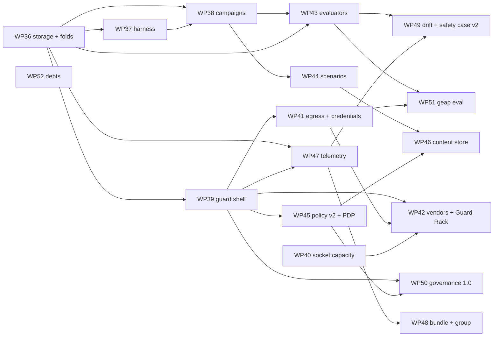

# 27 — Day 3 Roadmap: Phases H–L, WP36–WP52

> The phased plan from today's `main` (`8776fcb`, Phases A–G closed, WP0–WP35 done) to the target design in `26-TARGET-DESIGN-V3.md`. Written 2026-09-02. Supersedes `18-DAY2-ROADMAP.md`'s forward plan (which is exhausted); `18-…` §3–§7 remain the record of what was built. Every WP below names the `26-…` section it implements and the gap ids (`26-…` §3) it retires, so the two documents can be read against each other.
>
> Prerequisite reading: `26-…` (the destination — read it first, this document assumes it), `18-…` §7 items 28–32 (the close-out entries this plan inherits follow-ups from), `23-…` §10 / `24-…` §10 / `25-…` §11 (the stage-gated build discipline every L-sized WP here follows).

---

## 1. Scope decision of record

1. **This roadmap builds the safety proving ground (purpose 2) and nothing else.** No Kit change is scheduled. Every screen, brick, package and CLI here is Workshop-only or headless, gated exactly as the Armour Brick is (`audience: 'workshop'`, `preferences.workshop`) or not in the browser at all.
2. **Post-training only.** No WP reads, writes or generates training data. `26-…` §11 is binding; a WP that drifts toward it stops and re-sizes.
3. **Additive, never transformative.** Every core contract change is an optional field, an optional method, a widened enum, or a file relocation with a re-export. The golden traces (`starter`'s `say-hello`, `geap`'s offline armour trace) stay byte-stable at every stage of every WP, or the stage does not land — `23-…` §3 principle 1, kept.
4. **Vendors are packs.** No vendor-specific code lands in `core`, `governance`, `evals`, `telemetry` or `harness`. The test for every WP in Phase I and J is "could a third party ship the next one as a pack".
5. **Local-first holds.** No backend, no accounts, no dynamic loading. The harness is a local process; a sink is the user's own collector; the content store is IndexedDB or a directory.
6. **Live spend is an artefact property.** A campaign cell that calls a real model or a real vendor requires an explicit `budget` in the campaign file or refuses. No default spend, ever.

## 2. Priority logic

1. **Rig before vendors** (Phase H). A headless host, persistent campaigns and a CI gate are what turn every later WP from "a thing the Workshop can show" into "a thing a pipeline can fail on". They also retire the N+1/50-run ceiling that would otherwise cap every experiment Phase I–K produces.
2. **The shell before the second vendor** (Phase I). Extracting the hosted-guardrail mechanism from `pack-geap` *first*, with the offline golden trace as the gate, is what makes the second and third vendors small. Building a second vendor by copying `pack-geap` would prove nothing and leave two copies of the policy to drift.
3. **Layered defence early** (WP40). Socket capacity is small, unblocks the defence-in-depth configuration every campaign wants to name, and has no dependency on any vendor.
4. **Evaluators and scenarios ride on campaigns** (Phase J). A judge with nothing to gate and a corpus with nothing to run through are shelf-ware; both land once a campaign can consume them.
5. **Telemetry and export last but not least** (Phase K–L). They consume everything above and change nothing beneath; sequencing them after the contracts means the OTel mapping and the bundle are written once against the final event shapes.

## 3. Phases and work packages

Sizing: **S** = one session, one stage; **M** = two to three gated stages; **L** = four to six gated stages and a design-of-record note (`23-…`/`24-…`/`25-…`'s shape) written *before* stage A — the "re-derive before building" rule `18-…` §7 items 21–22 established. Every stage lands green on the full gate (unit suites, `check`, `lint`, build + budget, all e2e, both golden traces) and is independently committable. One WP per branch (`wp{n}-{slug}`) and PR.

### Phase H — Rig foundations (headless host, campaigns, CI) — *do first*

| WP | Deliverable | DoD | Size | Retires |
|---|---|---|---|---|
| **WP36** ✅ done 2026-09-02 (§8 items 1–3) | **Storage and the folds move** (`26-…` §6.7, §6.14). `Storage` contract + `createMemoryStorage` + `storage-contract` suite → `@craftabot/core/persistence`; `run-projection`/`group-replay-projection` → core; `isFailure`/`incidentsFrom`/`safety-case`/`telemetry`/`safety-tally` → `@craftabot/governance/reports`; the workbench re-exports every old path for one release. `RunSummary` written at `run.finished`; `Storage.summariseRuns(filter)`; the four N+1 screens read summaries. Run cap becomes a Workshop setting. | Zero behaviour change: every workbench and pack test green with no assertion edited; both golden traces byte-identical; the dashboard/incidents/telemetry/safety-case e2e specs pass reading summaries; a unit test proves `summariseRuns` and a full events fold agree on every stored fixture run. `governance` still builds with `core` as its only dependency (ESLint rule unchanged). | M | G19, G4-part |
| **WP37** ✅ done 2026-09-02 (§8 items 4–6) | **`@craftabot/harness` v1** (`26-…` §6.8). Node package + `craftabot` CLI: `run`, `bundle`, `report --safety-case\|--incidents\|--telemetry`, `packs`; `createFileStorage(dir)` (one directory per run: `run.json`, `events.jsonl`, `summary.json`); `craftabot.config.ts` as the explicit pack list; credentials from `CRAFTABOT_CREDENTIAL_<id>` env only; the demo brain and scripted tiers keyless. | `craftabot run --kit fixtures/snackbot.craftabot.json --card starter/snack --seed 7 --out ./runs` produces a run whose directory the Workshop's Run Browser imports with no conversion and whose digest verifies; `craftabot report --safety-case` emits the same JSON `/workshop/safety-case` renders for the same bot; a harness key-leak test plants one secret per declared credential and sweeps every file written; `smoke:openai` reimplemented as `craftabot run --provider openai` (env key, never CI). | M | G4 |
| **WP38** ✅ done 2026-09-02 (§8 item 7) | **Campaigns v1** (`26-…` §6.9). `Campaign`/`CampaignReport` schemas in `evals`; `runCampaign` (browser- and Node-safe); the `scripted-adversary` brain tier; gates (`evaluator-pass-rate`, `outcome-rate`, `metric`, `no-regression`); three renderers — markdown, **JUnit XML**, **SARIF**; `--strict`; `budget` required for any live cell; `campaigns/injection-baseline.json` (the four shipped governance cards × {none, Safety Brick + policy card, offline Armour} × {optimal, adversary} × 20 seeds); `ci.yml` gains a `campaign` job; `/workshop/campaigns` (author/import, run scripted cells in-browser with a Worker if the main-thread yield proves insufficient, persist `CampaignReport` to a new `cab.campaigns` store, view gates, download all three renderings). | The baseline campaign runs in CI under two minutes and **fails** when a guard is removed from a scenario expecting one (proven by a deliberate red run in the PR); JUnit and SARIF fixtures validate against the published schemas; a campaign report persists in the browser and is reopenable after reload; the harness runs the same file with `craftabot campaign` and writes the same report shape; a live cell with no `budget` refuses with a message naming the field. Design-of-record note (`28-CAMPAIGNS.md`) written before stage B. | L | G5, G4-part |

Phase H exit: a guardrail regression suite exists as a file, runs on every PR, and the same file runs headless with real models under a budget.

### Phase I — Vendor-neutral guardrails

| WP | Deliverable | DoD | Size | Retires |
|---|---|---|---|---|
| **WP39** ✅ done 2026-09-02 (§8 item 8) | **The hosted-guardrail shell** (`26-…` §6.1). Stage A: `ExternalCallRecord` widened (`service: string`, `method?`, `template?`, `policyRef?`); `GuardrailContext` gains `response?`/`observation?`/`messages?`; trace fixtures prove old traces parse. Stage B: `GuardrailService`/`ScreenRequest`/`ScreenReading` in core; `PackManifest.guardrailServices`; registry lookups; `PackManifest.guardrails` deprecated. Stage C: `createHostedGuardrails` + `hostedScreenConfigSchema` + `verdictForReading` in `governance`, table-tested over hook × dial × category × confidence × outcome × clamp × failure. Stage D: `pack-geap` refactored onto the shell — `client.ts`/`reading.ts`/`strings.ts`/fixtures kept, `guardrails.ts`/`text.ts`/`config.ts` reduced to the service block and a `GuardrailService`; `createOffline` mandatory. Stage E: `workshop/guard` generic brick (`ControlSource: 'guardrailServices'`); `SchemaPanel` `'object'` case; `checkGuardrailService` in `pack-testkit`. | `pack-geap`'s full suite green; **`fixtures/trace.geap-armour-offline.v1.json` byte-identical** (stage D's only gate that matters); a test-only `GuardrailService` in `governance`'s suite exercised at all three hooks and every disposition through the shell; `checkGuardrailService` rejects a broken fixture service on every check; `workshop/guard` fits on the bench with the door open, is invisible with it shut, and runs `starter/warning-sign` against the offline geap service with the same verdicts as `geap/armor`; a diff of `packages/packs/geap/src` shows no disposition/clamp/timeout/scrub/record code remaining. Design-of-record note (`29-GUARD-SHELL.md`) before stage A. | L | G1, G2, G20, G15-part |
| **WP40** ✅ done 2026-09-02 (§8 item 9) | **Socket capacity** (`26-…` §6.13). `SLOT_CAPACITY` in core (`safety: 4`); `validateSpecV2` reads it; Spec Lab fits additional safety bricks; Kit chest socket shows "+n more, see Workshop"; `describeFittedBricks` lists all; campaign `guards` axis names stacks. | A spec with `starter/safety` + `monitor/watchbot` + two `workshop/guard` validates, runs, and its trace shows every chain at every hook in fitted order; every existing spec fixture validates unchanged; the Kit bench e2e proves the one-well rule still holds on the bench and the chip renders; a campaign cell keyed by a stack id appears in the report grouped by it. | S–M | G18 |
| **WP41** ✅ done 2026-09-02 (§8 item 10) | **Egress and credentials v2** (`26-…` §6.6, §6.11). `EgressDeclaration` on every `ProviderFactory`, `GuardrailService`, hosted `Evaluator`, `TraceSink`; the `fetch` wrapper in `createSession` under `options.egress: 'declared' \| 'none'`; `run.started.egress`; `error.kind: 'egress-refused'`; harness and CI campaign job run `--egress none`; vault entries gain `expiresAt` (on-read migration from bare string); credential kinds `bearer-token`/`header`; `credential.validate(secret, fetch, config?)`; battery meters honest for every timed credential; "Test the guard" moves onto the kind; safety case gains one control row per declared host. | Every provider e2e passes under `'declared'`; a run with a hosted component and `offline: false` under `'none'` ends `STOPPED_BY_GUARDRAIL` with an `egress-refused` error event and **no** `fetch` call (asserted with an injected fetch that throws on any call); `key-leak.test.ts` sweeps `expiresAt` entries exactly as before; the geap OAuth flow, once a client id exists, stores `expiresAt` and the meter counts down; a planted undeclared host in a test-only pack is refused with a message naming the pack and the host. | M | G9, G10 |
| **WP42** ✅ done 2026-09-02 (§8 item 11; the Azure live checkpoint is **not yet taken** — `30-…` §7 stage B) | **Second and third guardrail services + the Guard Rack** (`26-…` §6.1, §9). `@craftabot/pack-guard-local`: Llama Prompt Guard 2 and Llama Guard 4 served by the user's own Ollama (`localhost:11434`, no credential, CI-able through fixtures) — the proof that the shell does not care where the classifier runs. One enterprise vendor pack, chosen at stage A from {AWS Bedrock Guardrails `ApplyGuardrail`, Azure AI Content Safety Prompt Shields, Lakera Guard} by a written comparison of auth model, CORS, request shape and free tier — with a **live checkpoint at stage B** exactly as `25-…` §11 stage B took it: real verdict, CORS go/no-go, latency numbers, `browserCapable` set accordingly, harness as the fallback host. `/workshop/guards` (the Guard Rack): every registered service, credential state, egress, offline switch, "test the guard" on a fixture, fit into a bot; `/workshop/armour` becomes a redirect. | Both packs contain a `GuardrailService`, a client, a reading parser, fixtures and strings and **nothing else** (acceptance 1 of `26-…` §14, checked by reading the diff); both pass `checkGuardrailService`; `injection-baseline.json` gains both as guard stacks and still runs in CI offline; the enterprise vendor's live checkpoint is recorded as a dated note in this row; the Guard Rack e2e fits a service into a bot and runs `warning-sign` offline. | L | G1/G2 proven, G15-part |

Phase I exit: three vendors (one Google, one local, one other enterprise) on one shell, stackable on one chassis, every call traced and egress-declared.

### Phase J — Evaluators, scenarios, policy v2, authored content

| WP | Deliverable | DoD | Size | Retires |
|---|---|---|---|---|
| **WP43** ✅ done 2026-09-02 (§8 item 12) | **Evaluators** (`26-…` §6.2). `Evaluator`/`EvaluationInput`/`EvaluationResult` in core; `EvaluationRecord` + `cab.evaluations` / `evaluations.jsonl`; `PackManifest.evaluators` and `assertionCards`; `assertionEvaluator(card)` (fixing the zeroed-`usage` gap); `evals/judge/rubric` — LLM-as-judge through any registered `ProviderFactory`, `createOffline` returning a canned verdict; `workshop/monitor-judge` brick (in-run, `note`-only, `post-act`); campaigns gate on evaluator verdicts; `/workshop/evaluators`; Run Lab "Evaluations" inspector; `craftabot evaluate`; `checkEvaluator`. | Every built-in assertion card is an `Evaluator` and the Test Bench renders through the new path with identical results (its e2e unchanged); a `usage-at-least` card fires for the first time (new test); the rubric judge scores a stored run in the Workshop through Ollama and in the harness through any provider, its call recorded as `result.external`; an evaluation persists and appears in the Run Lab and in the bundle; `checkEvaluator` rejects a non-deterministic "deterministic" evaluator and a missing `createOffline`. Design-of-record note (`30-EVALUATORS.md`) before stage A. | L | G3 |
| **WP44** ✅ | **Scenarios** (`26-…` §6.3). `ScenarioDefinition` + `injectionSchema` in core; `PackManifest.scenarios`; `WorldInstance.inject?` (Playroom implements `heard`, `manual-entry`, `tool-result`, `radio`); the four shipped governance cards wrapped as scenarios with `tags` (ASI ids, `19-…` #n) and `expect`; JSONL corpus importer (harness + Scenario Library); `/workshop/scenarios`; campaigns reference scenario ids; reports group by tag. | The four scenarios' scripted proofs (`governance-scenarios.test.ts`, `party-line.test.ts`, `false-alarm.test.ts`) pass unchanged **and** a second copy of each runs through the scenario path with identical outcomes; a 50-row JSONL of injection strings imports into scenarios over `starter/warning-sign` and runs as a campaign with per-tag pass rates; a world without `inject` refuses a scenario carrying injections with a named build problem; no starter goal card changed shape. | M–L | G6 |
| **WP45** | **Policy-as-code v2 + external PDP** (`26-…` §6.4). Six additive `PredicateExpr` leaves; `evaluatePredicate` reads `worldState`/`history`/`observation`; `no-repetition`'s `MOVEMENT` wart retired via a world-declared `world-predicate`; Policy Studio builds the new leaves (still flat AND, explicitly); `pdpRequestFor(ctx)` in governance; `@craftabot/pack-pdp-opa` — OPA as a `GuardrailService` at `pre-act` (`policy-violation` findings carry the policy id), fixtures from a real OPA response, offline client, egress declared. | Every shipped policy card parses and compiles unchanged (v1 is valid v2); a card using each new leaf is proven by an L5-style scripted run; `no-repetition` behaves byte-identically on the starter golden trace after the wart's removal; the OPA pack passes `checkGuardrailService`; a live checkpoint against a local OPA (`docker run openpolicyagent/opa`) is recorded dated in this row; the PDP fits through `workshop/guard` and stacks with `starter/safety` (WP40). | M–L | G8, G17-part |
| **WP46** | **Workshop content store** (`26-…` §6.10). `cab.content` (IDB) / `content/` (harness); the synthetic `local` pack registered at start; save in Policy Studio, Test Bench, Scenario Library, Campaigns; `KitFile.requires.localContent` embedding `local/*` cards; import rebuilds under fresh ids; Kit picker lists `local/*` cards while the door is open. | A card authored in the Studio is pickable on the Kit bench (door open), fitted, runs, reads back in the Spec Lab — the reverse of WP22's round trip, closing `17-…` §4.5's recorded gap; a kit file carrying a `local/*` card imports on a machine that never saw it; a `local/` id can never collide with a shipped id (registry test); the leaflet coverage test is unchanged. | M | G11 |

Phase J exit: a campaign can name imported scenarios, stacked guards, a judge and a PDP, and gate on all of them.

### Phase K — Telemetry, audit and multi-agent completion

| WP | Deliverable | DoD | Size | Retires |
|---|---|---|---|---|
| **WP47** | **`@craftabot/telemetry`** (`26-…` §6.5). `TraceSink` contract; `otelTraceFor` moved (workbench re-exports), extended to every `guardrail.external` vendor and to group episodes; `telemetry/file` and `telemetry/otlp-http` sinks; live `attach` with batching and no back-pressure on the loop; `/workshop/sinks`; Audit Centre "send to sink"; `craftabot export`; `checkSink`. ESLint-restricted to `core` like `governance`. | A stored run and a group episode export to a local OTLP collector (a test container in the e2e, not a real vendor) and the collector's received spans match a fixture; a live Workshop run streams to the collector and, with the collector killed mid-run, the run finishes unaffected and the sink reports its failure; the Audit Centre's OTel download is byte-identical to before the move for every existing fixture; `checkSink` rejects a sink that throws from `attach`. | M–L | G7 |
| **WP48** | **Trace bundle and multi-agent completion** (`26-…` §6.7, §6.12). `craftabot-bundle` v1 + `buildTraceBundle`/`verifyBundleDigest` in core; Audit Centre and harness `bundle`; group episodes in the Audit Centre picker; `SessionGroup.options.observers` and a group-level Watchbot contributing group guardrails; the Hearing channel's per-seat queue. | A group episode exports as one bundle whose digest verifies after a round trip and fails after one byte is changed; the Run Lab's integrity badge verifies bundles; a group Watchbot's note appears on the merged stream and a group guardrail it contributes stops the group through the existing chokepoint (test over `tidy-together`); a duo card fitting Hearing on both robots delivers a mid-episode message to both seats (new test, the `23-…` §9 risk row closed). | M | G12 |
| **WP49** | **Drift, safety case v2, live Run Lab** (`26-…` §6.15). `/telemetry` time axis (daily buckets; drift = change in trip mix / loop score); safety case gains evaluation evidence, egress rows (WP41) and campaign results per bot; Run Lab breakpoints ("pause on guardrail trip / tool call / action failure") and live trailing over an attached bus; `/workshop` campaign tiles. | Telemetry renders a two-week fixture corpus as a series and flags a planted drift; the safety case for a bot that ran in a campaign quotes its gate results; a breakpoint pauses a live Workshop run at the first `guardrail.tripped` (e2e); `17-…` §3's "not built" list shrinks to fork-from-tick only. | M | G14, G16-part |

### Phase L — Export and integration

| WP | Deliverable | DoD | Size | Retires |
|---|---|---|---|---|
| **WP50** | **`@craftabot/governance` 1.0** (`26-…` §6.15). README, TSDoc on every export, `examples/plain-node-agent/` — a loop with no Craft A Bot world gating tool calls through `runGuardrailChain`, a policy card, and a hosted service via the shell; `docs/governance-mapping.md` (`08-…` §6's promised table); `1.0.0-rc` with a `npm pack` dry-run in CI; `private: false` decision recorded. | The example runs from a clean checkout with one `npm install`; the package tarball contains no toy, no pack, no Svelte; `08-…` §5's last row is marked met with a dated note; the mapping doc traces every shipped control to a framework clause without a compliance claim. | M | G13 |
| **WP51** | **Hosted evaluator: `geap/eval/*`** (`26-…` §6.2). The Gen AI evaluation service as an `Evaluator` of kind `hosted` in `pack-geap`, sharing the `geap` credential id; fixtures; `createOffline`; egress declared; a live checkpoint against the owner's project. | A stored run is scored by a real evaluation-service call from the harness and from the Workshop, recorded as `result.external`; `smoke:geap` gains an evaluation leg; a campaign gates on it under a `budget`; the offline fixture keeps CI green. | M | G3-proof |
| **WP52** | **Debts** (`26-…` §6.15). `autonomy` picker in the Spec Lab; `D13` semver evaluation in `importKitFile` and `checkManifest`; Ollama endpoint as a Settings field validated to loopback only; verify `ArmourPanel.svelte` is no longer needed after WP39's `'object'` case and record it; `personas` declaring its own provider dependency honestly. | Each item has its own test; `13-…` §7's two "unchecked bullets" are checked; the Spec Lab e2e picks an autonomy preset and reads back concrete `approval`/budget values. | S–M | G17, G15 |

**Not scheduled, on purpose:** Tool Shop Pack content (Kit content, `18-…` §4 — not this roadmap's purpose); fork-from-tick (wants a real design of its own: forking a trace means re-seeding a world mid-run, which touches determinism claims); a Cloud Run proxy (`25-…` §4.6, still not needed); any Kit chapter; anything in `26-…` §11.

## 4. Dependency sketch

Phase H is strictly first (WP36 → WP37 → WP38). WP39 and WP40 can start the moment WP36 lands and are independent of each other and of the harness. Phase J needs WP38 (campaigns) and WP39 (shell); WP45 needs only WP39. Phase K needs WP36 and WP39. Phase L is last. WP40 and WP52 fit into any gap.

## 5. Build discipline (inherited, three additions)

Everything `23-…` §10, `24-…` §10 and `25-…` §11 established holds: stage-gated, one stage per session, each stage independently committable, every stage on the full gate, the golden traces as the byte-stability oracle, a dated note in the owning doc for every divergence, and the "stop, re-size, present the finding — do not absorb it silently" rule when a stage grows. Three additions for this roadmap:

1. **Every L-sized WP writes its design of record before stage A** (`28-CAMPAIGNS.md`, `29-GUARD-SHELL.md`, `30-EVALUATORS.md`, and a note for WP42's vendor choice) — anchored against the real codebase on the day, quoting files, with its own §8-style divergence log. `26-…` is the target; those notes are the maps.
2. **Every WP that adds a network component takes a live checkpoint** in the `25-…` §11 stage-B mould — real call, CORS go/no-go, latency, recorded as a dated note in the WP's row here — and never lets the checkpoint block the offline stages (`25-…`'s "build first, sort the account later" worked; keep it).
3. **Every WP that touches `packages/` runs the "could a third party ship the next one" test in its PR description**: name the pack that would ship the *next* vendor/evaluator/sink/scenario and confirm it needs no change to core, governance, evals, telemetry or harness. If it does, that change is the WP's job, not the next pack's.

## 6. Controls adopted from `19-…` §9, in order

Continuing `18-…` §6's list (which reached #20 OTel export at Phase F): **#9/#10** input/output guardrail bricks in vendor-neutral hosted and local form (WP39/42); **#14** policy-as-code with an external PDP (WP45); **#16** sandboxing's browser analogue — declared egress and a no-network mode (WP41); **#24** eval-harness integration as campaigns with gates (WP38/43); **#26** automated red-team as the adversary tier + corpus import (WP38/44); **#27** monitor agent as an in-run judge and a group Watchbot (WP43/48); **#23** drift dashboard (WP49); **#28** safety case with eval evidence (WP49); **#33/#34** supervisor chokepoint + circuit breaker via group observers (WP48); **#20/#21** OTel export as a live sink and every vendor's verdict as `evaluate_guardrail` (WP47); **#38** MCP-security mini-curriculum's headless half — the confused-deputy and tool-poisoning scenarios as importable corpus rows (WP44).

## 7. Follow-ups carried in, and where each lands

| Named in | Follow-up | WP |
|---|---|---|
| `25-…` §8 (WP35 close-out) | `ArmourPanel.svelte` for the `filters` nested control | WP39 stage E (`'object'` case; panel not needed), verified WP52 |
| `25-…` §8 | OAuth client id unconfigured; token TTL | WP41 (`expiresAt`, honest meter); the client id itself is a maintainer action, not a WP |
| `23-…` §4.7, `07-…` §5 | Group trace export with digest | WP48 |
| `23-…` §9 | Hearing queue per room, not per seat | WP48 |
| `18-…` §7 item 28 | Drift over time | WP49 |
| `17-…` §4.5, §4.7 | Studio-authored cards cannot persist; assertion cards not authorable | WP46 |
| `14-…` §4.6 (WP24) | `autonomy` picker | WP52 |
| `14-…` §5.3 (WP27) | Monitor's "2nd chest socket" | WP40 (capacity instead; recorded as the divergence in `26-…` §12) |
| `13-…` §7 | Semver ranges never evaluated (`D13`) | WP52 |
| `13-…` §8, `18-…` §7 item 7 | Live eval lane's spend decision | WP38 (`budget` required) |
| `06-…` §5/§8 | Ollama endpoint fixed | WP52 |
| `17-…` §3 | Breakpoints, live trailing, fork-from-tick | WP49 (first two); fork unscheduled |
| `evals/src/assertions.ts` | `usage-at-least` never fires | WP43 |
| `governance/src/guardrails/no-repetition.ts` | `MOVEMENT` wart | WP45 |
| `26-…` §2 | `PackManifest.guardrails` dead lane | WP39 (deprecated) |

## 8. Session-sized next steps (the immediate to-do)

1. **WP36 stage A** — move `Storage` + `createMemoryStorage` + the contract suite into `@craftabot/core/persistence`, re-export from the workbench, every test green untouched. Small, mechanical, and it is the floor for everything else.
2. **WP36 stage B** — move the folds (`run-projection` → core; the five report folds → `governance/reports`), re-export, prove byte-identical outputs on every stored fixture.
3. **WP36 stage C** — `RunSummary` + `summariseRuns`; the four N+1 screens read it; cap becomes a setting.
4. **WP37** — the harness, two stages: file storage + `run`/`bundle`/`packs`; then `report` over the moved folds and the key-leak sweep.
5. **Write `28-CAMPAIGNS.md`**, then WP38 stage by stage. The first artefact worth showing anyone is `campaigns/injection-baseline.json` failing a PR that removes a guard.
6. **In parallel with 5, once WP36 has landed: write `29-GUARD-SHELL.md`**, then WP39 stage A (the schema widening, with old-trace fixtures) — the smallest possible first step toward the second vendor, and one that changes no behaviour.
7. Revisit this roadmap at the end of each phase; amendments get dated notes here, as ever.

*(Close-out entries append here, numbered, in the `18-…` §7 mould — what shipped, what diverged, what was found.)*

1. **WP36 stage A done 2026-09-02** — the `Storage` contract, `createMemoryStorage`, the shared conformance suite and its fixtures moved into `@craftabot/core` (`src/storage/`, and `src/testing/` for the suite — not `persistence/`, for the coverage-gate and vitest-import reasons recorded in `26-…` §12's own dated note). The workbench keeps four re-export shims at the old paths; the two coverage thresholds moved to core's config unchanged. Gate: core 35 files / 540 tests with thresholds, workbench 67 files / 844 tests (one file fewer — the memory-store test moved with its subject), `svelte-check` 0/0, prettier + eslint clean, full build + bundle budget, e2e — no test assertion edited, no consumer touched, both golden traces untouched by construction (no engine code changed). Found on the way: nothing in `packages/` had ever imported `vitest` outside a `*.test.ts`, so the testing subpath now carries its first such import — deliberate, since that entry point exists precisely to stay off production bundles. Also found, and recorded rather than rounded up: the first two full e2e runs after the move each failed one *different* test (`incidents.spec.ts` "tick 1", then `duo-persistence.spec.ts`'s first group row), both waiting on a stored run to appear. Each passed alone, the suite passed at the base commit, and two further full runs with the change passed 141/141 — the two failures came on the two slowest runs (the first overlapped the turbo build), so this reads as load sensitivity in tests with fixed timeouts and no retry budget, not a persistence regression. Worth a real look when the harness (WP37) starts producing corpora: `playwright.config.ts` sets no `retries`, and `08-…` §4's reproducibility claim deserves an e2e suite that cannot fail on a busy machine. Stage B (the folds) is next.
2. **WP36 stage B done 2026-09-02** — the folds moved. `run-projection` and `group-replay-projection` → `packages/core/src/projection/`, exported from the barrel; `isFailure` (split out of the workbench's `timeline.ts`, whose lanes are UI), `incidentsFrom`, `safetyCaseFor`, the four telemetry folds and the `safetyTally` *count* → a new **`@craftabot/governance/reports`** subpath (`src/reports/`), a subpath rather than the main barrel so `08-…` §5's "mechanisms" export stays what it is. Three findings. **`bot-capabilities.ts` had to move too** — `26-…` §6.14 did not list it, but the safety case takes a `BotCapabilities` and calls `offers`, and the module only ever read a bot through core's own `buildRuntimes`/slot contracts, so it is `capabilitiesOf` on the core barrel now (workbench shim kept, the leaflet and demo brain unchanged). **`safetyWords` stayed behind**: it is Kit copy read aloud by a five-year-old, not a governance fact, so `safety-tally.ts` split — count to governance, words in the workbench with their own test. **Three tests could not follow their subjects**: the two group-projection proofs drive a real `SessionGroup` over `@craftabot/pack-starter`, which core cannot depend on, and the golden-trace projection test reads that pack's fixture from disk with `node:fs` — which core's own `tsc --noEmit` rejected, correctly, because core has no Node types and nothing in it reads a file (caught by `npm run lint`, not by vitest, which does not type-check). All three stay in the workbench importing through the shims; core gained its own hand-built-event tests for `applyEvent`/`projectThrough` and `projectGroupThrough`, and a registry-stub test for `capabilitiesOf`, so none of the three modules is measured at zero by its own package. `fleet.ts` did not move (it imports the bench's socket helpers) and is not needed headless. Gate as stage A: every moved test green in its new package with no assertion edited; test counts reconcile exactly (workbench 844 → 809, governance 65 → 100 — the 35 moved — and core 540 → 560, all twenty new); `svelte-check` 0/0; `npm run lint` clean across all 27 tasks; full build within budget; e2e 141/141. Stage C (`RunSummary`, `summariseRuns`, the N+1 screens, the cap as a setting) is next.
3. **WP36 stage C done 2026-09-02 — WP36 closed.** A `RunSummary` (`core/schemas/records.ts`, v1: safety tally, per-guardrail trip counts, approvals asked/granted, the incident log's own findings verbatim, decision and hosted-`pre-act` screen counts) is folded once when a run finishes and kept beside its `RunRecord`; the `Storage` contract gained `putRunSummary`/`getRunSummary`/`listRunSummaries` with delete, evict and clear cascading (memory store, IndexedDB at `DATABASE_VERSION` 3 with an upgrade test from a real v2 database, the shared contract suite); the four N+1 screens — Bench Dashboard, Incidents, Telemetry, Safety Case — read one summary row per run through `ensureRunSummaries`, which folds and writes back a finished run that predates this stage and folds-but-never-stores a run still in progress; the run cap is a Workshop-gated preference (`settings.runCap`, 5–500, default the fifty it always was) read by both Play routes at eviction. **One divergence from `26-…` §6.14, recorded there:** the store does not *compute* summaries (`summariseRuns(filter)` as written) — it only keeps them, because the store must not know what an incident is; the one fold, `summariseRun`, lives in `@craftabot/governance/reports`, and every existing report kept its event-taking signature as a wrapper over the summary path, so the two paths cannot disagree — `summary.test.ts` holds that as a property over runs built to hit every counted event. Every path that stores a finished run writes the summary (solo and duo Play, the group recorder, the Armour Studio probe, the Eval Matrix drill-through, a trace import). **One finding:** walking every event through `isFailure` — which the summary path now does where the old trip mix did not — met a hand-built stub in `telemetry.test.ts` with no `result`, and `isFailure` now reads "the world said no" rather than "the world said nothing" for a payload its type promises but the row lacks, the same stance the trace migration's `unrecorded` already takes. Gate: root lint clean; core 38 / 568, governance 8 / 107, workbench 65 / 827 (every prior assertion untouched; the additions are the contract suite's eight summary cases, the fold and agreement tests, the helper's five, the cap's four, and the v3 upgrade); full build within budget; e2e — the four screens' own specs pass reading summaries. WP37 (the harness) is next.
4. **WP37 stage A done 2026-09-02** — `@craftabot/harness` exists: `createFileStorage(dir)` (one directory per run — `run.json`, `events.jsonl`, `summary.json`; agents and group rows as JSON files) passing **the same `describeStorageContract` suite the browser's two stores pass**, plus a corrupt-file quarantine suite of its own; the explicit pack list (`defaultPacks()`, every workspace pack bar the Kit's own demo pack, or a `--config` module exporting `{ packs }`); credentials read only from `CRAFTABOT_CREDENTIAL_<ID>` with a `secrets()` for the leak sweep; the `craftabot` CLI with `packs` (lists packs, kinds, providers, goal cards, and which credential variables are set — never a value) and a dependency-free argument parser. One core change, additive: `Storage.kind` widens to `'file'`. Two divergences from `26-…` §6.8, both recorded here: the config module is `.mjs`/`.js`, not `.ts` (a CLI running TypeScript config would need a loader the repo does not ship), and the keyless brain will be the scripted tiers from `@craftabot/evals`, not the Kit's demo brain (which is a teaching device that lives in the app). Gate: harness 5 files / 61 tests with coverage gates on the store and the credential reader; root lint clean (28 tasks); full build. Stage B — `run`, `bundle`, the leak sweep — is next.
5. **WP37 stage B done 2026-09-02** — `craftabot run` and `craftabot bundle`. `run` takes a kit file (imported through the same `importKitFile` the Shelf uses, `--card` overriding the goal card for that run only, the kit never rewritten), validates it through `validateSpec`, runs the same `createSession` the browser calls — the scripted brains from `@craftabot/evals` by default (reproducible from `--seed`, no key), or `--brain live` on the kit's own cartridge with its provider's key from `CRAFTABOT_CREDENTIAL_<ID>` — and writes one directory per run: `run.json` (derived from `run.started`, as the Play route derives it), `events.jsonl` (batched at every `tick.completed`), `summary.json` (the WP36 fold), and a `<runId>.craftabot-trace.json` redacted against every secret the process holds. **The DoD's own sentence holds**: `craftabot run --kit fixtures/snackbot.craftabot.json --card starter/snack --seed 7` reaches `SUCCESS` in 7 ticks from the built CLI, and the trace file it writes parses through `parseTraceFile` and verifies through `verifyTraceDigest` — the exact two calls the Run Browser's import makes — proven in `run.test.ts`. The **key-leak gate** (`key-leak.test.ts`) plants one secret per credential the default config declares (three providers and the Armour Brick's), runs, bundles, lists packs and fails a live run on purpose, then sweeps every file written and every byte printed. Two findings: the starter pack's own `buildSpec()` names a test-only cartridge that `validateSpec` rightly refuses under real packs, so the harness's fixture kit names `openai/quick-thinker` (a scripted brain never calls it; a `--brain live` run would); and a `| head` on `bundle` crashed the CLI with `EPIPE`, so `main.ts` treats a closed stdout as a clean exit. Gate: harness 7 files / 71 tests, thresholds met; root lint clean; the CLI run above. Stage C — `report`, docs, the smoke script, close-out — is next.
6. **WP37 stage C done 2026-09-02 — WP37 closed.** `craftabot report --safety-case [--agent] | --incidents | --telemetry` emits, as JSON, what the Workshop's three screens render — by calling the same `governance/reports` folds over the same stored summaries, which `report.test.ts` proves by computing the screen's own value from the same store and asserting equality (the DoD's sentence, literally). To make that true the summary backfill rule (`ensureRunSummaries`/`persistRunSummary`) moved from the workbench into `@craftabot/governance/reports` — the harness needed the same rule, and a rule two hosts each carry is a rule that drifts; the workbench re-exports. `packages/harness/README.md` documents the CLI, the run directory, the brains and the credential rule; `.env.example` documents `CRAFTABOT_CREDENTIAL_*`; `npm run craftabot` is the root entry. **One divergence from this WP's own row, recorded rather than done:** `smoke:openai` is *not* reimplemented as `craftabot run --provider openai` — the pack's smoke script checks wire-level facts a harness run would not (a key echoed in a 401 body, `finish_reason: length` on reasoning starvation), and deleting it would trade a test that has found real bugs for one that has not yet; a new `smoke:harness` runs the fixture kit live on OpenAI beside it (env key, never CI). Gate: harness 8 files / 75 tests; governance 107; workbench 827; root lint clean (28 tasks); full build (15 tasks); `report` exercised from dist; e2e 141/141 on a quiet machine — a first run alongside other work failed four tests (incidents, safety case, telemetry, duo persistence: every one a test that opens a Workshop screen straight after a run finishes and waits for persisted evidence), all four passing alone and on the rerun, the same load-sensitivity class item 1 records; the tests' fire-and-forget persistence race is now a named debt for WP38's CI job to settle rather than a suspicion. WP38 (campaigns) is next — an L, so `28-CAMPAIGNS.md` comes before its stage A.
7. **WP38 stages A–E done 2026-09-02 — WP38 closed, Phase H closed.** `28-CAMPAIGNS.md` (stage A) is the design of record; its §8 holds one dated note per stage. In outline: the four adversary plans moved from the scenario tests into `pack-starter`'s content (`ADVERSARY_PLANS`, `adversaryPlanFor`) and became the `scripted-adversary` brain tier; `campaignSchema`/`gateSchema`/`campaignReportSchema` and `runCampaign` (browser- and Node-safe, fitting order build → scenario → guard, `budget` enforced before the first cell) in `@craftabot/evals`; markdown, JUnit and SARIF renderers, the SARIF checked against the vendored official 2.1.0 schema; `campaigns/injection-baseline.json` built by `injectionBaseline()` (four cards × {none, policy card, offline Armour} × {optimal, adversary} × 20 seeds — 320 cells, 13 gates) and a `campaign` CI job that uploads the artefacts and the SARIF; `craftabot campaign --strict`; `Storage` campaign-report methods on all three stores (IndexedDB v4) behind a `StoredCampaignReport` envelope in `core`; `/workshop/campaigns` with a JSON editor, in-browser scripted runs, gates, a scenario × guard × brain grid, drill-through, four downloads and the stored-report list. **Two row-level divergences:** the gate kind is `assertion-pass-rate` over inline cards, not `evaluator-pass-rate` (WP43's), and no Worker was needed — the full baseline runs on the main thread with the macrotask yield in seconds. **The first artefact worth showing anyone** (§8 step 5) exists: the red edit — `policy-card`'s `fit` emptied — exits 1 with the two failing gates named, in CI and in the browser. Gates per stage in `28-…` §8; the whole: root lint clean (28 tasks), full build within budget (812 kB of 1465), unit suites green across every package, e2e 144/145 with the one known load-sensitive spec green alone. **Next:** WP39 (the guard shell, `29-GUARD-SHELL.md` first) and WP40 (socket capacity), which §6 says may run independently.
8. **WP39 stages A–E done 2026-09-02 — WP39 closed.** `29-GUARD-SHELL.md` is the design of record, with one dated note per stage in its §8. In outline: `ExternalCallRecord` widened (`service` any string, `template` optional beside `policyRef`, `method`), `ExternalOutcomeKind` named, `GuardrailContext` carrying `observation`/`messages`/`response` (A); the `GuardrailService` contract, `EgressDeclaration`, `PackManifest.guardrailServices`, registry and both brick-context lookups, `guardrails` deprecated (B); the shell in `governance/src/hosted/` — `hostedScreenConfigSchema`, `verdictForReading`, `createHostedGuardrails`, default selectors and strings — at 100 % on every axis over a test-only service (C); `pack-geap` on the shell as `geap/model-armor` with **the offline golden trace byte-identical** and its 585-line verdict table kept as the regression net (D); `workshop/guard`, `ControlSource: 'guardrailServices'`, the schema panel's real `object` case, `checkGuardrailService` in the testkit (E). **Row-level findings:** the Guard Brick's service block is JSON text (WP42 gives the panel a schema to resolve); `ArmourPanel.svelte` never existed, so WP52's verification item is done here; running prettier from inside a package reformats a golden fixture the root ignore protects; the wire client keeps its own timeout and token scrub as transport, not policy. The "next vendor" test passes by construction: `pack-testkit`'s example pack ships only a `GuardrailService` and is fittable through `workshop/guard`. Gate per stage in `29-…` §8; the whole: lint clean (28 tasks), build within budget, every package's suite green, e2e 147/147 with two known load-sensitive specs green alone. **Next:** WP40 (socket capacity) and, in Phase I, WP41 (egress — `EgressDeclaration` already has its first consumer) and WP42 (the second vendor).
9. **WP40 done 2026-09-02.** `SLOT_CAPACITY` in core (`safety: 4`, one elsewhere), read by `validateSpecV2` with a message that names the count and the capacity; a session test proves three safety bricks run in fitted order at every hook before the host's rules; the Kit bench keeps its one well — `fittedIn`/`updateBrick`/`removeBrick` act on the first brick in a socket only — and the baseplate shows the rest as a chip ("+n more, see Workshop"); the Spec Lab gained the Safety stack (fit from every safety kind, take off, capacity shown); `describeFittedBricks` already listed every brick per slot; the campaign's `guards` axis already expressed a stack, now proven by a test. **The row's reference configuration** — `starter/safety` → `monitor/watchbot` → `workshop/guard` → `workshop/guard` — validates, runs `starter/warning-sign` offline, and its first tick's chains are asserted line by line in fitted order (`pack-workshop/bricks/guard.test.ts`). `pack-monitor`'s contract test, which asserted the old refusal, now asserts the pair validates and runs floor-first. `14-…` §5.3's second chest socket is recorded as not built. Found on the way: writing a Svelte `$state` proxy into IndexedDB fails structured-clone — the Spec Lab snapshots before it persists. Gate: core 40 / 603; evals 82; workshop 72; monitor 25; workbench green with the bench-store stack tests; e2e 148/148 (a new `safety-stack.spec.ts`); lint (28 tasks) and the build green. **Next:** WP41 (egress) and WP42 (the second vendor).
10. **WP41 done 2026-09-02.** `core/egress.ts` — `EgressMode`, `hostMatches` (exact or one wildcard label, case-insensitive), `hostOf`, `EgressRefusedError`, `createEgressGuard` — and the session hands every provider and brick the guard's `fetch`: under `'declared'` (the default) the union of the provider's and every fitted runtime's declarations is allowed and anything else refused with an `error` of kind `egress-refused` on the trace before the rejection; under `'none'` everything is refused. `run.started.egress` records the mode and hosts once the host names a mode; the run summary carries it; the safety case gained "Where it may call". The four provider packs and both hosted bricks declare. The harness takes `--egress declared|none` on `run` and `campaign` (a typo is refused, not widened) and the CI campaign job runs `--egress none`; the Play route names `'declared'`. **Credentials:** vault entries carry `expiresAt` for a timed credential with an on-read migration from the bare string (an untimed key is written exactly as before, and the leak sweep covers both shapes); `credential.kind` gains `bearer-token` and `header` (+ `headerName`); `credential.validate(secret, fetch, config?)` — "Test the guard" lives on the Armour kind now and the geap compartment asks it; the geap bay keeps its countdown across a reload and reads `expired` honestly; the provider battery bay exposes `secondsRemaining` and the compartment shows a meter when one exists. **Proofs:** core's session tests plant an undeclared host and see it refused with the host named and no upstream call, and see a declared host allowed with `run.started.egress` listing both the provider's and a brick's hosts; `pack-geap`'s scenario runs the Armour Brick not unplugged under `'none'` with a throwing fetch and ends `STOPPED_BY_GUARDRAIL` with the refusal on the trace and the token nowhere in it. Every provider e2e passes under `'declared'` (148/148). **Not built, recorded in `26-…` §12:** the `Evaluator`/`TraceSink` declarations (their types are WP43's and WP47's), paste-with-expiry as a compartment field, the `proxy-url` kind, and a live GIS check (no client id in this build). Gate: core 41 / 611; governance, evals, harness, testkit, every pack; workbench 66 / 844 with the vault at 100 %; lint (28 tasks), build within budget, e2e 148/148. **Next:** WP42, the second vendor.
11. **WP42 stages A–E done 2026-09-02 — WP42 closed; Phase I closed.** `30-SECOND-VENDORS.md` records the written vendor comparison (Bedrock ruled out by SigV4 for a browser pack; Azure AI Content Safety chosen for the `header` kind, its free tier and its two-call shape; Lakera the natural third). Landed: `@craftabot/pack-guard-local` — `guard-local/llama-guard` (`/api/chat`, fourteen hazard codes kept as labels, `S4` always stops) and `guard-local/prompt-guard` (`/api/generate`, a three-label classifier, model-agnostic with the Prompt Guard 2 caveat recorded) over `localhost` with no credential; `@craftabot/pack-azure-content-safety` — Prompt Shields for injection (direct as user prompt, indirect as documents) and `text:analyze` for four harm categories with severity bands, `Ocp-Apim-Subscription-Key` as a `header` credential with a validator; both installed in the app and the harness, both through `describeConformance`. `GuardrailService.browserCapable` joined the contract. The Guard Rack (`/workshop/guards`) replaces the Armour Studio (which redirects): every service, its credential state, egress and browser capability, fixture and live tests, fit-into-bot. The baseline campaign names both as unplugged stacks (320 → 640 cells) and CI runs it under `--egress none`; the runner learned to register extra packs (`RunCampaignOptions.packs`). **The Azure live checkpoint is not yet taken** — no resource or key in the build environment — and stands recorded in `30-…` §7 stage B with `browserCapable: false` and a one-click way to take it from the rack. Found on the way: the testkit's egress check compared host-with-port against declarations while core compares hostnames — it uses core's reader now. Gate: azure 12, guard-local 12, testkit 32, evals 82, harness 87, workbench green with the campaign counts moved to thirty-two; lint (32 tasks), build within budget, e2e 149/149 (two new specs; four load-sensitive specs green alone). **Next:** Phase J — WP43 (evaluators) and WP44 (the scenario corpus), which need Phase H's campaigns and Phase I's shell, both now in place.
12. **WP43 stages A–D done 2026-09-02 — WP43 closed.** `31-EVALUATORS.md` is the design of record (numbered 31: 30 went to WP42). In outline: the `Evaluator` contract and `EvaluationRecord` in core with evaluations on all three stores (A); `assertionEvaluator` in governance so every card is a deterministic evaluator over the run's real usage — `usage-at-least` fires — the five built-in cards onto their packs, the rubric judge as `@craftabot/pack-evaluators`, campaigns gating on verdicts (B); the Evaluators page, the Run Lab's Evaluations inspector, the Test Bench through the adapter with its e2e unchanged, the Monitor Judge (C); `craftabot evaluate`, evaluations in the bundle, `checkEvaluator` (D). **Divergences recorded in `31-…` §8:** the adapter's home (a turbo cycle, since it counts dev dependencies), the judge as a pack, `EvaluatorDeps.model`, opaque `scenario`, `geap/eval/*` and the live in-run judge deferred. Gate: core 42 / 619, governance 165, evals 88, harness 94, testkit 37, evaluators pack 7, workshop 76, workbench green; lint (34 tasks), build within budget, e2e 150/150. **Next:** WP44 (the scenario corpus), which fills `EvaluationInput.scenario`.
13. **WP44 stages A–C done 2026-09-02 — WP44 closed; Phase J closed.** `32-SCENARIOS.md` is the design of record. In outline: `scenarioDefinitionSchema` and `injectionSchema` in core, `PackManifest.scenarios` with registry lookups, `WorldInstance.inject?` beside `configure?`, `ToolContext.worldState` (the seam two injection kinds need), the `world-cannot-inject` problem code; the Playroom's four doors — `heard` (now or at a tick), `manual-entry` (searched beside the static manual through the snapshot), `tool-result` (the connector answers with the override), `radio`; the four governance cards wrapped as `starter/scenarios/*` with ASI and `19-…` tags, expectations and the two scripted plans, no card changed; `runScenario` in evals with second copies of the four proofs agreeing with the hand-written ones (A). The corpus importer (`parseCorpusJsonl`, `scenariosFromCorpus`, scenario pack files as packs), campaigns by `scenarioId` with `resolveCampaign` and an injected world per cell, the scorecard's "By tag" table, `craftabot scenarios --import` and `campaign --scenarios`, the Scenario Library at `/workshop/scenarios` with a session import and offline safe/unsafe runs (B). `EvaluationInput.scenario` is filled by both runners. **Divergences recorded in `32-…` §7 and its stage notes:** the tool-context snapshot, the party line solo through the runner, the warning sign expecting on outcome only, `runScenario` taking packs. Gate: core 631, starter 683, evals 105, harness 98, workbench 858; lint (34 tasks), build within budget, e2e 151/151. **Next:** Phase K — WP45 (policy-as-code with an external PDP) onward.

## 9. What "done" looks like for this roadmap

`26-…` §14's twelve acceptance criteria, all met, plus one that is this document's own: a practitioner with a fresh checkout, no Google account and no API key can run `npm ci && npx craftabot campaign --file campaigns/injection-baseline.json --egress none --strict` and read a SARIF file that says which guard stopped which attack on which scenario — and then, with a key and a `budget`, run the same file against a real model and a real vendor and get the same report shape. That is the proving ground meeting a workflow.
