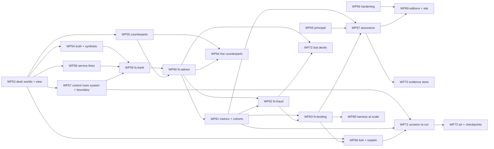

# 42 — Day 4 Roadmap: Phases M–Q, WP53–WP73

> The phased plan from today's `main` (`c5825fa`, Phases A–L closed, WP0–WP52 done) to the target design in `41-TARGET-DESIGN-V4.md` — the Retail Financial Services Playground. Written 2026-09-05, revised the same day with the design's sharpened scope, and again with its foundations assessment and decisions D2–D4 (`41-…` §2.1): Phase M is now a foundations phase that includes the Control Room's system and the Boundary map, and editions (the three-section site) have a WP of their own. Supersedes `27-DAY3-ROADMAP.md`'s forward plan (which is exhausted); `27-…` §3–§8 remain the record of what was built. Every WP below names the `41-…` section it implements and the gap ids (`41-…` §3) it retires, so the two documents can be read against each other.
>
> Prerequisite reading: `41-…` (the destination — read it first, this document assumes it), `27-…` §8 items 11–21 (the close-out entries this plan inherits follow-ups from), `28-…`/`29-…`/`31-…` (the design-of-record notes whose shape every L-sized WP here writes before stage A), `23-…` §10 / `25-…` §11 (the stage-gated build discipline).

---

## 1. Scope decision of record

1. **This roadmap builds the Retail Financial Services Playground (purpose 2 on real work) and nothing else.** Two Kit changes are scheduled, both content behind existing seams — the Playground's box on the shelf and a desk's cards in the rack. No chapter, no leaflet page, no copy change.
2. **UK retail financial services, and only that.** One synthetic bank; three desks — advice, fraud, lending — because they exercise the three shapes a retail journey takes (a conversation with a person; a queue of decisions; a decision about a person that is explained and contested) and the three failure classes a firm fears (saying the wrong thing; doing the wrong thing; treating people differently). Further decks (complaints, promotions, operational incident) are content on those desks and come last. A fourth desk or another domain is content someone else ships against `41-…` §6.5.6.
3. **Nothing real, ever** (`41-…` tenet 15). The first fixture that contains a person is the first that could be a real one; the synthetic primitives and the CI sweep land *before* the bank (WP54, then WP59), not after.
4. **Additive, never transformative.** Every core change is an optional field, an optional door, a widened enum or a new package — with one recorded exception, the removal of the long-dead `PackManifest.guardrails` lane, which takes `core`'s major version with a fixture (`14-…` §7). The golden traces (`starter`'s `say-hello`, `geap`'s offline armour trace) stay byte-stable at every stage of every WP, or the stage does not land.
5. **Journeys are packs; the bank is a pack.** No domain code lands in `core`, `governance`, `evals`, `telemetry`, `desk`, `evidence` or `harness`. The test for every Phase N WP is "could a bank's own team ship the next desk as a pack".
6. **Obligations are content.** The Consumer Duty outcomes, SS1/23's principles, COBS, CONC, DISP, FG21/1, tipping-off, UK GDPR and the Equality Act enter the product as tags, control-map rows, policy cards, evaluators and rubrics — reviewed by a compliance reader, never interpreted by code beyond grouping. No WP claims compliance with anything.
7. **Local-first holds; the evidence store is the one opt-in.** No accounts, no gallery, no auth UI. Keys never leave the vault; the store holds artefacts and nothing else.
8. **Live spend is an artefact property** — unchanged from `27-…` §1.6, and now including live counterparts and live service lines: a campaign cell that calls a model, a vendor or a sandbox API requires a `budget`, or refuses.
9. **Post-training only** — `26-…` §11 stays binding. A bank of synthetic cases is a test set.
10. **TypeScript, one codebase, static editions** (`41-…` D2, D3). No Python in the repo beyond one example reader; no runtime flag decides what a visitor sees — the build does; no auth in the app.
11. **Foundations before desks, the visual system before the screens** (`41-…` D4). Nothing in Phase N starts until Phase M's exit is met; no desk is drawn with an ad-hoc component.

## 2. Priority logic

1. **Foundations before the domain** (Phase M). The view seam, the runtime, truth and the scripted counterpart are what turn a business world from a 5k-line pack into content; the hardening (budget per edition, e2e retries, the deferred `core` major bump) is what makes a corpus-scale gate trustworthy; the Control Room's tokens, components, dataviz grammar and the Boundary map are what every desk is drawn with. Building the Advice Desk first, by hand, would prove nothing and leave a second Playroom — and a second set of ad-hoc charts — to drift from what comes after.
2. **Synthetic discipline before the first customer** (WP54 before WP59). A sweep that lands after the fixtures exist is a sweep that finds something.
3. **The bank before any desk** (WP59 before WP60). One customer through three journeys is the point of the Playground; three desks with three banks is three toys.
4. **Three desks in series, each against the contracts alone** (Phase N). `fs-advice` is where the runtime is proven; `fs-fraud` is where the pattern is proven; `fs-lending` is where cohorts and fairness are proven. Writing them in parallel would let mechanism leak into the first and be copied into the rest.
5. **Metrics ride on the desks** (WP61 between advice and fraud). A confusion matrix with nothing labelled, a parity gate with no cohorts and an obligation table with no obligations are shelf-ware; labels arrive with the Fraud Desk, cohorts are exercised by the Lending Desk, so the report lands between them.
6. **Evidence, identity and counterfactuals once there is a decision worth explaining** (Phase O). The principal on the trace, the fork and the assurance pack are small and valuable, and they are valuable *because* a fraud case and a declined loan exist to explain.
7. **Scale and sharing when there is a corpus** (Phase P). A worker pool for 640 scripted cells is a distraction; for a thousand live cases it is the difference between a campaign and a weekend.
8. **The visual system early, the screens' re-cut and the art last** (D4). The Desk view ships in WP53 and the Control Room's system and the Boundary map in WP57, so every desk is drawn with the real components from its first stage; the re-cut of the existing screens and the visual-regression set wait until the shapes they draw (cohort slice, chain, explanation) exist; the complaints, promotions and incident decks are pure content and can slip without loss; art is the tail, and nothing blocks on it.
9. **Publish when there is something to publish** (WP69, Phase P). Editions are cheap to build and cost nothing to carry, but a `/playground` section with one desk in it is a demo; it ships once three desks and the assurance pack exist.

## 3. Phases and work packages

Sizing: **S** = one session, one stage; **M** = two to three gated stages; **L** = four to six gated stages and a design-of-record note (`28-…`/`29-…`/`31-…`'s shape) written *before* stage A. Every stage lands green on the full gate (unit suites, `check`, `lint`, build + budget, all e2e, both golden traces, the baseline campaign) and is independently committable. One WP per branch (`wp{n}-{slug}`) and PR. Design-of-record notes are numbered from `43-…` on the day they are written.

### Phase M — Foundations (the Desk, the hardening, the Control Room's system) — *do first*

| WP | Deliverable | DoD | Size | Retires |
|---|---|---|---|---|
| **WP53** | **Desk worlds: the view seam and `@craftabot/desk`** (`41-…` §6.1). Stage A: `WorldDefinition.view?`, `DeskWorldState` in core; `WorldStage.svelte` choosing `WorldView` or `DeskView`; every host's world type widened to the union; a test-only two-record desk world rendering in the Play route and the Run Lab. Stage B: `@craftabot/desk` — `DeskWorldSpec` (with `purpose?` and `DeskRecord.classification?`), `createDeskWorld` supplying `snapshot/observe/perform/test/reset/receiveInput/describeProgress/inject/configure` (`forAgent` is WP55's); the golden `trace.desk-minimal.v1.json`. Stage C: `DeskView` (transcript, revealed case file, queue, alerts; a "FOR SIMULATION ONLY" strip) on the Kit skin and the Workshop layer; `checkDesk` (first cut: snapshot validity, tiers, purity, the four injection kinds, purpose-gated classification). | The test-only desk world runs `say-hello`-style through the real engine and appears in the Kit's Playroom slot, the Run Lab, Compare and replay with no cast anywhere (`grep GridWorldState apps/` shows only the union and `WorldView`); both golden traces byte-identical; the desk golden trace is the runtime's byte-stability oracle; `checkDesk` rejects a desk whose action lacks a tier, one whose `perform` reads `Date`, and one whose sense reveals a `special-category` record outside its purpose; e2e opens a Desk run and reads a transcript line. Design-of-record note (`43-DESK-WORLDS.md`) before stage A. | L | G21, G22 |
| **WP54** | **Case files, truth, and the synthetic sweep** (`41-…` §6.2, §6.13). `WorldInstance.truth?()`; `run.finished.truth?` written once; `EvaluationInput.truth?`; `Evaluator.reads?`; `checkEvaluator` extended; the desk runtime's `truth` block and the "Case file (truth)" flap in `DeskView` after the run ends (Workshop only). The synthetic primitives in `desk` (a seeded name corpus, Luhn-failing PANs, reserved sort codes, impossible NI/IBAN shapes, fictional streets); `checkSynthetic` in `pack-testkit`; the CI sweep beside the key-leak test; hard rule 9 in `CLAUDE.md` and `10-…` §8. | A core session test proves `truth` on `run.finished` exactly once and on no other event; the tenet-13 property (no sense reveals a truth-only field, 100 seeds) holds on the test-only desk; a planted Luhn-valid PAN in a fixture fails CI; every existing fixture passes the sweep; both golden traces unchanged (their worlds have no truth). | M | G24, G34 |
| **WP55** | **Scripted counterparts and the second seat** (`41-…` §6.3). `CounterpartScript` and its interpreter in `desk` (rules, triggers, `pressure`, `fallback`), advanced inside `perform` on `say`, surfaced through the hearing-style sense; `AgentHandle.role?` in core; the desk runtime's `forAgent` for `agent` and `counterpart`; `scripted-counterpart` brain tier in `evals`; a scenario may name a `counterpart` script; the Workshop's duo route and the harness run `[agent, counterpart]`; the transcript projection from two seats' `action.performed`. | The scripted counterpart's rules table-tested; the golden `trace.desk-counterpart-offline.v1.json`; a group test that a live seat's `say` becomes the agent's next observation; a scripted-tier two-seat episode reproduces from a seed; the Run Lab shows a two-seat transcript from a group bundle; `checkDesk` proves every script has a `fallback`. | M | G23 |

| **WP56** | **Foundations hardening** (`41-…` §2.1, §6.13, §6.14-part). The bundle budget becomes per-build (`bundle-budget.mjs` takes a limit; the `full` build keeps 1.5 MB) and per-route sizes are reported, so the desks' cost is visible from their first stage; `playwright.config.ts` gains `retries: 1` in CI and the five load-sensitive specs wait on the summary row; `PackManifest.guardrails` removed with the `core` major bump and its fixture; `evals/src/cli.ts` retired into `craftabot campaign --matrix`; `scripts/json-schema.mjs` generating `docs/schemas/` from the Zod sources for the artefacts that exist today (trace, bundle, scenarios, campaign file and report, evaluation record) with the fixture-validates test (`41-…` §6.16's seam, opened now so every later artefact joins it). | The e2e suite passes three consecutive full runs on a busy machine; every shipped manifest and kit file loads after the removal (fixture test); `craftabot campaign --matrix` reproduces `evals`' last CLI output on its fixture; every existing boundary artefact has a schema a fixture validates against; the build prints per-route sizes and fails over its limit as before. | M | G36, G37, G42-part |
| **WP57** | **Control Room foundations and the Boundary map** (`41-…` §6.12 stages A–B, §6.15). Stage A: the refreshed mock-up (`mockups/pro-mode-mockup.html`) as the reference — now including the Boundary map and a Desk — and the token extension (`--cab-metal`, `--cab-graph`, `--cab-engrave`, `--cab-counterpart`, `--cab-truth`, `--cab-pass/fail/inconclusive`) with a dated note in `04-…` §2 and `contrast.test.ts` rows. Stage B: `dataviz.ts` and the instrument components (`Meter`, `Readout`, `Strip`, `Lamp`, `Tape`, `Matrix`, `CaseTable`, `Transcript`, `CaseFile`, `Queue`) — `DeskView` (WP53 stage C) rebuilt on `Transcript`/`CaseFile`/`Queue` in the same stage. Stage C: `boundaryMapFor` in `governance/reports` and the `Boundary` component, static (the Spec Lab) and over a trace (the Run Lab's fourth pane, lit by the scrubber) — drawn from the registry, the spec and events only; the fold's `outside` entries from every registered provider, service, evaluator and sink the build reaches, `human` from approvals, `activity` from `tool.executed`/`guardrail.external`/`approval.*`/`sense`. | No brick colour redefined and `--cab-board`/`--cab-rug` untouched (`contrast.test.ts`); every new token passes on every ground it is used on; a lint rule over `components/control-room` that no chart is drawn outside `dataviz.ts`; the desk golden trace renders through the rebuilt `DeskView` unchanged (its e2e); the Boundary fold snapshot-tested over both golden traces and the desk goldens; the property that every `outside` host ⊆ `run.started.egress.hosts` when a mode was named; an e2e that scrubs the geap offline golden trace and sees the Model Armor edge light on the tick of its `guardrail.external`; the first screenshots of the visual-regression set (the Spec Lab and the Run Lab with a Boundary, Kit and Workshop) committed. Design-of-record note (`44-CONTROL-ROOM.md`) before stage A — it carries the mock-up. | L | G32-part, G41 |

Phase M exit: a business world is a `DeskWorldSpec`; it is drawn with the real components; it has truth an evaluator can read; someone is on the other side of the desk; the system around a bot can be seen as a picture; and the build, the tests and the schemas are ready to carry three desks.

### Phase N — The Playground (the bank and three desks)

| WP | Deliverable | DoD | Size | Retires |
|---|---|---|---|---|
| **WP58** | **Service lines** (`41-…` §6.4). `ServiceLine` in core; `PackManifest.serviceLines`; registry lookups; `ControlSource: 'serviceLines'` on the Connector's picker; `starter/weather` as the first registered line with `services.ts` reduced to a re-export; `CassetteFile` v1 + `redact`-at-write + key-leak sweep; `craftabot record` (harness-only, `--egress declared`); replay with `error.kind: 'cassette-miss'`; `checkServiceLine`. | The WP32 confused-deputy scenario runs byte-identically before and after; a cassette replays twice identically and a miss is on the trace with no `fetch` (throwing-fetch assertion); `checkServiceLine` rejects an operation without a tier and a `live` without egress; a live checkpoint against a public sandbox API chosen at stage A (recorded dated here, `browserCapable` set, latency noted). | M | G27 |
| **WP59** | **`@craftabot/pack-fs-bank` — the synthetic bank** (`41-…` §6.5.1). Stage A: the design-of-record note (the bank's domain model, what each generator produces, the cohort block and where each attribute is revealed, the four vulnerability groupings) and the generators — customers with cohorts and vulnerability drivers, accounts and baselines, the product shelf (~30, with factsheets), transactions, complaints, bureau files — deterministic from a seed. Stage B: the nine service lines, each `simulate`d over the bank's state with tiers; the counterpart persona library; the obligation-tag vocabulary; the bank's control-map rows as content (the type is WP67's — rows ship as data now and register then). Stage C: `docs/playground.md`'s domain glossary; the Kit shelf box (one row in `expansion-packs.ts`, CSS placeholder art); `/workshop/playground` first cut (the bank: generate a case from a seed and read it, on `CaseFile`; the bank's lines on a static `Boundary`). | Same seed → identical bank (a determinism test); `checkSynthetic` green over 1,000 seeds; `checkServiceLine` over every line; the tenet-13 property that no line returns a `special-category` record for a purpose that does not allow it; the pack ships **no** runtime (`grep -L createDeskWorld` is the whole pack); the box appears on the shelf with the leaflet coverage test unchanged. Design-of-record note (`45-FS-BANK.md`) before stage A. | L | G39 |
| **WP60** | **`@craftabot/pack-fs-advice` — The Advice Desk** (`41-…` §6.5.2), `requiresPacks: { 'fs-bank': '^1' }`. Stage A: the note and the world (`DeskWorldSpec` over the bank, `purpose: 'advice'`, actions with tiers, senses, predicates, truth). Stage B: the four decks — advice & savings, vulnerable customer, financial promotions, red team (~30 scenarios with obligation and threat tags, counterpart scripts parameterised from the bank's library, goal cards). Stage C: the seven policy cards (v2 leaves only), the eight deterministic evaluators (incl. `data-minimised`), the four Consumer Duty rubrics, the desk's control-map rows. Stage D: `campaigns/fs-advice-baseline.json`, the CI job, a desk's cards in the Kit's rack when the box is open, `/workshop/playground`'s desk page. | The pack contains **no** `observe`/`perform`/`inject`/`forAgent` (checked by reading the diff); `checkDesk` and `checkSynthetic` green; the baseline runs in CI under `--egress none` in under three minutes and fails when *No recommendation before suitability* is removed (a deliberate red run in the PR); `recommendation-suitable` labels agree with truth on every scripted-optimal cell; the pushy and injecting counterparts each defeat the `none` stack and none other; `data-minimised` catches a build that reads the vulnerability record on a plain savings case; the Kit e2e proves the box opens and its cards fit; the leaflet coverage test unchanged. Design-of-record note (`46-FS-ADVICE.md`) before stage A. | L | G26-part, G33 |
| **WP61** | **Domain metrics, cohorts and the campaign report v2** (`41-…` §6.6). `Evaluator.labelSemantics?`; label aggregation and the derived metrics (precision, recall, F1, false-positive rate); `WorldDefinition.metrics?` and the per-case metrics; `metricNameSchema` widened to a pattern; `where.cohort?` read from `run.finished.truth`; gate kinds `derived-metric`, `label-rate` and `parity` (with `matched` on the slice); `CampaignReport` v2 with the v1 reader; the confusion matrix, case table, cohort slices and obligation table in markdown, JSON and the browser, with JUnit/SARIF unchanged in shape; `telemetrySeries`/`driftIn` over evaluation records and campaign reports (derived, per-case and cohort-spread series). | A hand-built cell set folds to a known matrix; a `parity` gate over a planted cohort skew fails and over matched pairs passes; a v1 report loads and is `comparable: false` against a v2; the Advice Desk's obligation table groups by its `fca:cd:*` tags; a `label-rate` gate fails the baseline when a stack is emptied; a planted step change in a derived metric across a two-week fixture corpus is flagged with the existing thresholds; the existing injection baseline's report is unchanged but for `schemaVersion`. | M | G25, G38 |
| **WP62** | **`@craftabot/pack-fs-fraud` — The Fraud Desk** (`41-…` §6.5.3), **written against the contracts alone** — no import from `fs-advice`; the note's stage A records every place the contract was found wanting and fixes it in `desk`/`core`/`fs-bank` *before* the pack works around it. Stages as WP60: world and truth (labels, reasons, caller identity, cohort); the four decks (fraud & scams incl. the APP-scam coaching case, calls, red team incl. the CRM-note and `kyc` injections, stress); the five policy cards; the seven deterministic evaluators (`alert-decision` with `labelSemantics: confusion`) and two rubrics; `campaigns/fs-fraud-baseline.json` with its `parity` gate on false-freeze rate; the desk's control-map rows; the Kit rack and the Playground page. | Everything WP60's DoD says, for this pack; **plus** precision/recall/F1/false-freeze rate in the report equal an independent computation in the pack's test; the social engineer lifts a freeze under `none` and under no other stack; `no-tip-off` is 1 under every stack with the tipping-off card; the coached customer is warned in plain words; the "Friday afternoon" queue under a token budget escalates rather than releases; the PR description names the contract changes WP62 needed (the "next desk" test's honest answer) — zero is the target, and each one found is a `desk`/`core`/`fs-bank` fix, not pack code. Design-of-record note (`47-FS-FRAUD.md`) before stage A. | L | G26-part |
| **WP63** | **`@craftabot/pack-fs-lending` — The Lending Desk** (`41-…` §6.5.4). Stages as WP60: world and truth (the bank's rule-based affordability verdict, `should-refer`, cohort); the four decks (lending journey, explanation & appeal, fairness with matched pairs, red team incl. the doctored payslip); the five policy cards incl. *Cohort-blind* over `GuardrailContext.messages`; the four deterministic evaluators and the *understanding* rubric; `campaigns/fs-lending-baseline.json` with `parity` on approval rate and `over-decline`; control-map rows (CONC, Equality Act, SS1/23 explanation). `explanation-faithful` reads the reasons the decision actually used from the trace — the first consumer of the `decisionExplanation` fold, so a minimal `reasonsUsed` extractor lands here in `governance/reports` and WP66 grows it. | Everything WP60's DoD says; **plus** a matched pair one seed apart differing only in cohort produces identical decisions under the full stack and a planted cohort-sensitive build fails the `parity` gate; *Cohort-blind* blocks a decision whose prompt carries an unrevealed attribute (a planted brick that leaks it); `explanation-faithful` fails a build that names a reason it never assessed; `disburse` never without approval. Design-of-record note (`48-FS-LENDING.md`) before stage A. | L | G26 |
| **WP64** | **Live counterparts** (`41-…` §6.3, the live half). Persona cartridges for every script in the bank's library over any provider (Ollama free); the counterpart seat's brief composed from `persona` + the truth's counterpart-known facts; the Workshop's duo route offering a desk's counterparts; `craftabot run --counterpart live`; campaigns naming `counterpart: { tier: 'scripted' \| 'live', script }` under `budget`; the report labelling the tier and refusing to compare across tiers; the **Compliance Watchbot** stack (`41-…` §6.5.6) as a named `guards` entry on every desk's campaign and a Spec Lab preset. | A live-seat episode through Ollama in the Workshop exports as a bundle with both seats and a transcript; the harness runs the same under a budget and refuses without one; a scripted-seat and a live-seat report are `comparable: false`; the Compliance Watchbot's circuit breaker stops an Advice Desk episode on `unsuitable` (test over the scripted tier); a smoke script (`smoke:counterpart`, env key, never CI) runs one Advice Desk case live end to end. | M | G23-part |

Phase N exit: one bank, three desks — each a pack of content and rules, each with a gated campaign in CI, each fittable to any bot, each with a counterpart that talks back — and a report a fraud team, a conduct reviewer or a model-risk committee can read in their own vocabulary, including how outcomes differ by cohort.

### Phase O — Enterprise evidence

| WP | Deliverable | DoD | Size | Retires |
|---|---|---|---|---|
| **WP65** | **Principal, delegation and attestation** (`41-…` §6.8). `run.started.principal?`, `approval.resolved.by?`, `action.performed.attestation?`; the browser's stable per-browser principal + Settings display name; the harness's `CRAFTABOT_PRINCIPAL`; `onBehalfOf` for group members and `parentRunId` chains; the OTel mapping's attributes; the Run Lab's `Chain` on action rows; the run summary carrying the principal. | A group test with a nested principal; the OTel fixture gains the attributes; both golden traces unchanged (no host names a principal until updated, the `egress` rule); the assurance pack's "who acted" and "validated by" sections read them (WP67); the trace digest covers them (a flipped `by` fails verification). | S–M | G30 |
| **WP66** | **Counterfactual replay and "explain this decision"** (`41-…` §6.9). `forkSession` in core with `WorldInstance.restore?` and `run.started.forkedFrom?`; `craftabot fork`; the Run Lab's "Fork from this tick" opening Compare with synced scrubbers from the fork; `decisionExplanation` in `governance/reports` (growing WP63's `reasonsUsed`) and the `Explain` inspector; causal row linking from the fold's `related`. | A fork at tick *n* with no overrides reproduces the origin after *n* byte-identically (over both golden traces and the desk goldens); a fork of a Fraud Desk freeze with the *Freeze needs a second look* card added pauses where the origin froze; a fork of a declined loan with a different guard stack diverges or does not, and the report says which; the explanation fold snapshot-tested over every golden trace; the timeline highlights a decision's related rows (e2e). | M | G31 |
| **WP67** | **The assurance pack and the control map** (`41-…` §6.7). `ControlMap` content type, `PackManifest.controlMaps`, `checkControlMap`; `governance`'s generic rows (NIST AI RMF; EU AI Act Arts. 9, 12, 14, 15; ISO/IEC 42001; OWASP ASI); the bank's and the desks' UK rows registered (Consumer Duty outcomes, COBS, CONC, FG21/1, DISP, PRA SS1/23 principles, POCA/MLR, UK GDPR, Equality Act, SS1/21, SR 11-7 secondary); `assurancePackFor` with digest, sectioned by SS1/23's principles with the Consumer Duty outcomes as the second axis, including the inventory entry (agent card, kit-file `requires`), the drift series and the cohort slices; markdown and self-contained HTML renderers; `craftabot assurance`; `/workshop/assurance`; the Audit Centre download. | `checkControlMap` refuses a dangling evidence id; the HTML report opens with no app, passes the contrast test and axe, and cites a run id for every number; a snapshot over a fixture bot with one campaign and one incident; a pack for a bot with no campaign says so in every section; the pack's digest changes when any constituent does; the harness and the Workshop render the same pack for the same bot (the WP37 equality pattern); every row in the three desks' maps resolves. | M | G26-part |

Phase O exit: a decision on a fraud case or a loan can be attributed, explained, re-run with a different guard, and filed against the obligations in one rendered document.

### Phase P — Scale, publishing and sharing

| WP | Deliverable | DoD | Size | Retires |
|---|---|---|---|---|
| **WP68** | **The harness at scale** (`41-…` §6.10). `runCampaign`'s `execute` seam; `--jobs` (worker pool, results merged in cell order); `--shard i/n` and `craftabot merge` (refusing over-budget merges); `--resume`; `index.jsonl` on file storage with a rebuild; harness-side live trailing through the file sink (the `37-…` half). | `--jobs 4` byte-identical to `--jobs 1` on all three desk baselines; shards merged equal the whole; a killed run resumes with every cell present and none duplicated; an index rebuilt from disk equals the maintained one; a 2,000-cell scripted campaign completes under a stated time on the CI runner (recorded here). | M | G28, G35-part |
| **WP69** | **Editions and the site** (`41-…` §6.14, decision D3). `edition.ts` (`simulator` · `workshop` · `playground` · `full`) read from `CAB_EDITION` at build; `packs.ts` → `edition.packs`; the route allow-list and the "not in this box" page; `kit.paths.base` per edition; the service worker scoped to `base`; the shelf's `status: 'in-another-edition'` rows with links; `npm run build:editions` writing `apps/workbench/build/<edition>/`, each against its own budget (WP56's seam); `importKitFile`'s message naming the section that has a missing pack; a Playwright project per edition with one smoke spec; `docs/publishing.md` — how the three folders map to `/simulator`, `/workshop` and `/playground` on a static host, and where a login would sit if one is wanted (in front of the folder; the app never knows). | The three editions build in CI within their budgets and the folders are uploaded; each smoke spec passes under its `base` (the Kit's first run; the Workshop's Run Lab; the Playground's Advice Desk); a route outside an edition's allow-list renders the edition's page; the `simulator` edition's Workshop door is a link, not a toggle; `full` is byte-identical to today's build; the key-leak test runs over all three folders. | M | G40, G42 |
| **WP70** | **The shared evidence store** (`41-…` §6.11, decision D1). `@craftabot/evidence` — `EvidenceStore`, `EvidenceItem`, the memory store and the contract suite; `PackManifest.evidenceStores`; `evidence/supabase` (tables per artefact kind, RLS by workspace, the workspace token as a `bearer-token` credential, egress declared); `craftabot evidence push\|pull`; `/workshop/evidence`; push from the Audit Centre and Campaigns, pull into the Run Browser with digest verification; `docs/evidence-setup.md`. | The memory store passes the suite; the supabase adapter passes it against `supabase start` in a test CI skips without the CLI; a live checkpoint against a real project recorded dated here; the planted workspace token appears in no file, trace, log or URL; a bundle pushed from one machine pulls and verifies on another; nothing in the app requires the store (every e2e green with it unconfigured). Design-of-record note (`49-EVIDENCE-STORE.md`) before stage A — the note records D1 and what the store may never hold. | L | G29 |

### Phase Q — The Control Room's screens, the last decks, the art

| WP | Deliverable | DoD | Size | Retires |
|---|---|---|---|---|
| **WP71** | **The Workshop's screens on the Control Room** (`41-…` §6.12 stages C–D). Stage A: the screens re-cut on WP57's system — Bench Dashboard (strips, readouts, desk tiles, campaign lamps), Run Lab (Explain and Chain beside the Boundary pane), Campaigns (Matrix, CaseTable, cohort slices, obligation table), Telemetry (Tape), Guards/Evaluators/Sinks (lamps and meters), Playground, Assurance, Evidence. Stage B: the visual-regression pass completed — Playwright screenshots of every Workshop route on the fixture corpus, committed, diffed in CI; the Kit's screenshots in the same set. | Axe green on every Workshop route; the Kit's screenshots unchanged in the diff; every chart on every screen renders through `Matrix`/`Tape`/`Meter` (the WP57 lint rule holds across `routes/workshop`); the campaign grid, the confusion matrix, the cohort comparison and the telemetry series all on the system; `17-…` §4's screen notes amended with dated notes where a screen changed shape. | M | G32 |
| **WP72** | **The last decks** (`41-…` §6.5.5), content on the desks above. *Complaints & redress* on the Advice Desk's world with `purpose: 'complaints'` over `fs-bank/complaints` (DISP timescales as ticks; the ombudsman escalation; evaluators for acknowledgement, root cause named, redress within bounds). *Operational incident*: the fifth injection kind `provider-fault` delivered by the session to the provider wrapper (the one core seam; the events it yields already exist); the *Fallback* policy card; the "told plainly" evaluator; a deck on each desk. Both decks in the desks' campaigns with gates; the SS1/21 and DISP control-map rows resolving. | A `provider-fault` injection produces `error`/`provider.retried` on the trace and never reaches the world (a world test asserts `inject` was not called with it); the *Fallback* card stops a run after N faults with a note; the complaints deck's redress action is irreversible and gated; both desks' baselines still run under three minutes in CI; `19-…` #5 recorded as adopted. | M | G26-part |
| **WP73** | **Art wave 2 and the live checkpoints** (`41-…` §6.12 art, §6.13). A commission brief in the `20-…` mould: the Playground's box, the Workshop instrument icon set (roundel family — meter, lamp, tape, matrix, chain, case, desk, deck, cassette, cohort, boundary), the engraved-metal and graph-paper finishes; the swap-in seams (`lib/assets`) ready with CSS placeholders. The Azure and Gen AI evaluation live checkpoints taken when a key and a token exist (recorded in `30-…` and `39-…`); `examples/python-reader/` (`41-…` §6.16). | The art brief handed over and the seams proven with placeholders (the WP18 pattern); the two checkpoints recorded dated; the Python example reads a bundle and validates it against `docs/schemas/` with no code from this repo, in CI only if `python3` is present. | S | G35 |

## 4. Dependency sketch

Phase M is first and is itself parallel-friendly: WP53 → WP54, WP55; WP56 (hardening) is independent of everything and is the first thing to do while `43-DESK-WORLDS.md` is being written; WP57 (the system and the Boundary map) needs WP53's Desk and nothing else. Phase N does not start until Phase M's exit is met. WP58 needs WP53; WP59 needs WP54, WP57 and WP58; Phase N is then serial through WP59 → WP60 → WP61 → WP62 → WP63, with WP64 beside WP61–WP63. WP65 is independent of everything and fits any gap. Phase O otherwise needs WP63. WP68 needs WP63 (a corpus worth scaling); WP69 needs WP56 and WP67 (something to publish); WP70 needs WP67. WP71 needs WP57, WP61 and WP66; WP72 needs only WP60 and WP62 and can slip without loss; WP73 is the tail.

## 5. Build discipline (inherited, six additions)

Everything `23-…` §10, `25-…` §11 and `27-…` §5 established holds: stage-gated, one stage per session, each stage independently committable, every stage on the full gate, the golden traces as the byte-stability oracle, a dated note in the owning doc for every divergence, the "stop, re-size, present the finding" rule, the design-of-record note before every L-sized stage A, a live checkpoint for every network component, and the "could a third party ship the next one" test in every PR that touches `packages/`. Five additions:

1. **Every desk PR answers the "next desk" test with a number** — how many contract changes the pack needed — and each one is a `desk`/`core`/`fs-bank` change in the same PR, never pack code that works around the contract. WP62's and WP63's target is zero.
2. **Every fixture that describes a person, an account, a transaction or a document is generated, never typed.** A hand-written case file is refused in review; `checkSynthetic` is the floor, not the ceiling.
3. **Every obligation row, tag, card name and rubric is reviewed by a compliance reader before it ships**, and is worded as relevance, never as compliance. The PR description says who read it. Where no reader is available the row ships marked `unreviewed` and the assurance pack says so.
4. **Every screen the Control Room re-cuts ships a screenshot in the visual-regression set in the same PR**, and the Kit's set is diffed alongside it. A Workshop change that moves a Kit pixel is a bug (`15-…` §7 rule 3, made checkable). From WP57 on, no Workshop screen introduces a chart, gauge or table outside the `control-room` components — the lint rule is the reviewer's floor.
6. **Every artefact that crosses a boundary has a schema in `docs/schemas/` before its first release** (`41-…` §6.16), and a change to its shape is a version change with a fixture — the rule `14-…` §7 already sets, now visible to readers in other languages.
5. **Every rendered artefact that leaves the app** — the assurance pack's HTML, the case table, a pushed bundle — passes the same contrast and key-leak bars the app does, in a test, before it can be downloaded, and carries "FOR SIMULATION ONLY" where it names a customer or a product.

## 6. Controls adopted from `19-…` §9, in order

Continuing `27-…` §6's list: **#16**'s picture — the execution boundary as a drawn thing, egress and approval on its ring (WP57); **#25** policy-compliance benchmark scenarios under user pressure — the scripted counterpart's `pressure` and every desk's decks (WP55/60/62/63); **#10** output filtering as the PII, no-guarantee and tipping-off cards over `say` (WP60/62); **#38**'s confused-deputy and tool-poisoning shapes as banking scenarios (the poisoned factsheet, the CRM instruction, the doctored payslip — WP60/62/63); **#36** autonomy telemetry as `approvalsPerDecision` and `escalationRate` per case (WP61); **#23** the drift dashboard over domain metrics and cohort spreads (WP61); **#27** the monitor agent as the Compliance Watchbot stack (WP64); **#17/#18** per-agent identity and delegation-chain recording (WP65); **#22** replay / time-travel as a counterfactual fork (WP66); **#37** explain-this-decision, first consumed by `explanation-faithful` (WP63/66); **#29/#30** the agent card and kit-file transparency artefact as the SS1/23 inventory entry in the assurance pack (WP67); **#31** incident reporting rendered against the control map (WP67); **#5** safe-mode degradation as the operational-incident deck (WP72).

## 7. Follow-ups carried in, and where each lands

| Named in | Follow-up | WP |
|---|---|---|
| `30-…` §7 stage B | Azure Content Safety live checkpoint (no key) | WP73 (when a key exists; a maintainer action) |
| `39-…` stage A | Gen AI evaluation live checkpoint (token expired) | WP73 (same) |
| `25-…` §8 | geap OAuth client id | maintainer action, not a WP |
| `26-…` §6.11 | `proxy-url` kind | not built; the harness is the answer (unchanged decision) |
| `37-…` §7 | Harness-side live trailing | WP68 (the file sink through the worker pool) |
| `17-…` §3 | Fork-from-tick; causal row linking | WP66 |
| `27-…` §8 items 1, 6 | e2e load sensitivity, no retry budget | WP56 |
| `29-…` §4.3 / `pack-manifest.ts` | `PackManifest.guardrails` deprecated, removal "WP52's if nothing adopted it" — WP52 did not remove it | WP56 (with the `core` major bump) |
| `26-…` §2 | `evals/src/cli.ts` duplicates the harness | WP56 |
| `14-…` §5.6 / `services.ts` | The Connector's catalogue of one | WP58 |
| `18-…` §4 | Tool Shop Pack "coming soon" on the shelf | unchanged; the Playground is the next box, Tool Shop stays honest |
| `19-…` #5, #10, #16, #17/#18, #22, #23, #25, #27, #36, #37 | Unadopted controls | §6 above |
| `01-…` §6 | Supabase "when (not if)" | WP70, as an artefact sync target only; a login in front of a published section is a hosting rule (D3), not a WP |
| `00-…` §2 | The AI Architect box | WP59 (the box on the shelf); the training half stays out (`41-…` §12) |
| `01-…` §5 | The public/private split "by packaging" | WP69 — editions are the packaging |
| `01-…` §8 | One 1.5 MB budget | WP56 (per build), WP69 (per edition) |
| `19-…` #16 | Sandboxing — the execution boundary | WP57 draws it from the egress guard WP41 built |

## 8. Session-sized next steps (the immediate to-do)

0. **A documentation PR before any code** — `CLAUDE.md`'s table and Workflow paragraph and `docs/design-day2/README.md`'s map gain `41-…` and `42-…`; `00-…` §6 gains the eleven glossary rows from `41-…` §1.3 as a dated amendment and §2's AI Architect row gains a dated note pointing at `41-…` §12; `01-…` §5 and §8 gain dated notes pointing at `41-…` §6.14 (editions, a budget per build); `10-…` §8 gains hard rule 9's placeholder pending WP54. Small, and it is what makes the next session's "read the docs it names" true.
1. **WP56 (hardening) first, while `43-DESK-WORLDS.md` is being written** — it touches nothing the desks will touch, it retires the two debts that have been carried longest (the `core` major bump, the e2e retries), and the per-build budget and the schema generator are seams every later WP uses. One or two sessions.
2. **Write `43-DESK-WORLDS.md`**, anchored against the codebase on the day — quoting `world.ts`, `grid-world.ts`, `WorldView.svelte`, `session.svelte.ts`, the Playroom's `observe`/`perform` — then **WP53 stage A**: `view?`, `DeskWorldState`, `WorldStage`, the union in every host, the test-only desk world visible on every screen that shows a world.
3. **WP53 stages B–C** — `@craftabot/desk` and `createDeskWorld` (with `purpose` and `classification`); the desk golden trace; a first `DeskView` and `checkDesk`.
4. **Write `44-CONTROL-ROOM.md` with the refreshed mock-up** — the Boundary map and a Desk drawn in it before a component exists — then **WP57 stage by stage.** This is the up-front UI/UX investment D4 asks for, and it is bounded: tokens, components, the dataviz grammar and one new instrument; not the re-cut of every screen.
5. **WP54** — truth on `run.finished`, the synthetic primitives, `checkSynthetic` in CI, hard rule 9. Land this *before* anyone types a customer's name into a fixture.
6. **WP55** — the scripted counterpart and the second seat. **In parallel, once WP53 has landed: WP58** (service lines).
7. **Phase M exit review** — the six criteria in the exit line above, checked and recorded here before Phase N opens.
8. **Write `45-FS-BANK.md`** — the domain model is the design decision of this whole phase, and it deserves a day's thought with a compliance reader before a generator is written — then WP59 stage by stage.
9. **Write `46-FS-ADVICE.md`**, then WP60 stage by stage. The first artefact worth showing anyone is `campaigns/fs-advice-baseline.json` failing a PR that removes the suitability card — a conduct question, answered by a build — drawn on the Control Room, with its Boundary map.
10. Revisit this roadmap at the end of each phase; amendments get dated notes here, as ever.

*(Close-out entries append here, numbered, in the `27-…` §8 mould — what shipped, what diverged, what was found.)*

1. **WP56 stage A done 2026-09-05** (branch `wp56-hardening`; the docs pass, item 0, merged the same day as PR #20). Landed: `scripts/bundle-budget.mjs` takes `--limit <bytes>` and `--app <dir>` (the default is the 1.5 MB the `full` build keeps) and prints a per-route table — the JS a first visit to each route fetches, folded from SvelteKit's server route manifest over Vite's chunk manifest, static imports only, a report not a gate (`01-…` §8's dated note); `playwright.config.ts` gains `retries: 1` in CI only. **Diverged:** the DoD said the load-sensitive specs "wait on the summary row"; there was no such row to wait on, because the write they were racing was the Play route's own fire-and-forget persistence, and a navigation to any screen abandoned it. So the Play route and the duo route now say when a finished run has reached storage — the end card's "Saved to your Scrapbook." (`run-saved`) once `persistRun` has resolved, and the duo banner's "Saved to the Scrapbook." (`duo-saved`) once every member's row and summary and the group's row have — and the specs (`incidents`, `telemetry`, `duo-persistence`, `sinks` ×2) wait on that through `awaitRunSaved`/`awaitDuoSaved` in `support.ts`; the campaigns screen shows its verdict only after the report is stored, which is what `safety-case-v2` was racing. Two of those specs (`incidents` "tick 1", `telemetry` blocklist) had a guardrail *block one action* and read the run as if it had ended; they now press Stop first, so the evidence they read is a stored run. **Found:** awaiting the summary write for the first time showed it had **never succeeded from the solo Play route** — `summariseRun` was handed the `$state` proxy of the events, IndexedDB threw `DataCloneError`, and the unhandled rejection was read by nothing while `ensureRunSummaries` folded the summary on every Workshop read, so no screen was ever wrong. Fixed with `$state.snapshot` (the same cure `toRunRecord` has carried since WP7) and now proven by every `run-saved` wait; recorded as `12-…` D18. Gate: workbench 76 files / 881 tests; `check` and root lint clean (39 tasks); full build with the per-route table; e2e 162/162 in one run on a working machine (the three-consecutive-runs criterion is the WP's, taken at close). Stages B (the `guardrails` lane and the `core` major bump; `evals/src/cli.ts` into `craftabot campaign --matrix`) and C (`scripts/json-schema.mjs` and `docs/schemas/`) are next.
2. **WP56 stage B done 2026-09-05.** `@craftabot/core` is **1.0.0** (`package.json` and `CRAFTABOT_CORE_VERSION`, held together by `version.test.ts` — the test `version.ts` had promised since WP52 and never had). `PackManifest.guardrails` and `PackRegistry.getGuardrail` are gone; `registerPack` refuses a manifest that still carries the key, naming the three lanes a pack's guardrails use instead, and `docs/migrations.md` is the migration note `01-…` §5 asked for from the first release. The fixtures `14-…` §7 requires: every shipped kit-file fixture imports at the current core version (`kit-fixtures-core.test.ts`); every shipped pack registers at 1.0.0 with no `guardrails` key (`packs.test.ts` in the harness); `pack-guardrail.test.ts` in `starter` keeps its lesson (a pack-authored rule is enforced exactly like a built-in) without the lane. Every `requiresCore` in the repo was already `>=0.0.1`, which 1.0.0 satisfies, and the kit fixtures already said `>=1.0.0`. `evals/src/cli.ts` and `main.ts` are deleted; `craftabot campaign --matrix scripted|expert [--out] [--record] [--strict]` (`harness/src/commands/matrix.ts`) does what they did, and `npm run evals` now runs it into `packages/evals/baselines/`. **Proven as the DoD asks:** `matrix.test.ts` runs the scripted matrix and asserts its summaries equal the committed `scripted.baseline.json`'s, summary for summary, and the alias run by hand reports "no regressions" and rewrites only the scorecard's id-and-date line (reverted). **Found:** `craftabot` would not start at all on the pinned Node 24 — WP51's `geap/src/fixtures/eval/index.ts` imported six JSON fixtures without `with { type: 'json' }` (every other JSON import in the repo has it), and Node refuses that with `ERR_IMPORT_ATTRIBUTE_MISSING`; fixed here. Whether CI's campaign job had been failing since WP51 is not verified from this machine. Gate: lint 39/39, every unit suite (core 666, harness 121 incl. the four matrix tests, starter 685, evals 112, workbench 881), full build, e2e 162/162 (`safety-case.spec.ts`'s blocked-run test was the sixth of stage A's class and got the same Stop-then-wait), the baseline campaign 13/13 gates under `--egress none`. Stage C is next.
3. **WP56 stage C done 2026-09-05 — WP56 closed.** `scripts/json-schema.mjs` generates `docs/schemas/<name>.schema.json` (draft 2020-12, Zod 4's own `toJSONSchema`, no new dependency) from the built `dist/` of `core` and `evals` for the six artefacts that exist today — `craftabot-trace`, `craftabot-bundle`, `craftabot-scenarios`, `campaign`, `campaign-report`, `evaluation-record`; `npm run schemas` regenerates and `npm run build` now ends with `--check`, which fails when the committed files differ from what the code would generate (so a shape change is a deliberate regeneration, and by `14-…` §7 a version bump with a fixture — held by review). The files are committed and prettier-ignored (generated). `packages/evals/src/json-schema.test.ts` is the fixture-validates test: Ajv (draft 2020-12, already a dependency of `evals`), not Zod, accepts a real instance of every artefact — the v2 trace fixture, a bundle built over it, a scenario pack over the starter scenarios, the committed baseline campaign and the builder's output, a report the runner produced, a stored-shape evaluation record — and refuses the invalid trace fixture and a wrong `schemaVersion`; and asserts the committed files equal the generator's output. `41-…` §6.16 names more artefacts (cassette, assurance pack, boundary map) — they join this list when their WPs create them. **WP56's DoD, checked:** the e2e suite passed three consecutive full runs on a working machine (162/162 each, the retry budget in place for CI); every shipped manifest and kit file loads after the removal (fixtures in `core` and the harness); `craftabot campaign --matrix` reproduces the evals CLI's committed baseline; every existing boundary artefact has a schema a fixture validates against; the build prints per-route sizes and fails over its limit as before. G36, G37 and the WP56 part of G42 retired. Beyond the plan: D18 and D19 found and fixed. Next: `43-DESK-WORLDS.md`, then WP53 stage A (`§8` item 2).
4. **`43-DESK-WORLDS.md` written and WP53 stage A done 2026-09-05** (branch `wp53-desk-worlds`). The note is anchored line by line against `world.ts`, `grid-world.ts`, `run-projection.ts`, `WorldView.svelte`, the two session views and the five mounts; its §8 records four divergences from `41-…` §6.1 (the shape decides the renderer; `create(layoutId, { random? })` as the one core seam a desk's per-seed case needs, stage B's; the goal-card `audience` gate; two desks rather than one). Landed: `WorldDefinition.view?` and `WorldViewKind`; `types/desk-world.ts` — `DeskWorldState` and its parts, `WorldViewState`, the two structural guards with their disjointness test; `RunProjection.world` and both session views on the union, the fold still blind; `goalCardDefinitionSchema.audience?` with its test; `WorldStage.svelte` (four branches, each drawn in its component test) and the first-cut `DeskView.svelte` (three panes, the alerts strip, "FOR SIMULATION ONLY", `data-testid="world-view"` kept so every existing e2e selector holds) replacing `WorldView` at all five mounts, with the Play and duo routes passing the registry's `view` as the waiting-state hint; the bench's two racks gated on `audience`; the Front Desk (`workshop/the-desk`) hand-written in the Workshop pack — two records, one queue item, four tiered actions, three senses, three predicates, `receiveInput` and `heard` — with its card `workshop/sign-the-visitor-in` (`audience: 'workshop'`, par 3), its scripted plan in the solvability suite, `checkWorld` over it with every predicate reached, and the Demo Brain's script for it; `desk.spec.ts` proves the card is off the rack with the door closed and on it open, and a bot built on it plays as a desk in the Kit, opens as one in the Run Lab and replays as one. `grep -n GridWorldState apps/` now finds `WorldView.svelte`, one narrowed test, and nothing else. **Found:** the starter Sense and Actions bricks default to the Playroom's channel and action ids, so on any other world — the Workshop room today, the desk now — a bot acts only once the player ticks that world's own in the brick panels; no e2e had ever played the Workshop world's cards through the Kit, which is how it went unnoticed. Not fixed here (a bench behaviour, and the Playground's cards will meet it at WP60); recorded for the Phase M exit review. Gate: root lint 39/39 (svelte-check clean on the union), every unit suite (core 670, workshop 89, workbench 885), full build with the budget and schema checks, e2e 164/164, both golden traces unchanged. Stage B (`@craftabot/desk`) is next.
5. **WP53 stage B done 2026-09-05.** `@craftabot/desk` at `packages/desk`: `createDeskWorld(spec)` → a `WorldDefinition` with `view: 'desk'` whose `snapshot/observe/perform/test/reset/receiveInput/describeProgress/configure/inject` the runtime supplies once (`forAgent` is WP55's, and said so); a `DeskWorldSpec` of layouts-as-case-generators, actions (Zod schema, a required tier, a `perform` over the desk's state with a context that reveals, decides, alerts and speaks), senses (three built-in kinds plus custom `reveal`s), predicates and progress; a seeded stream of the desk's own from one draw of the session's `random`, so a case varies and replays by seed and `reset` is byte-identical; `didYouMean` from a nearest-match of the runtime's own; the four injection kinds mapped as `43-…` §4.4 says. `WorldDefinition.create(layoutId, options?: { random? })` is the one core change — additive — with the session and the group passing their own stream (`world-create-options.test.ts`). The Front Desk is now a hundred lines of spec on the runtime with no `observe`/`perform`/`inject`/`forAgent` (the acceptance test read off the diff), same ids, same card, same e2e. `trace.desk-minimal.v1.json` over the runtime's own test desk is the oracle (45 events, 13 types, every one parsing through `engineEventSchema`), prettier-ignored like the other two goldens. Divergences from `43-…` §4.4 (Zod schemas, senses by `kind`, radio's `fromName`) recorded in its stage note. Gate: root lint 41/41, desk 18 tests at 98% on the runtime (gated ≥90/85), core 672, workshop 89, workbench 885, full build with both checks, e2e 164/164 (`duo-persistence` failed once under load and passed alone; the two saved-notice waits widened to the finish wait's 30s), both golden traces unchanged. Stage C (`DeskView` proper, `checkDesk`) is next.

## 9. What "done" looks like for this roadmap

`41-…` §14's seventeen acceptance criteria, all met, plus one that is this document's own: a conduct or model-risk practitioner at a UK retail firm, with a fresh checkout and no key, can run `npm ci && npx craftabot campaign --file campaigns/fs-fraud-baseline.json --egress none --strict` and read a report that says, per guard stack and per customer cohort, the precision and recall of the analyst assistant on a synthetic queue, whether it ever tipped off a customer, and whether a social engineer ever got a freeze lifted — then fork the one case where it did, add a policy card, and watch the deterministic world diverge; then run the lending baseline and read whether a matched pair of applicants was decided alike; then, with a key, a budget and a live counterpart, run the same files against a real model and a real vendor and file the same reports' assurance pack, rendered, sectioned by SS1/23's principles and the Consumer Duty's outcomes, with every number traceable to a run. And a visitor to the published site can open `/simulator` and build their first bot, `/workshop` and inspect a run, and `/playground` and watch the analyst bot inside its boundary — three sections, one codebase, no server. That is the proving ground meeting the work a bank actually does.
