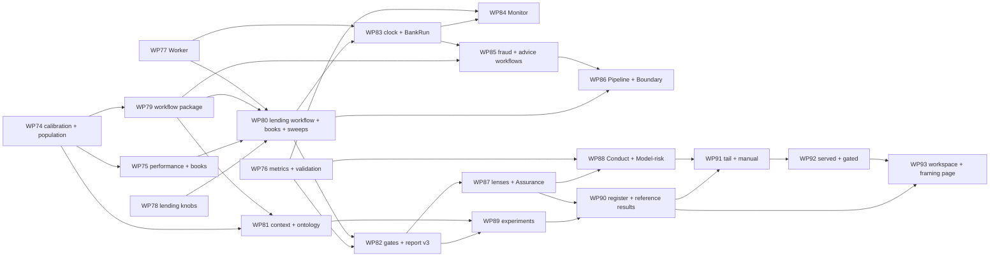

# 65 — Day 5 Roadmap: Phases R–W, WP74–WP93

> The phased plan from today's `main` (`4acafc1`, Phases A–Q closed, WP0–WP73 done, the UX register closed) to the target design in `64-TARGET-DESIGN-V5.md` — the bank in motion, the workflows, the metrics, the lenses, the evidence, and the simulator on the site. Written 2026-09-09; revised the same day with Phase W and the human-load work. Supersedes `42-DAY4-ROADMAP.md`'s forward plan (exhausted); `42-…` §3 and §8 remain the record of what Day 4 built. Every WP below names the `64-…` section it implements and the gap ids (`64-…` §3) it retires, so the two documents can be read against each other, and carries the backlog items from `docs/manual/UX-AND-GAPS.md` §4 where they fall.

---

## 1. Scope decision of record

Day 5 is the phase in which the product stops demonstrating and starts measuring. Three decisions taken with Andrew on 2026-09-09 fix its shape:

1. **Synthetic, calibrated, cited.** The bank grows to a population whose distributions are set to published UK aggregates with a source on every row. No real or anonymised record enters the repo or any artefact; the import seam was offered and declined. Tenet 15 stands.
2. **A simulated bank in motion, with an ingest seam.** The Monitor reads a clock-driven simulator. The seam that would let it read artefacts from bots running elsewhere is designed and stubbed, not connected.
3. **Three lenses first: Assurance, Conduct, Model-risk.** The engineer's Workshop is the fourth and is today's. A lens orders and renames; it never recomputes.
4. **Published on axiom-verity.com, client-only, beside the thought experiment.** The three editions are served as member-gated sections of the site; a member's site account is their evidence-store workspace; hosted compute is a recorded non-goal under the site's Labs security policy. The simulator is presented with *Can a Small Team Govern an AI Bank?* as the bottom-up half of one question, and the workflow configurations carry the thought experiment's autonomy levels so the two speak one language (`64-…` §6.9, tenet 26).

Everything else follows `64-…`: the workflow contract with stages and executors, the context ladder with an ontology, the metrics package with its validation suite, the Worker, the lending knobs and books, experiments and the Control Effectiveness Register.

## 2. Priority logic

The order is dictated by what evidence needs before it can be trusted:

- **Data before metrics, metrics before screens, screens before evidence.** A fairness number over an uncited population is a number about nothing; a screen over an unvalidated metric is a picture of nothing; an experiment before both is a story. Phase R builds the population, the metrics and the Worker; Phase S puts the lending workflow and its variables on them; Phase T makes the bank run; Phase U gives the three readers their pages; Phase V produces the evidence and the register.
- **The lending workflow is the spine.** It is the journey with a rule, a book, a performance label, a matched pair and five reference configurations labelled by autonomy level; every contract is proven on it first and the fraud and advice workflows follow on the same seam (WP85).
- **Every foundation lands with its identity test.** The population's digest, the Worker's byte-identity with the main thread, `DEFAULT_LENDING_POLICY`'s byte-identity with today's constants, a workflow over the golden trace adding only `stage.*` events, a v2 report loading as v3 — each foundation is proven not to have moved what exists before it is built on.
- **Backlog items land where a WP gives them a reason**, not as a fix pass: the Worker (UX-12) is WP77's whole point; the Boundary rewrite (UX-7) is WP86's second ring; the guided path (GAP-2) and report comparison (GAP-6) are WP87's; the cohort axis outside a report (GAP-3) is WP88's; the cache name (CLOSE-2) and the banner's grammar (CLOSE-1) are WP91's.

## 3. Phases and work packages

Sizes as `42-…`: **S** — a session or two; **M** — several sessions; **L** — a week of sessions. Every WP has a design-of-record note (`66-…` onward, numbered as they land) written before its stage A where `64-…` leaves a contract to be detailed, and a dated *Done* entry here on close, with what diverged.

### Phase R — Foundations for evidence (WP74–WP78)

*The population, the metrics, the Worker, the knobs. Nothing in this phase is visible to a reader except the bank page's calibration table; everything in it is what the numbers rest on.*

| WP | What | Definition of done | Size | Retires |
|---|---|---|---|---|
| **WP74** | **The calibration table and the population** (`64-…` §6.1.1–§6.1.2, D5). Stage 0: the **sourcing note** (`66-CALIBRATION.md`) — for every row `64-…` §6.1.2 names, the publication, its edition, the table within it, what it gives and what is simplified; reviewed before a value is typed. Stage A: `CalibrationRow`, `CALIBRATION`, `PackManifest.calibrations`, `checkCalibration`; the generators read the table (the hand-set weights in `generate/customer.ts`, `accounts.ts`, `transactions.ts`, `bureau.ts`, `complaints.ts` become rows). Stage B: `population(seed, options)` with per-customer derived seeds, the lazy `TransactionStream`, calendar dates beside relative days, `customerCase`, the digest. Stage C: the bank page's *Where this bank's shape comes from* and *The bank at scale*. | Every row cites publisher, title, edition, retrieval date; `checkCalibration` refuses a row without one; the 20,000-customer calibration test passes within tolerance per row; customer *k* is identical across sizes; `between` equals concatenated `forAccount`; the population digest asserted for the shipped seed; a 20,000-customer population under a stated time on the CI runner (recorded here); `checkSynthetic` over a 1,000 sample; `bankCase(seed)` unchanged for every existing test and golden. | L | G43, G44 |
| **WP75** | **The performance label and the books** (`64-…` §6.1.3–§6.1.4, D6). Stage A: the note (`67-PERFORMANCE-AND-BOOKS.md`) recording the hazard's form and coefficients and the cited range its base rate must sit in. Stage B: `performanceLabel`, drawn for every application; `LoanApplication`, `LoanBook`, `WorkItem`, `Book`, `loanBook`, the planted departure truth and the `alertRule` in `fs-bank` (`64-…` §6.1.3 — the desk's handwritten alerts are untouched), `alertBook`; `book.schema.json`. | The base rate inside the cited range; the alert rule's precision and recall over a 20,000-customer population recorded as a calibration test; the label never appears in any desk snapshot, brief or line (the tenet-13 sweep extended); the book's outcome mix within its calibration tolerance; a book is byte-stable per population and filter; the schema validates a fixture; `fs-bank` still ships no runtime. | M | G43-part |
| **WP76** | **`@craftabot/metrics` and the validation suite** (`64-…` §6.4.1–§6.4.3, tenet 20). Stage A: the note (`68-METRICS.md`) — every metric, definition, interval method, the planted-effect design and the null design. Stage B: the package — the nine fairness metrics, the six drift metrics, the six human-load and decision-rights metrics (`64-…` §6.4.1a — touches per case, unattended rate, minutes per touch as a cited row, human load at volume, ceiling-breach rate, oversight cost), Wilson / Newcombe / log-ratio / Clopper–Pearson intervals, the z, Fisher and sign tests, Page–Hinkley; `driftIn` delegating with its snapshot unchanged. Stage C: `validation/` — the hand case, the planted effect and the null per metric; `docs/metrics.md` generated from the suite's results with the seeds. | Every metric's three tests green (the human-load metrics over a fixture of stage records with a hand count); `driftIn`'s existing snapshot byte-identical when no new option is passed; the Fraud Desk's precision/recall equal the package's; the null rates at or under bound over 200 seeds, recorded; `docs/metrics.md` regenerated by `npm run metrics:doc` and checked in the build like the schemas. | L | G47, G48 |
| **WP77** | **The Worker host** (`64-…` §6.6.1, D7; UX-12). One module Worker hosting the campaign runner behind the message protocol; packs registered inside from `packs.ts`; storage writes on the main thread; the Campaigns screen's runner moved with **Cancel**, the estimate and a queue; the `runBook` and `runBank` entry points stubbed for WP80 and WP83. | The injection baseline's report from the Worker byte-identical to today's main-thread report; an e2e clicks the rail mid-run and the route changes; the Advice Desk baseline's wall time within 20% of today's; the edition builds' budgets hold (the Worker is a separate chunk, counted). | M | G52 |
| **WP78** | **The lending knobs** (`64-…` §6.6.2). `LendingPolicy`, `DEFAULT_LENDING_POLICY`, `affordabilityVerdictWith`; the desk, the truth, the book's verdicts and the five policy cards reading `extra.config.knobs`; `builds[].overrides.knobs`; the report's slices carrying `knobs`. | `DEFAULT_LENDING_POLICY` reproduces every lending test, the golden trace and the baseline campaign byte-for-byte; a knob sweep over 500 book rows moves approval rate monotonically; the cards' thresholds follow the knobs (a test per card); `52-…` §7 amended with a dated note. | S–M | G50 |

**Exit:** `64-…` §14 items 1, 2 and 6 met; the Worker byte-identity in CI; the knobs' default identity; the sourcing note reviewed and every row cited. A Phase R exit review is recorded in §8 before Phase S opens.

### Phase S — The lending workflow, end to end (WP79–WP82)

*Stages, executors, the five reference configurations, books as a campaign source, the context ladder, the gates that carry intervals. At the end of this phase the spine exists and `64-…` §14 items 3, 4, 5 and 7 are met.*

| WP | What | Definition of done | Size | Retires |
|---|---|---|---|---|
| **WP79** | **`@craftabot/workflow`** (`64-…` §6.2.1–§6.2.2, §8). Stage A: the note (`69-WORKFLOWS.md`) — the spec, the four executors, how an agent stage carries the world across stages through `restore`, how a `human` stage resolves per host, the stage-record digest. Stage B: `StageSpec`, `WorkflowSpec`, `WorkflowConfig`, `runWorkflow`, `WorkflowRun`, `StageRecord`; `stage.started`/`stage.completed` in the catalogue with the OTel mapping; `workflow-run.schema.json`; `fromStage`. Stage C: the harness's `craftabot workflow run` over one work item. | A workflow of one agent stage over the golden lending trace reproduces its events plus only `stage.*` (byte diff); a `rule` stage performs the desk's action with the same `action.performed`; a `human` stage resolves by the scripted resolver and records `by`; a stage whose bot ends without the output is `error` with a finding; `fromStage` reproduces stages 1…*n*−1 byte-identically; input and output validated both ways (a wrong output shape fails the stage, not the run); the trace digest covers the new events; both golden traces unchanged. | L | G45 |
| **WP80** | **The lending workflow, the reference configurations, books and sweeps** (`64-…` §6.2.3, §6.6.3). `LENDING_WORKFLOW` with nine stages over the existing desk; the five reference configurations labelled by autonomy level — `rules-only`, `bot-explains-only` (1–2), `bot-recommends` (3), `bot-with-a-person-at-the-decision` (4), `bot-everywhere` (5); `WorkflowConfig.autonomy` with the ceilings from the site's decision-rights table carried as pack content citing the page; `campaignSchema.source: book`; the runner over a book (one cell per item × guard × brain × context); `craftabot book run`, `craftabot sweep`; the Campaigns screen's **Books** and **Sweeps** tabs on the Worker. | `rules-only` over the whole 2,000-item book agrees with the rule on every row; the five configurations run over the same book and the report slices by configuration and by autonomy level; the ceiling-breach rate is zero at Level 3 and non-zero for declines at Level 5 (the metric sees the breach, nothing prevents it); `--jobs 8` byte-identical to `--jobs 1` over a book; the browser runs a 200-item book in the Worker with the tab live; the intake stage refuses a malformed work item with a finding; `campaigns/fs-lending-book.json` committed and run in CI at `--size 500`. | L | G45-part, G50-part |
| **WP81** | **The context ladder and the ontology** (`64-…` §6.3). Stage A: the note (`70-CONTEXT-AND-ONTOLOGY.md`) — the four levels' record sets per desk, the ontology's classes and relations with their purposes, the knowledge-card rendering, the `graph` line's operations and tiers. Stage B: `ContextSpec`; the desk runtime composing `revealed` and the brief from `extra.config.context`; `checkDesk`'s superset property. Stage C: `fs-bank/src/ontology.ts`, `knowledgeCard`, the `graph` line as the tenth service line. Stage D: `campaignSchema.contexts`, the cell's `context`, the slices, `gateWhereSchema.context`. | The superset property per level on all three desks; the tenet-13 sweep over `knowledgeCard` and `graph` at every purpose; a knowledge card byte-stable per seed and depth; the token budget truncates deterministically with a note; the Advice Desk's `data-minimised` fails a `relational` build on the plain savings case and passes `minimal`; a two-context campaign's report carries per-context slices; a campaign without `contexts` is byte-identical to today's report but for `schemaVersion`; the bank page draws the `graph` line on the Boundary. | L | G46 |
| **WP82** | **The gates and report v3** (`64-…` §6.4.4). `parity`'s `metric`, `stratify`, `confidence`, `power`; the `drift` gate kind with reference windows; the summary's `fairness` and `drift`; `CAMPAIGN_REPORT_SCHEMA_VERSION = 3` with the v2 reader; the browser's panes with `Meter`'s range band and the *underpowered* Lamp; the scorecard's two new sections. | A `parity` gate with `power: 'required'` inconclusive over 12 cells and conclusive over 1,200 (a book campaign); the lending baseline's existing parity gates unchanged in verdict; a `drift` gate over the `population` reference fails on a planted shift; a v2 report loads as v3 with empty panes and a reason; JUnit and SARIF unchanged in shape; the visual baselines regenerated for Campaigns. | M | G47-part |

**Exit:** `64-…` §14 items 3, 4, 5, 7 and 14; the lending book campaign in CI; a Phase S exit review in §8.

### Phase T — The bank in motion (WP83–WP85)

*The clock, the scheduler, the Monitor, and the two other workflows on the contract. `64-…` §14 item 8.*

| WP | What | Definition of done | Size | Retires |
|---|---|---|---|---|
| **WP83** | **The clock, the scheduler and `BankRun`** (`64-…` §6.5.1–§6.5.2, tenet 24). Stage A: the note (`71-THE-CLOCK.md`) — the thinned Poisson arrivals with hour profiles from the calibration table, the routing, the concurrency model, what a `BankRun` records. Stage B: `bankClock`, `ArrivalRates`, `runBank`, `DeskAssignment`, `MonitorSink` (IndexedDB via the Worker; the file store in the harness), `bank-run.schema.json`; `craftabot bank run --day <date> --desks <file>`. | Two clocks from one seed emit the same arrivals whatever the acceleration; `runBank` over one simulated day with `rules-only` desks is byte-stable by `BankRun` digest; every workflow run and trace reaches the sink; a desk at concurrency 4 finishes a day's queue with no item worked twice; the harness's day at `Infinity` under a stated time (recorded). | M | G51 |
| **WP84** | **The Monitor and the ingest seam** (`64-…` §6.5.3). `/workshop/monitor` on the Control Room system: the Strip, the Readouts, the Tapes with the reference hairline, *Fairness now* and *Drift now* from `@craftabot/metrics` over the rolling window, incidents, the queue view; Play/Pause/Step/Replay; the second `MonitorSink` reading the evidence store by workspace and date, stubbed and tested against the memory store. | The monitor folds equal the campaign-summary folds over the same runs (one test per readout); the e2e runs a simulated hour at `Infinity`, pauses, reads a Readout equal to the fold, and the tab answered a click during it; Replay draws the same picture (a snapshot); *underpowered* greys until the window fills; axe green; the evidence-store sink round-trips a `BankRun` through the memory store. | M | G51-part |
| **WP85** | **The fraud and advice workflows** (`64-…` §6.2.3's siblings). `FRAUD_WORKFLOW` (alert → triage → contact → decision → freeze/release → SAR → note) and `ADVICE_WORKFLOW` (request → suitability → recommendation → warnings → execution → confirmation) over the existing desks, each with reference configurations; `alertBook` and the advice-request arrivals on the clock; the desks routed by kind. | Each workflow over its golden trace adds only `stage.*`; `rules-only` fraud over an alert book is the alert rule alone, and its precision and recall equal WP75's calibration test; the SAR stage is irreversible and gated; a bank day runs all three desks; the two workflows' book campaigns in CI at reduced size; the Boundary shows three desks on the ring (WP86 draws the stages). | M | G45-part |

**Exit:** `64-…` §14 item 8; a bank day with three desks in CI at reduced size; a Phase T exit review in §8.

### Phase U — Screens and lenses (WP86–WP88)

*The Pipeline, the Boundary's second ring, the lens system and the three readers' pages. `64-…` §14 items 11 and 12.*

| WP | What | Definition of done | Size | Retires |
|---|---|---|---|---|
| **WP86** | **The Pipeline view and the Boundary rewrite** (`64-…` §6.2.4–§6.2.5; UX-7). `/workshop/workflows` and `/workshop/workflows/<runId>` — the stage rail, the *In*/*Out* panes on `CaseFile`, the Run Lab link at the stage's first tick with the boundary marked, the **What if** drawer re-running from a stage into Compare with synchronised rails. `Boundary.svelte` rewritten: radial layout, collision-resolved leader-lined labels, the workflow ring lit by the run, the executor drawn as the actor. | The Pipeline e2e opens a run, changes an executor, re-runs, and shows two rails; every stage's input and output rendered for the lending, fraud and advice runs; the Boundary's label test asserts no overlapping bounding boxes on the bank's page and on each desk's; the visual baselines regenerated; `44-…` and `60-…` amended with dated notes. | L | G54, G45-part |
| **WP87** | **The lens system, the Assurance lens, Compare for reports, the guided paths** (`64-…` §6.7; GAP-2, GAP-6). `lens.ts` with four lenses; the rail regrouped per lens with a switcher; Settings remembering it; the vocabulary component; `/workshop/assurance` re-cut as the Assurance entry (the register's table lands in WP90 — here it renders *untested* over an empty register and says so); Compare accepting two campaign reports; each lens's three-step `firstRun` Strip. | Every route renders under every lens (the matrix e2e); the vocabulary grep finds no un-mapped term on the rails and entries; the Assurance entry renders for a bot with no experiment; two reports side by side in Compare with the gate tables aligned; the guided Strip dismisses and stays dismissed; axe green. | M | G53-part, G55-part |
| **WP88** | **The Conduct and Model-risk lenses** (`64-…` §6.7; GAP-3). `/workshop/conduct`: the four outcomes with the obligation table beneath each, vulnerability recognised × acted on, DISP timescales, tipping-off and KYC Lamps, a case list per obligation opening the Pipeline at the governing stage. `/workshop/model-risk`: the fairness workbench (every metric, population, window, stratifier, intervals, *n*, matched pairs, the counterfactual flip rate by fork), the drift workbench (PSI per feature against a chosen reference, the series, the detectors), rule agreement over time, the synthetic-hazard label, the validation suite's page. | Every number on both pages is a call into `@craftabot/metrics` or an existing fold (a lint rule as for the instruments); the counterfactual flip rate over twenty forks matches a hand count; the Conduct case list opens the right stage; axe green; the visual baselines gain both. | L | G53, G55 |

**Exit:** `64-…` §14 items 11 and 12; a Phase U exit review in §8.

### Phase V — The evidence (WP89–WP91)

*Experiments, the register, the eight reference results, the tail. `64-…` §14 items 9, 10, 13, 15 and 16.*

| WP | What | Definition of done | Size | Retires |
|---|---|---|---|---|
| **WP89** | **Experiments** (`64-…` §6.8.1, D8). Stage A: the note (`72-EXPERIMENTS.md`) — the design's expansion to campaigns, the analysis fold per metric kind, the verdict rule and the power note. Stage B: `Experiment`, `EffectRecord`, `ExperimentResult` and their schemas; `craftabot experiment run|analyse|render`; the evidence-item kinds. Stage C: `/workshop/experiments` — author over a book, queue on the Worker, the result as a `Matrix` per metric with the band, the verdict Lamp, effects opening runs. | A two-level design expands to two campaigns sharing seeds; `analyse` recovers a planted 6-point effect with sign and a containing interval; a null design over 200 seeds is *inconclusive* ≥ 95% of the time; matched-pair effects use the sign test; the schemas validate fixtures; a result pushes to and pulls from the evidence store with digest verification. | L | G49 |
| **WP90** | **The Control Effectiveness Register and the reference experiments** (`64-…` §6.8.2–§6.8.3). `controlEffectiveness` in `governance/reports`; the Assurance entry's table; the assurance pack's §5 rendering each mitigant's effect and experiment; `experiments/` — the eight files, `human-oversight` among them; `docs/evidence/<experiment>/` with results and the register, committed with digests; the CI shape-run at `--size 500`. | An untested control is `untested`; the pack's §5 cites an effect's experiment and run ids; the eight run full-size on demand (wall time recorded) and reduced in CI; `human-oversight`'s touches-per-case by level fall monotonically from Level 3 to Level 5 and its breach rate rises; the register renders on the Assurance lens with every row opening its effects; `docs/evidence/README.md` states what the results are evidence *of* and not of. | M | G49-part |
| **WP91** | **The tail** (`64-…` §12's last row; CLOSE-1, CLOSE-2). The service-worker cache named per `editionId` and `docs/publishing.md` amended; the tidy banner's singular case; `docs/manual/USER-MANUAL.md` Part G (the population and the calibration table, workflows and the Pipeline, contexts, the Monitor, the lenses, experiments and the register), the Appendix A/B/D updates, the PDF rebuilt through `docs/manual/pdf/`; `docs/playground.md` and the README; the edition budgets re-stated with the Worker and the three screens; the instrument-icon seam extended for the new roundels (pipeline, clock, lens, experiment, register). | The two-section collision does not reproduce (an e2e serving two editions from one origin); the banner reads *and it is an episode* for one; the manual's figures regenerated and the PDF rebuilt; every edition within budget; the schemas check in the build. | S–M | G56 |

**Exit:** `64-…` §14 items 1–16 met and recorded here.

### Phase W — The site (WP92–WP93)

*The three sections served and gated, the member's workspace, the framing page. `64-…` §14 item 17. Both WPs touch the `axiomverity` repository as well as this one, and each lands as one PR in each, cross-referenced.*

| WP | What | Definition of done | Size | Retires |
|---|---|---|---|---|
| **WP92** | **Served and gated** (`64-…` §6.9.1 tier 0, §6.9.2). In this repository: `build:editions` output published as a release artefact; `docs/publishing.md` rewritten for the site. In `axiomverity`: the three folders served as static assets under `/simulator`, `/workshop`, `/playground` by the Node service; the `hooks.server.ts` rule redirecting an unauthenticated request for any of them to `/login` with the return path (`isSafeRedirectPath` guards it); `labs.ts`'s `craft-a-bot` entry pointing at the sections; the *your keys never leave your browser* copy on the landing of each. | The three sections open on a preview deploy for a signed-in member and redirect for a visitor; the two-section service-worker e2e passes on the served origin (WP91's cache name is the prerequisite); the key-leak sweep runs over the served folders; every edition within its budget; `npm run check` and `lint` clean on the site; no route of the simulator is server-rendered (a test greps the site's build for the three bases in the SSR manifest and finds none). | M | G57-part |
| **WP93** | **The workspace and the framing page** (`64-…` §6.9.1 tier 1, §6.9.3). In `axiomverity`: the third `SECURITY DEFINER` function minting a scoped evidence-store token for `profiles.id` (a migration; types regenerated); `/thought-experiment/simulator` — the top-down claims, the bottom-up measurements from `docs/evidence/`, the assumption-beside-measurement table with *agree* / *disagree* / *not yet measured*, the *Try it* links; `SeoHead`, breadcrumb, sitemap and `llms.txt` entries. In this repository: the Evidence screen's *Use my Axiom Verity workspace* offer when served from the site; the decision-rights ceilings as pack content citing the page; the simulator's *About* strip linking back. | The token lets the simulator push and pull one bundle under the member's workspace and nothing else (the store's contract suite against the minted token; a second member cannot read it); the offer is absent when the simulator is served elsewhere and every screen works with it declined; the framing page's table is generated from `docs/evidence/` and the site build fails when an assumption names a metric the evidence lacks; the page passes axe and the contrast test; `v4-site-design.md` amended with the fifth sub-page. | M | G57 |

**Exit:** `64-…` §14 all seventeen met and recorded here; §9 below.

## 4. Dependency sketch

Phase R is parallel-friendly: WP76 (metrics) and WP77 (Worker) touch nothing WP74 touches and start on day one; WP78 (knobs) is a session inside `fs-lending` and fits any gap; WP75 needs WP74. Phase S is serial through WP79 → WP80, with WP81 beside WP80 (both need WP79; the ontology needs WP74's population) and WP82 after WP80 (it needs a book to prove power). Phase T needs WP80 and WP77; WP85 can slip a phase without loss. Phase U needs Phase S (WP86 needs three workflows, so WP85; WP87 needs the report v3; WP88 needs WP87 and WP76). Phase V needs WP82 and WP81 for WP89, and WP87 for WP90's landing. WP91 is last.

WP92 needs WP91's cache name and nothing else in Phase V, so it can start as soon as WP91's first stage lands; WP93 needs WP90's committed results (the framing page has nothing to show without them) and WP92's serving.

The critical path is WP74 → WP79 → WP80 → WP82 → WP89 → WP90 → WP91 → WP92 → WP93. Everything off it can be scheduled around it. If the site should go up earlier, WP92 can be pulled forward to any point after WP91's cache name — the sections it serves are whatever `main` builds that day, and the framing page's table simply reads *not yet measured* until WP90.

## 5. Build discipline (inherited from `42-…` §5, six additions)

1. **A row without a source does not build.** `checkCalibration` is a build check, not a lint; the sourcing note precedes any value.
2. **A metric without its three tests does not merge.** The validation suite is the definition of done for every function in `@craftabot/metrics`; `docs/metrics.md` is generated and checked like the schemas.
3. **Every host runs the same runner.** The Worker, the main thread and the harness import one module; the byte-identity test between them is a CI job that never moves to "flaky".
4. **A screen shows a fold, never its own arithmetic.** The lint rule that keeps charts on `Matrix`/`Tape`/`Meter` gains a sibling: a Workshop route may import from `@craftabot/metrics` and `governance/reports`, never compute a rate inline.
5. **Client-only stays client-only.** No WP adds a server the simulator calls. A change that would make a request reach a server the site pays for is a design change to `64-…` §6.9 and §11, not a PR.
6. **Reduced in CI, full on demand, results committed.** Books, bank days and experiments run at `--size 500` in CI for shape; full-size results are produced on a working machine, committed under `docs/evidence/` with digests and wall times, and never regenerated silently.

## 6. Carried in from the UX register (`docs/manual/UX-AND-GAPS.md` §4), and where each lands

| Item | Lands in |
|---|---|
| UX-12's Worker | WP77 |
| UX-7 Boundary label collisions | WP86 |
| CLOSE-2 one service worker per origin | WP91 (the prerequisite for WP92) |
| GAP-2 a guided path through the Playground | WP87 (`firstRun` per lens) |
| GAP-6 compare two campaign reports | WP87 |
| GAP-3 the cohort axis outside a campaign report | WP88 (the fairness workbench) |
| GAP-1 control-map row review as content | Unchanged; the register (WP90) shows `unreviewed` rows beside `untested` ones, which is the case for reviewing them |
| GAP-5 *Talk to this desk* | Not scheduled; the Pipeline's What-if drawer is the nearer need |
| CLOSE-1 the tidy banner's grammar | WP91 |

## 7. Follow-ups from Day 4's notes, and where each lands

| From | Follow-up | Lands in |
|---|---|---|
| `50-…` §7 | No statistical test on parity | WP76, WP82 (computed and reported; the gate still bounds) |
| `52-…` §7 | One rate, one rule, no scorecard | WP78 (knobs; still no scorecard) |
| `43-…` §4.4 | `configure` stored and unread | WP78, WP81 |
| `57-…` | The harness at scale: a corpus worth scaling | WP80's books, WP83's days |
| `58-…` | Evidence kinds beyond bundles and reports | WP79, WP83, WP89 (`workflow-run`, `bank-run`, `experiment-result`) |
| `53-…` §5 | Mitigants without measured effect | WP90 |
| `59-…` | Publishing three sections | WP91 (cache name) |
| `62-…` §4.1 | The instrument-icon seam | WP91 (five new roundels) |

## 8. Session-sized next steps (the immediate to-do)

Each is one sitting, in order; each ends with a dated note here.

0. **Docs pass.** Add `64-…` and this document to `docs/design-day2/README.md` and `CLAUDE.md`'s doc chain; amend `41-…`'s status line to point forward; record in `12-…` that the Day 5 foundations assessment is `64-…` §2.1.
1. **`66-CALIBRATION.md` stage 0 — the sourcing note.** Every row, its publication, edition, table and simplification. No values yet. Reviewed by Andrew before step 2.
2. **WP76 stage A — `68-METRICS.md`.** The definitions and the planted-effect designs, on paper, with the hand cases worked. In parallel with step 1; touches no code.
3. **WP77 — the Worker.** The runner module, the protocol, the Campaigns screen moved, the byte-identity test. One WP, whole.
4. **WP74 stage A — the table.** Rows typed from the sourcing note with their citations; `checkCalibration`; the generators reading rows; every existing test green.
5. **WP78 — the knobs.** `DEFAULT_LENDING_POLICY` and the identity tests.
6. **WP76 stages B–C — the metrics package and the validation suite.** `docs/metrics.md` generated.
7. **WP74 stages B–C — the population.** The digest, the calibration test, the bank page.
8. **WP75 — the performance label and the books.**
9. **Phase R exit review** — the exit line above, checked and recorded here before Phase S opens.
10. **`69-WORKFLOWS.md`, then WP79 stage B.** The package, the events, the golden-trace identity test.
11. **WP80 — the lending workflow, the five configurations by autonomy level, books, sweeps.** The first book campaign in CI.
12. **`70-CONTEXT-AND-ONTOLOGY.md`, then WP81.**
13. **WP82 — gates and report v3.**
14. **Phase S exit review.**
15. **`71-THE-CLOCK.md`, WP83, WP84, WP85.** The bank runs.
16. **Phase T exit review.**
17. **WP86, WP87, WP88.** The readers' pages.
18. **Phase U exit review.**
19. **`72-EXPERIMENTS.md`, WP89, WP90.** The eight reference experiments run full-size on a working machine; results committed.
20. **WP91.** The manual's Part G, the PDF, the tail — the cache name first, because WP92 waits on it.
21. **Phase V exit review.**
22. **WP92 — served and gated.** One PR here, one on the site; a preview deploy a member can open.
23. **WP93 — the workspace and the framing page.** The assumption-beside-measurement table goes up with whatever it can measure.
24. **Phase W exit review and the §9 check.**

## 9. What "done" looks like for this roadmap

`64-…` §14's fifteen acceptance criteria, all met, plus one that is this document's own: a model-risk analyst at a UK retail firm, with a fresh checkout and no key, can run `npm ci && npx craftabot experiment run experiments/lending-stack.json --size 5000 --jobs 8 --egress none` and read, for the policy-card stack against rules-only and against a bot with a person at the decision, the change in over-approval, missed referral, approval load and tokens per case, each with an interval and an *n*, sliced by age band and by context; open the Model-risk lens and see the same population's demographic-parity, equal-opportunity and conditional-parity gaps with their intervals, the matched-pair discordance, and PSI per feature against the population it was drawn from; open the Pipeline on any one of the five thousand runs and read what every stage took in and put out; press Play on the Monitor and watch the same bank work a day; and hand a board member the Assurance lens, where the Control Effectiveness Register says, for each control on the bank's map, what it did, at what cost, how sure, and which controls nobody has tested yet — every number opening to a run, every run reproducible from a seed, and not one record in any of it real. And a member of axiom-verity.com, with no checkout at all, can sign in, open `/playground`, run the same experiment in their own browser against their own key, push the result to their own workspace, and then read `/thought-experiment/simulator`, where the scenario model's assumed touches per case sit beside the simulator's measured ones, and the page says whether they agree.

---

*End of document.*
