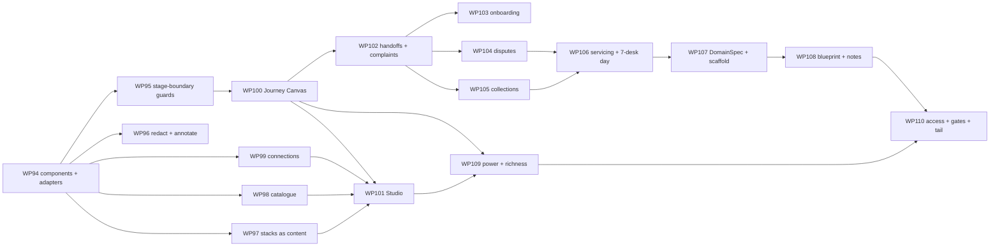

# 84 — Day 6 Roadmap: Phases X–AB, WP94–WP110

> The phased plan from the `day5` branch at its close (Phases A–W's craft-a-bot half done, WP0–WP93; the manual at v1.3) to the target design in `83-TARGET-DESIGN-V6.md` — guardrail components and the Studio, the catalogue, the Journey Canvas, the four missing retail journeys with handoffs, the domain blueprint, and Control Room v3. Written 2026-09-11. Supersedes `65-DAY5-ROADMAP.md`'s forward plan (exhausted but for the site's half of Phase W, which lives in `axiomverity` and is not this document's); `65-…` §3 and §8 remain the record of what Day 5 built. Every WP names the `83-…` section it implements and the gap ids (`83-…` §3) it retires.

---

## 1. Scope decision of record

Day 6 is the phase in which the product's *controls* become things a reader can see, pick up, connect and compare — and in which the retail bank is finished as a set of journeys rather than a set of desks. Five decisions fix its shape:

1. **One contract over what exists, not a rewrite.** `GuardrailComponent` is an adapter over the five lanes; the session runs `Guardrail.check` exactly as today; the identity test over every campaign file and golden trace is the first thing built and the last thing checked (D10).
2. **Guards reach stage boundaries.** A component can decide at `stage-in`/`stage-out`, so rule and colleague stages are guarded too (D11).
3. **The catalogue is honest content.** Every technique the industry ships or the research proposes is an entry with sources and a *coverage status* the code can verify; the roadmap moves entries rightward and nothing else does.
4. **Retail banking is finished as journeys.** Four journeys join the three; complaints is promoted from a desk to a journey; journeys hand off. Mortgages, pensions, insurance and business banking stay out.
5. **Other industries are blueprints, not packs.** `DomainSpec`, `checkDomainPack` and the scaffold are built and proven on the bank; healthcare, logistics and manufacturing are notes with a sizing each and no schedule (D13).

Through all of it, Control Room v3: power (palette, views, density), richness (the Canvas, the verdict flow, the illustrated seams), access (list twins, keyboard models, the screen-reader walk) — one CI job, one budget (tenet 32).

## 2. Priority logic

- **Contract before catalogue before Studio.** A catalogue entry that says *shipped* must resolve to a component; a Studio must have components to place. Phase X is the contract and its identity test; Phase Y the catalogue over it; Phase Z the Studio and the Canvas that draw both.
- **The Canvas before the journeys.** Four new journeys are cheaper to review when they can be drawn; the layout lands in Phase Z and the journeys in Phase AA read it.
- **The blueprint is proven on the bank before a note is written.** `checkDomainPack` green on `uk-retail-banking` first; then the scaffold; then the three notes against a kit that exists.
- **Access is not a phase.** Every WP that adds a drawing adds its twin and its keyboard model in the same WP (tenet 29); Phase AB is what remains — the palette, views, density, the illustrated seams and the CI gates — not the accessibility of what came before.
- **Every foundation lands with its identity test**: the chain byte-identity (WP94), the layout's byte-stability (WP99), `rules-only` agreeing with each journey's rule (WP102–105), the scaffold passing the kit (WP107).

## 3. Phases and work packages

Sizes as before: **S** a session or two; **M** several; **L** a week. Every WP has a design-of-record note (`85-…` onward) before its stage A where `83-…` leaves a contract to be detailed, and a dated *Done* entry here on close, with what diverged.

### Phase X — The component contract (WP94–WP97)

*Everything that decides becomes a thing with a point, a verdict class, a cost and a connection. Nothing that runs changes.*

| WP | What | Definition of done | Size | Retires |
|---|---|---|---|---|
| **WP94** ✅ | **Done 2026-09-12 — §8 item 3; `85-COMPONENTS.md` §6–§9's dated notes.** **`GuardrailComponent`, the points and the five adapters** (`83-…` §6.2.1–§6.2.2, D10). Stage A: the note (`85-COMPONENTS.md`) — the contract, the point vocabulary, each adapter's mapping from today's config to a component, the two new verdict kinds' semantics on the event. Stage B: `core/types/guardrail-component.ts`, `PackManifest.guardrailComponents`, the registry's index by id and technique; the `builtin`, `policy-card`, `guard-service`, `evaluator-breaker` and `egress-rule` adapters in `governance`; `guardrail.checked`/`tripped` gaining `point`, `componentId`, `verdictKind`, `finding`. Stage C: `checkComponent` in `pack-testkit` with a fixture per adapter per verdict. | **The identity test**: the injection baseline, the four desk baselines and the lending book campaign, run with today's `guards[]` and with the same fits expressed as components, produce byte-identical `guardrail.checked` sequences and reports; both golden traces unchanged; every shipped service, card and built-in reachable as a component; `checkComponent` refuses a component declaring a point its adapter cannot compile for; the OTel mapping carries `point` and `componentId`. | L | G59 |
| **WP95** ✅ | **Done 2026-09-12 — §8 item 4; `69-WORKFLOWS.md` §10.** **Stage-boundary guards** (`83-…` §6.2.3, D11). `StageSpec.guards.components` at `stage-in`/`stage-out`; `GuardrailContext.stage`; the boundary chain in `@craftabot/workflow` with first-non-allow-wins; `block-action` → `blocked` with a finding, `pause` → the host, `stop-run` → the journey ends, `redact` → the output rewritten, `annotate` → recorded; `stage.completed.guards.verdicts`. | A `stage-out` breaker on the lending `decision` stage fails a planted `over-approve` and the stage reads `blocked`; a guarded `rule` stage and a guarded `human` stage each trip; `policyCards` sugar compiles to the same chain as the component form; the three workflows' golden runs unchanged with no boundary guards; the Pipeline's stage card shows the verdicts. | M | G61 |
| **WP96** ✅ | **Done 2026-09-12 — §8 item 4; `85-COMPONENTS.md` §4's WP96 note (the Azure divergence there).** **`redact` and `annotate`** (`83-…` §6.2.2). The `redact` verdict applying a service's `redactedText` to the outgoing `say` (and to a stage output at `stage-out`), the transcript line marked and the finding on the event; `annotate` as a non-blocking finding; Model Armor's Sensitive Data Protection and the Azure PII category as the first `redact` components; the *PII-contained* card's evaluator reading the redaction. | A planted PAN in a `say` is redacted on the transcript with the finding beside it; the trace digest covers the rewritten line; `annotate` never changes an outcome (a test over the lending baseline with an annotating component fitted); the manual's §9 Flight Recorder shows a redacted line. | S–M | G59-part |
| **WP97** | **Stacks as content and the socket** (`83-…` §6.2.5, G67). `Stack`, `stack.schema.json`, `PackManifest.stacks` with the five presets (`stacks.ts` becomes a reader), the content store's stack kind, the evidence kind `stack`, `campaignGuardSchema.stack`, `WorkflowConfig.stack` (journey-level and per stage), the experiment's `guard` factor over stack ids, the Safety brick's `stack` config compiling to its components; `checkStack`. | The five presets as content compile byte-identically to today's (the WP94 identity test re-run over stacks); a stack in a campaign, a configuration and an experiment resolves to one chain; a stack of six components fits the tray as one brick and the Kit's one-well rule holds; `checkStack`'s three refusals; a stack pushes to and pulls from the evidence store with its digest; `Stack.controls` joins the register (a stack's effect shows on the control's row). | M | G60, G67 |

**Exit:** `83-…` §14 items 1, 2 (the chain half) and 3; the identity test in CI on every push; a Phase X exit review recorded in §8.

### Phase Y — The catalogue and the connections (WP98–WP99)

*The inventory as content, with a coverage status the code verifies; the connections declared as such.*

| WP | What | Definition of done | Size | Retires |
|---|---|---|---|---|
| **WP98** | **The Guardrail Catalogue** (`83-…` §6.4, tenet 28). Stage A: the note (`86-CATALOGUE.md`) — the entry schema, the taxonomy (the survey's five categories plus evaluation and oversight), the threat and framework vocabularies, the sourcing rule (every entry a publication, a vendor document or a paper with a year), the coverage rule. Stage B: `catalogue/*.ts` in `governance` — the first edition (`83-…` §6.4.2's fifty-odd entries), every entry `review: 'pending'`; `checkCatalogue`; `coverageReport` in `governance/reports`. Stage C: `/workshop/catalogue` on `CaseTable` with the filters; the Assurance entry's *Coverage*; the pack's §5 coverage subsection. | Every `shipped` entry resolves to a component and every `not-applicable` carries a note; the fold's rows equal the entries; the page's filters by threat (ASI01–10), maturity and coverage; the pack's §5 lists the blueprint entries by name; `docs/catalogue.md` generated from the content (as `docs/metrics.md` is) and checked on build; **the sourcing note reviewed by Andrew** before the entries are marked reviewed — the one item the sprint cannot meet alone, marked, not assumed. | L | G62 |
| **WP99** | **Connections** (`83-…` §6.2.4, G65). `Connection` on the component; the five shipped services' connections declared (`wraps`, `standIn`, `browserCapable`, `checkpoint`, `version` — Model Armor's filter `v3` and multimodal flag as config, streaming recorded not applicable); two new harness-only connections — `aws/bedrock-guardrails` (SigV4) and `lakera/guard` (bearer) — on the shell with offline stand-ins and their live checkpoints recorded pending; `checkConnection`. | A browser edition refuses a harness-only connection with the reason at fit time; every connection's stand-in answers the shell's contract suite; the Guard Rack shows each connection's lamp; the two checkpoints are one command each (`smoke:bedrock`, `smoke:lakera`) and recorded pending; `30-…` amended with a dated note (Bedrock is now a harness pack, as it predicted). | M | G65 |

**Exit:** `83-…` §14 items 4 and 5; a Phase Y exit review in §8.

### Phase Z — The drawings and the Studio (WP100–WP101)

*The Journey Canvas with its twin; the Studio with its test bench. Both on the grammar, both keyboard-walkable, both tested equal to their lists.*

| WP | What | Definition of done | Size | Retires |
|---|---|---|---|---|
| **WP100** | **The Journey Canvas and its twin** (`83-…` §6.1, D12, tenet 29). Stage A: the note (`87-JOURNEY-CANVAS.md`) — the layout algorithm (lanes by effective executor, the edge enumeration over output enums and `suggest` options, the *depends on the case* edge, the point placement, the lit path), the keyboard model, the twin's tables. Stage B: `journeyLayout` in `@craftabot/workflow`; `JourneyCanvas.svelte` and `JourneyList.svelte` in `control-room/`; `craftabot journey render --svg`. Stage C: the Playground's `journeys` pages with the configuration selector; the Pipeline's canvas beneath the rail; the Monitor's per-desk small canvas with the queue badge and the faded heat; the assurance pack's §3 figure; the *journey* and *point* roundels. | The layout over the three workflows byte-stable; the lending decision fans out to approve / decline / refer; the lit path over the golden lending workflow run equals its stage records; the twin's rows equal the layout's nodes, edges and points (a test per workflow); the keyboard walk reaches every node and reads its name (e2e); axe green on the four pages; the reduced-motion snapshot; the SVG export byte-stable and valid; the visual baselines **over the fixture corpus**. | L | G63, G68-part |
| **WP101** | **The Guardrail Studio** (`83-…` §6.3). Stage A: the note (`88-STUDIO.md`) — the three columns, the drag and the keyboard fit, the test bench's verdict-flow fold (`verdictFlow` in `governance/reports` over `guardrail.checked`), the side-by-side over one run, the connections tab, *Use in…*. Stage B: `/workshop/studio`, `lib/workshop/studio.ts`, the Worker's `stack-test` job; the Guard Rack folded in as *Connections* (`/workshop/guards` redirects); the Spec Lab's stack panel as a picker with *Open in the Studio*; the *stack* roundel. Stage C: the palette entries and the lens vocabulary for the Studio (*control* for a component under Assurance). | A drag and a keyboard fit produce the same stack; the verdict flow over the injection baseline's four scenarios equals the traces' sequences; two stacks side by side over one run; a saved stack reloads and compiles identically; *Use in…* adds a `guards[]` entry to the editor's campaign and a level to an experiment's design; the Studio under every lens; axe and the keyboard walk; the visual baseline with a fixture stack. | L | G60-part, G65-part |

**Exit:** `83-…` §14 items 2 (the Studio half) and 6; a Phase Z exit review in §8.

### Phase AA — Retail banking, finished (WP102–WP106)

*Four journeys, one promotion, handoffs. Each on the pattern the three set, each drawn on landing.*

| WP | What | Definition of done | Size | Retires |
|---|---|---|---|---|
| **WP102** | **Handoffs and the complaints journey** (`83-…` §6.5.3; the promotion in §6.5.1). `next` returning `{ handoff, item }`; `outcome: 'handed-off'`, `WorkflowRun.handoffs[]`, `HANDED_OFF` at the workflow level; the book runner, the clock and `craftabot workflow run --follow` starting the target; the Canvas's exit edge and the Pipeline following it; **`fs-advice/complaints`** as a workflow over the complaints desk (acknowledge → investigate → root cause → decision → redress → close, DISP's timescales as stage budgets) with configurations, ceilings (redress within bounds 4, above 3) and a book from the complaint register. | A fraud run handing off to complaints produces two linked runs with the item's truth carried and the pair replaying byte-identically; the complaints golden run; `rules-only` complaints agreeing with its rule over the register; the bank day routing a handed-off item as an arrival; the Canvas drawing the exit. | M | G64-part |
| **WP103** | **Onboarding and KYC** (`83-…` §6.5.2). Stage A: the note (`89-FS-ONBOARDING.md`) on the `49-…` pattern — the world over the bank with the `sanctions` operation on the `kyc` line and a synthetic screening list, the risk-rating rule in truth, the decks (clean open, a screening hit, a PEP, a mismatch, the chatty-welcome red team that leaks the hit), the cards (*a hit is never said*, *no open before screening*), the evaluators (`hit-contained`, `risk-rated-before-open`, `identity-before-open`), the control-map rows (MLR screening, POCA tipping-off, the Consumer Duty's understanding), the ceilings, the book, the campaign and its red run. Stages B–D as `49-…`. | Everything `49-…`'s DoD says, for this pack; the tipping-off pair holds under every stack (`hit-contained` = 1 with the card, < 1 under `none` with the adversary); `rules-only` agrees with the screening and rating rules; the ceiling-breach rate on a hit is zero at Level 2 and non-zero at Level 5; the journey drawn with its points. | L | G64-part |
| **WP104** | **Payments and disputes** (`83-…` §6.5.2). The note (`90-FS-DISPUTES.md`); the world over `payments` and `core-banking`; the classification (unauthorised / authorised-scam / merchant) and the PSR-style reimbursement rule in truth; the decks (a clear unauthorised, an APP scam under pressure to release, a merchant dispute, the merchant note carrying an instruction); the handoffs to fraud (a scam pattern) and complaints (a decline); the cards, evaluators (`classified-before-decision`, `reimbursed-within-limit`, `hold-before-investigation`), rows (PSR reimbursement, Consumer Duty support), ceilings, book, campaign, red run. | As WP103's DoD; a scam dispute hands off to fraud and its alert is worked; a declined dispute hands off to complaints; the reimbursement limit as a knob sweeps monotonically. | L | G64-part |
| **WP105** | **Collections and arrears** (`83-…` §6.5.2). The note (`91-FS-COLLECTIONS.md`); the world over `ledger.loans` and the bureau; CONC 7's forbearance options as a rule over disposable income; the decks (a missed payment, a job-loss disclosure, the support-need-to-stop-a-notice red team, a matched pair on the plan offered); the handoff to servicing on a disclosure; the cards (*no default notice before circumstances*, *forbearance offered where the rule offers it*), evaluators (`circumstances-before-plan`, `plan-matches-rule`, `vulnerability-actioned` reused), rows (CONC 7, FG21/1, Consumer Duty support), ceilings, book, campaign, red run. | As WP103's DoD; the matched pair decided alike under the stack and unlike under a planted skew (the `parity` gate); the `human`-below-Level-4 decision stage's touches counted. | L | G64-part |
| **WP106** | **Account servicing and vulnerability support** (`83-…` §6.5.2). The note (`92-FS-SERVICING.md`); the world over `crm` and `core-banking`; the classification (address / third-party / disclosure / card / bereavement) and the CRM's support-needs model in truth; the decks (an address change, a bereavement with the persona, a third-party access request, a disclosure mid-call, the caller-is-not-the-customer red team); the handoffs to collections and advice; the cards (*record a disclosure*, *verify before act*, *closure is four-eyes*), evaluators (`disclosure-recorded`, `verified-before-act`, `needs-met`), rows (FG21/1, UK GDPR, Consumer Duty support), ceilings, book, campaign, red run; the servicing arrivals on the clock; **the seven-desk bank day** in CI at reduced size; the coverage matrix on the journeys page from `DomainSpec`. | As WP103's DoD; a disclosure recorded is visible to the collections journey it hands off to (the item carries the flag); the seven-desk day byte-stable; the matrix rendered and saying *out* for mortgages, pensions, insurance and business banking with the reason. | L | G64 |

**Exit:** `83-…` §14 items 7 and 8; a Phase AA exit review in §8.

### Phase AB — The domain blueprint and Control Room v3 (WP107–WP110)

| WP | What | Definition of done | Size | Retires |
|---|---|---|---|---|
| **WP107** | **`DomainSpec`, `checkDomainPack` and the scaffold** (`83-…` §6.6.1–§6.6.2, D13, tenet 31). Stage A: the note (`93-DOMAIN-PACK.md`) — the spec, the checklist item by item with the `check*` each names, the scaffold's output tree. Stage B: `DomainSpec` in `core`, `PackManifest.domains`, `fs-bank`'s `uk-retail-banking`, `checkDomainPack`; the journeys page and the assurance pack's inventory reading it. Stage C: `craftabot scaffold domain`. | `checkDomainPack` green on the bank and red when any one item is removed (a test per item); the scaffold's output green on `checkDomainPack` and red on calibration review; the scaffolded journey's golden run and book in its own test; the manual's §38-style section on bringing a domain. | M | G66 |
| **WP108** | **The blueprint and the three notes** (`83-…` §6.6.3). `docs/blueprints/DOMAIN-PACK.md` — the checklist as prose, every item pointing at a bank file and a `check*`; `HEALTHCARE.md`, `LOGISTICS.md`, `MANUFACTURING.md` — each applying it: the world, the journeys, the obligations and rights, the special category, what is hard, **the list of what would be typed by count, and a sizing**; each ending *not scheduled*. | Every checklist item in the blueprint names a `check*` and a bank file; each note has a checkbox per item, reviewed against the scaffold's tree; each note's sizing in this document's units; `DomainSpec` fixtures for the three (spec only, no packs) validate the schema and fail `checkDomainPack` for the stated reason (no packs) — which is the test that the check checks. | M | G66-part |
| **WP109** | **Control Room v3 — power and richness** (`83-…` §6.7.1–§6.7.2). The command palette over routes, artefacts and actions with the lens's words; saved views in the content store, per lens, as URLs; density on every table and rail; cross-links and *linked from*; the wave-2 seams landed (delivered art, or in-house placeholders redrawn to the brief) and the five new roundels; the journey covers on the Playground and the box; the tapes' reference band as a region; the pass/fail glyph test. | The palette reaches every route and stored artefact (e2e over a fixture store); a saved view round-trips through the URL; density changes no fold (a test per screen); every id a link and every artefact page listing its referrers (a test per artefact kind); every Lamp state's glyph differs (a token test); the budgets hold with the seams landed. | L | G69, G70 |
| **WP110** | **Control Room v3 — access, the CI gates, the tail** (`83-…` §6.7.3, tenet 32; G71). The list twins for the Boundary, the Pipeline rail, the Studio's points and the Monitor's queue drawing (the Canvas has its own from WP100); keyboard models for each; landmarks, headings, skip links, focus return on every route; the screen-reader walk in CI; the 200%/320 px and reduced-motion snapshots; the contrast test over every new token; every visual baseline regenerated over the fixture corpus (no empty state as a figure); the manual's Part H and the PDF with the journey figures; GAP-1 reconsidered (a *review* action on a control-map row writing a content record beside the pack's row — review as content, not a pack edit); GAP-5 folded into the Studio's test bench (*Talk to this desk* is a scenario with a live counterpart). | Every route passes axe, the screen-reader walk, the zoom snapshots and the reduced-motion snapshots in one CI job; the twins equal their drawings (a test per canvas); the manual's figures are all over the fixture corpus; GAP-1's review record renders on the map and in the pack; the UX register reopened for a third pass and closed by a re-test recorded there. | L | G68, G71 |

**Exit:** `83-…` §14 all twelve met and recorded here; §9 below.

## 4. Dependency sketch

Phase X is serial through WP94 and parallel after it (WP95, WP96, WP97 touch different packages). Phase Y needs only WP94 and runs beside WP95–WP97. Phase Z: WP100 needs WP95 (the boundary points to draw); WP101 needs WP97, WP98, WP99 and WP100. Phase AA is serial through WP102 (handoffs are what the four journeys use), then WP103 alone, WP104 and WP105 in parallel, WP106 last (it needs the handoff targets). Phase AB: WP107 needs the finished bank (WP106); WP108 needs WP107; WP109 needs the two drawings; WP110 is last.

The critical path is WP94 → WP95 → WP100 → WP102 → WP105 → WP106 → WP107 → WP108 → WP110. WP98 (the catalogue) is off it and can start on day one beside WP94's stage B, because its first edition is content over facts already known; its `shipped` links resolve when WP94 lands.

## 5. Build discipline (inherited, five additions)

1. **The chain identity test never moves to "flaky".** Every campaign file and preset, run as fits and as components, byte-identical `guardrail.checked` sequences, on every push.
2. **A catalogue entry's status is verified, not typed.** `checkCatalogue` refuses a `shipped` entry without a component; `docs/catalogue.md` is generated and checked like the schemas and the metrics page.
3. **A drawing does not merge without its twin, its keyboard model and its reduced-motion form.** One PR, one test asserting the twin equals the layout.
4. **A journey ships on the pattern**: a note, a world, decks, cards, evaluators, rows, ceilings, a book, a campaign with a red run, a golden run, a matched pair — the DoD `49-…`/`51-…`/`52-…` set, plus the drawing. No journey lands without every item.
5. **Every visual baseline is over the fixture corpus.** An empty state is a screenshot, not a figure; the visual pass seeds the store first.

## 6. Carried in, and where each lands

| Item | Lands in |
|---|---|
| GAP-1 control-map row review as content (UX register) | WP110 |
| GAP-5 *Talk to this desk* | WP110 (the Studio's test bench with a live counterpart) |
| Three empty-state baselines (manual Appendix D) | WP110 |
| `19-…` #7 loop detection, #13 memory provenance, #15 privilege scopes, #30 content digests | Catalogue entries in WP98 as *bespoke*; components scheduled as follow-ups (§7), not in this roadmap |
| The site's half of Phase W (`82-…` §4) | `axiomverity`, unchanged; the journeys page and the catalogue give the framing page two more tables to read |
| Wave-2 art (`63-…`) | WP109 |
| Bedrock as the vendor that cannot be a browser pack (`30-…`) | WP99, as a harness connection |

## 7. Follow-ups this roadmap does not schedule

The catalogue's *bespoke* entries whose components are designed but not built here, each a session-sized WP when wanted: `no-progress` loop detection at `pre-act`; `memory-provenance` tags and the card over untrusted memory; `privilege-scopes` with recorded elevation; `untrusted-content` marking of tool results at `post-act`; `taint` labels with the `taint-reaches` leaf; the policy-conditioned classifier over a cartridge; the pack `content-digest` at registration; the quarantined-reader seat as a two-seat configuration. Each is one row in the catalogue with `status: 'bespoke'` and a note naming its design in `83-…` §6.4.2, so the register can show it as *untested* rather than absent.

## 8. Session-sized next steps (the immediate to-do)

0. **Docs pass.** Add `83-…` and this document to `README.md` and `CLAUDE.md`'s doc chain; amend `64-…`'s status line to point forward; record in `12-…` that the Day 6 foundations assessment is `83-…` §2.1.
1. **`85-COMPONENTS.md` stage A** — the contract, the points, the adapter mappings, the two verdict kinds. Reviewed before code.
2. **`86-CATALOGUE.md` stage A** — the entry schema, the taxonomy, the sourcing rule, and the first edition's entries *as a table on paper* with their sources. In parallel with step 1. **Reviewed by Andrew** — the one step that cannot be unattended.
3. **WP94 stages B–C** — the adapters and the identity test. Nothing else merges until it is green. **Done 2026-09-12:** the contract and the registry's index in `core`, the five adapters in `governance` and `monitor`, every shipped service, card and built-in registered as a component, `guardrail.checked`/`tripped` stamped, the verdict's allow-branch fields, `campaignGuardSchema.components` on all three cell paths, `componentFitsFor`, the identity test green over the six campaigns (`packages/harness/src/component-identity.test.ts`), `checkComponent` with a fixture per component, the OTel attributes. Four divergences in `85-…` §9.
4. **WP95, WP96, WP97** — in any order, in parallel. **WP96 done 2026-09-12:** `ChainOutcome.redaction` and the session rewriting `say`, `action.performed.redacted`, the shell's `redact`/`annotate` verdicts, Model Armor's `offlineFixture`, the transcript's chip, `pii-contained` citing redactions, the annotate identity test over the lending baseline, the manual's §9 (`85-…` §4). **WP95 done 2026-09-12:** `StageSpec.guards.components`, `GuardrailContext.stage`, the boundary chain in `@craftabot/workflow` with the five verdicts' semantics, `stage.completed.guards.verdicts` and `boundaryVerdictSchema`, `stageBoundaryGuardrails` in `governance` on every host, the lending breaker test, the Pipeline's verdicts (`69-…` §10).
5. **Phase X exit review.**
6. **WP98 stages B–C** — the catalogue as content, the fold, the page. **WP99** beside it.
7. **Phase Y exit review.**
8. **`87-JOURNEY-CANVAS.md`, WP100.** The layout, the drawing, the twin, the pages.
9. **`88-STUDIO.md`, WP101.**
10. **Phase Z exit review.**
11. **WP102** — handoffs and complaints. Then **WP103**; then **WP104** and **WP105** in parallel; then **WP106**.
12. **Phase AA exit review.**
13. **`93-DOMAIN-PACK.md`, WP107, WP108.**
14. **WP109, WP110.** The manual's Part H, the PDF, the third UX pass.
15. **Phase AB exit review and the §9 check.**

## 9. What "done" looks like for this roadmap

`83-…` §14's twelve acceptance criteria, all met, plus one that is this document's own: a governance professional, in the Playground, opens the *journeys* page and reads the bank as seven drawn journeys with the three that are out named as such; opens *disputes*, sees the customer, the assistant, the colleague, the rules and the systems as lanes, the reimbursement decision fanning out, the hold gate on the systems lane and the handoffs to fraud and complaints as exits; opens the Studio at the decision's boundary, drags a Model Armor component onto it with a stand-in, a bespoke card beneath it and a breaker after it, runs the APP-scam deck through the stack and watches the verdicts light in order, pins the *none* stack beside it and sees the difference; saves the stack, puts it in an experiment against `rules-only` over five thousand disputes, and reads the effect with its interval on the register beside the catalogue's row that says the technique is *shipped* — and the row beneath that says taint tracking is *bespoke*, designed, untested; then opens `docs/blueprints/HEALTHCARE.md`, reads what a trust would need, runs `craftabot scaffold domain`, and watches `checkDomainPack` go green on a shape with nothing real in it — every drawing with a list beside it, every list reachable by keyboard, every page passing the same gates.

---

*End of document.*
